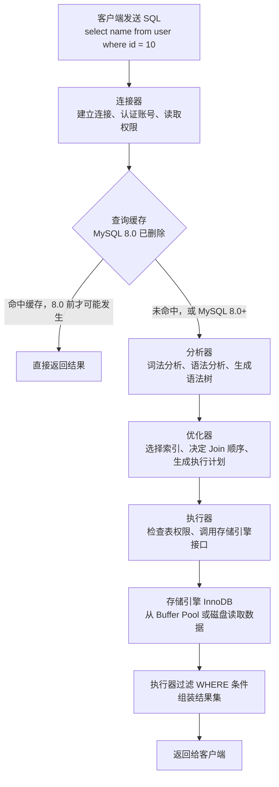

# M1-01 MySQL 一条查询语句从客户端发送到返回结果，中间经过了哪些步骤？


可视化页面：[M1-01-query-flow.html](M1-01-query-flow.html)
分类：基础架构与存储引擎

难度：L2/L3

关键词：连接器、查询缓存、分析器、优化器、执行器、存储引擎、InnoDB

## 先用一张图看懂



可以把它想成一次“去仓库取货”：

```text
客户端：我要查 user 表里 id = 10 的 name
连接器：先确认你是谁，有没有资格进来
分析器：看你这句话语法对不对，想表达什么
优化器：决定从哪条路去仓库最快，比如走哪个索引
执行器：按计划去取货，并检查你有没有看这张表的权限
存储引擎：真正管理仓库，把数据页和记录拿出来
```

## 面试时可以直接这样回答

一条查询 SQL 从客户端发送到 MySQL 后，整体会经过 Server 层和存储引擎层。

首先客户端通过 TCP 和 MySQL 建立连接，连接器负责用户名密码认证，并读取该用户当前的权限。连接建立后，这个连接内后续的权限判断通常基于连接建立时读到的权限。

如果是 MySQL 8.0 之前，可能会先看查询缓存；如果完全相同的 SQL 命中缓存，并且相关表没有更新过，就可以直接返回结果。但查询缓存因为表级失效、命中率低、维护成本高，MySQL 8.0 已经完全删除。

接着进入分析器。分析器会做词法分析和语法分析，识别 SQL 里的关键字、表名、列名和条件，并判断 SQL 是否符合 MySQL 语法。

然后进入优化器。优化器会基于成本模型选择执行计划，比如决定使用哪个索引、多个表 Join 时决定表的连接顺序，选择它认为成本最低的方案。

最后由执行器真正执行。执行器会先检查当前用户是否有表的查询权限，然后按照优化器给出的执行计划调用存储引擎接口。存储引擎，例如 InnoDB，负责真正读取数据。执行器拿到数据后判断 WHERE 条件，把符合条件的行组成结果集返回给客户端。

总结来说，Server 层负责连接、解析、优化和执行调度；存储引擎层负责真正的数据存取。

## 每一步到底在做什么

### 1. 客户端发送 SQL

例如：

```sql
select name from user where id = 10;
```

客户端可以是命令行、Java 程序、Go 程序、Navicat、DataGrip 等。它们本质上都是把 SQL 发给 MySQL Server。

### 2. 连接器：你是谁，有没有资格连进来

连接器负责建立连接、认证身份、读取权限。

这一步会做：

1. 建立 TCP 连接。
2. 校验用户名和密码。
3. 从权限表里读取这个用户的权限。

常见考点：如果管理员修改了某个用户的权限，已经建立的连接通常不会立刻使用新权限；新建连接才会重新读取权限。

### 3. 查询缓存：老版本有，MySQL 8.0 删除了

查询缓存的逻辑是：把 SQL 字符串当 key，把查询结果当 value。

如果之前执行过完全一样的 SQL：

```sql
select name from user where id = 10;
```

并且 `user` 表没有发生过更新，那么可以直接返回缓存结果。

但它的问题是失效粒度太粗：只要 `user` 表有任何更新，所有依赖 `user` 表的查询缓存都会失效。业务表通常更新频繁，所以命中率很低，还会带来额外维护成本。因此 MySQL 8.0 删除了查询缓存。

### 4. 分析器：SQL 写得对不对，MySQL 能不能理解

分析器主要做两件事：

1. 词法分析：识别 SQL 中的词。
2. 语法分析：判断 SQL 是否符合 MySQL 语法。

例如：

```sql
select name from user where id = 10;
```

MySQL 会识别出：

- `select` 是关键字。
- `name` 是列名。
- `user` 是表名。
- `where id = 10` 是过滤条件。

如果 SQL 写错，比如：

```sql
select from user where id = 10;
```

这种语法错误就会在分析器阶段报出来。

### 5. 优化器：决定怎么查更划算

同一条 SQL 可能有多种执行方式，优化器负责选一个成本较低的方案。

它常做的决策包括：

1. 多个索引都能用时，选择哪个索引。
2. 多表 Join 时，决定先查哪张表、后查哪张表。
3. 判断是否需要全表扫描、是否需要排序、是否需要临时表。

例如：

```sql
select * from user where age = 18 and city = 'Shanghai';
```

如果 `age` 和 `city` 都有索引，优化器会估算哪一个索引过滤效果更好、成本更低，然后决定使用哪个索引。

### 6. 执行器：按计划真正执行

执行器拿到执行计划后，会真正开始执行。

它会做：

1. 检查当前用户对这张表有没有查询权限。
2. 调用存储引擎接口读取数据。
3. 判断每一行是否满足 WHERE 条件。
4. 把满足条件的行加入结果集。
5. 返回给客户端。

执行器自己不直接管理磁盘上的数据，它通过存储引擎接口拿数据。

### 7. 存储引擎：真正负责数据怎么存、怎么读

存储引擎层负责真正的数据读写。现在默认常用的是 InnoDB。

InnoDB 负责很多底层能力，例如：

- 数据页和索引页。
- Buffer Pool。
- B+ 树索引。
- 事务。
- MVCC。
- 行锁。
- redo log 和 undo log。

所以这道题里要强调：Server 层负责 SQL 的通用处理流程，存储引擎层负责具体的数据存取。

## 容易说错的点

1. 不要说 MySQL 8.0 还有查询缓存。准确说法是：MySQL 8.0 已经删除查询缓存。
2. “查询服务器”应改成“查询缓存”。
3. 优化器不是一定选择你以为最好的索引，而是基于统计信息和成本模型估算。
4. 执行器会调用存储引擎，但真正的数据组织、索引、事务能力主要在 InnoDB。

## 高频追问

### 追问 1：长连接和短连接有什么区别？

短连接是每次执行少量 SQL 后就断开连接；长连接是连接建立后持续复用。

长连接的好处是减少频繁建立连接的开销，因为建立连接要经过 TCP 握手、认证和权限读取。

长连接的问题是可能占用较多内存。MySQL 在执行过程中使用的一些临时内存，会在连接断开时才彻底释放。如果连接长期不断开，内存可能越积越多。

解决方法：

1. 定期断开长连接，让 MySQL 释放连接资源。
2. MySQL 5.7 及以上可以使用 `mysql_reset_connection` 重新初始化连接资源，避免重新建连接和重新认证。

### 追问 2：MySQL 8.0 为什么删除查询缓存？

因为查询缓存的失效粒度是表级别的。只要一张表有任何更新，这张表相关的所有查询缓存都会失效。

对于频繁更新的业务表，查询缓存几乎很难命中，但 MySQL 还要维护缓存一致性、加锁和清理缓存，成本大于收益。所以 MySQL 8.0 删除了查询缓存。

### 追问 3：Server 层和存储引擎层怎么分工？

Server 层负责 MySQL 通用能力，例如连接管理、权限校验、SQL 解析、SQL 优化和执行调度。

存储引擎层负责具体的数据存取，例如 InnoDB 负责索引、事务、MVCC、锁、Buffer Pool、redo log、undo log 等。

一句话：Server 层决定“怎么执行 SQL”，存储引擎层负责“怎么把数据拿出来”。

## 记忆口诀

```text
连、缓、析、优、执、引

连接器：认证和权限
查询缓存：8.0 删除
分析器：词法和语法
优化器：选索引和执行计划
执行器：调引擎拿数据
存储引擎：真正读写数据
```
