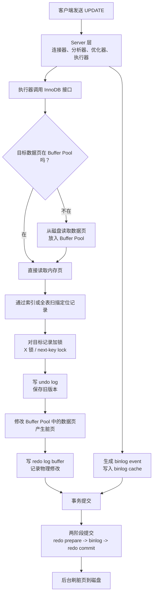

# M1-02 一条 UPDATE 语句的完整执行流程是什么？涉及哪些日志和缓冲组件？

分类：基础架构与存储引擎

难度：L2/L3

关键词：UPDATE、Buffer Pool、脏页、undo log、redo log、binlog、两阶段提交、WAL、Change Buffer

## 问题

一条 `UPDATE` 语句在 MySQL 中是怎么执行的？中间经过哪些组件？涉及哪些日志和缓冲区？

例如：

```sql
update user set name = 'Tom' where id = 10;
```

## 面试官考察点

这道题不是只问 SQL 执行顺序，而是在考察你是否理解 InnoDB 的写入路径，尤其是：

1. Server 层和 InnoDB 层的分工。
2. `UPDATE` 如何找到目标行、加锁、修改数据。
3. `undo log`、`redo log`、`binlog` 分别解决什么问题。
4. Buffer Pool 中的脏页为什么不会立刻刷盘。
5. 事务提交时为什么需要两阶段提交。

## 先讲人话

`UPDATE` 可以理解成一次“先记账，再改账本，最后确认账本和流水一致”的过程。

MySQL 不会直接把磁盘上的数据改掉。它会先把数据页读到内存里的 Buffer Pool，在修改前记录旧值，方便回滚；然后修改内存页，让这个页变成脏页；同时记录 redo log，保证宕机后能恢复；Server 层还会记录 binlog，用于主从复制和数据恢复。

真正提交事务时，MySQL 会用两阶段提交保证 redo log 和 binlog 这两份日志的一致性。

## 前置概念

| 概念 | 小白解释 |
| --- | --- |
| Server 层 | MySQL 通用层，负责连接、解析、优化、执行调度、binlog。 |
| InnoDB | 默认存储引擎，负责数据页、索引、事务、锁、Buffer Pool、redo log、undo log。 |
| Buffer Pool | InnoDB 的内存缓存，缓存数据页和索引页，读写都优先在这里进行。 |
| 脏页 | Buffer Pool 中已经被修改、但还没写回磁盘的数据页。 |
| undo log | 记录旧版本，用于事务回滚和 MVCC。 |
| redo log | 记录物理修改，用于宕机恢复，属于 InnoDB。 |
| binlog | 记录逻辑变更，用于主从复制和数据恢复，属于 Server 层。 |
| WAL | Write-Ahead Logging，先写日志，再写数据页。 |

## 30 秒短答

一条 `UPDATE` 语句前半段和 `SELECT` 类似，都会经过连接器、分析器、优化器、执行器。区别在于执行器调用 InnoDB 后走写入路径。

InnoDB 会根据索引找到目标行，把相关数据页加载到 Buffer Pool，对记录加锁；修改前先写 `undo log` 保存旧版本，然后修改 Buffer Pool 中的数据页，使其成为脏页，同时写 `redo log buffer`。Server 层还会生成 `binlog` 写入 `binlog cache`。

事务提交时，MySQL 通过两阶段提交保证 redo log 和 binlog 一致：先写 redo log prepare，再写 binlog，最后写 redo log commit。脏页不会马上刷盘，而是后台线程在合适时机异步刷盘，这就是 WAL 的核心思想。

## 面试时可以直接这样回答

一条 `UPDATE` 的执行流程可以分成 Server 层和 InnoDB 层两部分。

首先在 Server 层，客户端发送 SQL 后，会经过连接器、分析器、优化器和执行器。这个前半段和 `SELECT` 基本一致：连接器负责连接和权限，分析器做词法语法分析，优化器选择执行计划，执行器负责调用存储引擎接口。

真正的区别从执行器调用 InnoDB 开始。InnoDB 会根据执行计划定位要更新的记录，可能通过主键索引、二级索引，也可能因为没有合适索引而全表扫描。目标记录所在的数据页如果已经在 Buffer Pool 中，就直接使用；如果不在，就从磁盘读入 Buffer Pool。

找到记录后，`UPDATE` 是当前读，会对要修改的记录加排他锁。如果是范围更新，在 RR 隔离级别下还可能加 next-key lock。

修改数据前，InnoDB 会先写 `undo log`，保存旧版本。它的作用是事务回滚和 MVCC。然后 InnoDB 在 Buffer Pool 中修改数据页，修改后的页变成脏页。同时，InnoDB 会把这次物理修改写入 `redo log buffer`，用于崩溃恢复。

与此同时，Server 层会生成这次更新对应的 `binlog event`，先写入当前事务的 `binlog cache`。`binlog` 主要用于主从复制和基于时间点的数据恢复。

事务提交时，MySQL 使用两阶段提交保证 redo log 和 binlog 一致。第一步，InnoDB 把 redo log 写到 prepare 状态；第二步，Server 层写入并刷 binlog；第三步，InnoDB 把 redo log 标记为 commit。这样即使中途宕机，恢复时也能判断事务到底应该提交还是回滚。

最后，Buffer Pool 中的脏页不需要在事务提交时立即写回磁盘。后台线程会在 redo log 空间不足、Buffer Pool 空间不足、系统空闲或 MySQL 正常关闭时刷脏页。

## 先用一张图看懂



## 原理拆解

### 1. Server 层：和 SELECT 一样先走通用 SQL 流程

`UPDATE` 的前半段和 `SELECT` 类似：

```text
连接器 -> 分析器 -> 优化器 -> 执行器
```

这几步分别负责：

1. 连接器：建立连接、认证账号、读取权限。
2. 分析器：做词法分析和语法分析，判断 SQL 是否合法。
3. 优化器：选择索引和执行计划。
4. 执行器：调用存储引擎接口执行。

区别在于，`SELECT` 主要是读路径，`UPDATE` 从执行器调用 InnoDB 开始进入写路径。

### 2. InnoDB：先找到要更新的行

InnoDB 会根据执行计划查找目标记录。

如果有合适索引，例如：

```sql
update user set name = 'Tom' where id = 10;
```

并且 `id` 是主键或索引列，InnoDB 可以通过 B+ 树快速定位记录。

如果目标数据页已经在 Buffer Pool 中，就直接读取；如果不在 Buffer Pool 中，就从磁盘读取数据页放入 Buffer Pool。

### 3. UPDATE 是当前读，需要加锁

`UPDATE` 不是快照读，而是当前读。它要读到记录的最新版本，并对要修改的记录加锁。

常见锁包括：

1. 等值命中唯一索引时，通常对目标记录加排他锁。
2. 范围条件下，RR 隔离级别可能加 next-key lock，也就是记录锁加间隙锁。
3. 没有合适索引时，扫描范围会很大，加锁范围也会变大。

### 4. 修改前写 undo log

InnoDB 修改数据前，会先记录旧版本到 `undo log`。

例如：

```sql
update user set name = 'Tom' where id = 10;
```

如果原来的 `name` 是 `Jerry`，undo log 会记录“这行数据原来的值是什么”。如果事务后面回滚，InnoDB 就可以根据 undo log 把数据恢复成旧值。

undo log 还有一个重要作用：支持 MVCC。其他事务做快照读时，如果不应该看到当前事务的新值，就可以通过 undo log 找到旧版本。

### 5. 修改 Buffer Pool，产生脏页

InnoDB 不会直接修改磁盘文件，而是修改 Buffer Pool 中的数据页。

被修改后的页叫脏页，因为：

```text
内存中的数据页 != 磁盘上的数据页
```

注意，脏页不是错误数据，也不是脏读。它只是表示这个页已经在内存中被修改过，但还没有刷回磁盘。

### 6. 写 redo log buffer，保证崩溃恢复

修改数据页的同时，InnoDB 会把本次修改写入 `redo log buffer`。

redo log 记录的是偏物理层面的修改，例如“某个数据页的某个位置发生了什么变化”。它的核心作用是崩溃恢复。

只要 redo log 已经落盘，即使脏页还没来得及刷盘，MySQL 崩溃重启后也可以根据 redo log 把数据恢复回来。

这就是 WAL：

```text
先写日志，再写数据页
```

这样可以避免每次更新都随机写磁盘数据页，把大量随机写转化为顺序写日志，提高写入性能。

### 7. Server 层写 binlog cache

`binlog` 属于 Server 层，不属于 InnoDB。

执行器会生成本次更新对应的 binlog event，先写入当前事务的 `binlog cache`，提交时再统一写入 binlog 文件。

binlog 的作用主要是：

1. 主从复制。
2. 数据恢复。
3. 基于时间点恢复。

redo log 和 binlog 的区别：

| 日志 | 所属层 | 记录内容 | 主要用途 |
| --- | --- | --- | --- |
| undo log | InnoDB | 旧版本数据 | 回滚、MVCC |
| redo log | InnoDB | 物理修改 | 崩溃恢复 |
| binlog | Server 层 | 逻辑变更 | 主从复制、数据恢复 |

### 8. 提交时两阶段提交

事务提交时，MySQL 要同时处理 redo log 和 binlog。

如果只有 redo log 成功、binlog 失败，主库崩溃恢复后可能有这条数据，但从库没有复制到。

如果只有 binlog 成功、redo log 失败，从库可能复制到了这条数据，但主库崩溃恢复后没有这条数据。

所以 MySQL 用两阶段提交保证一致性：

```text
1. InnoDB 写 redo log，状态为 prepare
2. Server 层写 binlog，并按配置刷盘
3. InnoDB 写 redo log，状态为 commit
```

崩溃恢复时可以根据 redo log 的状态和 binlog 是否存在来判断：

1. redo log 只有 prepare，binlog 不存在：事务回滚。
2. redo log 只有 prepare，binlog 存在：事务提交。
3. redo log 已经 commit：事务提交。

### 9. 脏页异步刷盘

事务提交并不要求脏页立刻刷盘。

只要 redo log 已经可靠落盘，即使数据页还在 Buffer Pool 中，MySQL 崩溃后也能恢复。

脏页通常由后台线程异步刷盘，常见触发时机有：

1. redo log 快写满，需要推进 checkpoint。
2. Buffer Pool 空间不足，淘汰脏页前必须先刷盘。
3. MySQL 空闲时，后台线程定期刷脏页。
4. MySQL 正常关闭时，刷所有脏页。

## 涉及哪些日志和缓冲组件

| 组件 | 位置 | 作用 |
| --- | --- | --- |
| Buffer Pool | InnoDB 内存 | 缓存数据页和索引页，更新时先改内存页。 |
| undo log | InnoDB | 保存旧版本，用于回滚和 MVCC。 |
| redo log buffer | InnoDB 内存 | 暂存 redo log。 |
| redo log | InnoDB 磁盘日志 | 保证崩溃恢复。 |
| binlog cache | Server 层内存 | 暂存当前事务的 binlog。 |
| binlog | Server 层磁盘日志 | 用于主从复制和数据恢复。 |
| 脏页 | Buffer Pool 中的数据页 | 已修改但未刷盘的数据页。 |
| Page Cleaner Thread | InnoDB 后台线程 | 负责异步刷脏页。 |
| Change Buffer | InnoDB | 非唯一二级索引页不在 Buffer Pool 时，可能先缓存索引变更，后续再合并。 |

## 结合项目怎么讲

可以结合业务服务里的状态更新、订单更新、保单更新来讲：

> 在业务系统里，像订单状态、保单状态这类更新，底层通常就是一条或多条 `UPDATE`。如果 `WHERE` 条件能命中主键或唯一索引，InnoDB 可以快速定位记录，只锁住较小范围；如果没有合适索引，就可能全表扫描并扩大加锁范围，导致锁等待、慢 SQL，甚至影响同表其他写入。

可以再补一句：

> 所以线上写更新 SQL 时，我会优先确认 `WHERE` 条件是否走索引，尤其是状态更新、批量更新、补偿任务这类语句，否则它影响的不只是查询性能，还会影响锁范围和事务并发。

## 容易说错的点

1. 不要说 `UPDATE` 直接修改磁盘数据。准确说法是：先修改 Buffer Pool 中的数据页，变成脏页，后续再刷盘。
2. 不要把 undo log、redo log、binlog 混成一种日志。undo 管回滚和 MVCC，redo 管崩溃恢复，binlog 管复制和恢复。
3. 不要说事务提交必须刷脏页。事务提交重点是日志落盘，脏页可以后续异步刷盘。
4. 不要说 redo log 和 binlog 属于同一层。redo log 属于 InnoDB，binlog 属于 Server 层。
5. 不要把脏页和脏读混淆。脏页是内存页未刷盘；脏读是事务读到了其他事务未提交的数据。
6. `UPDATE` 的读不是普通快照读，而是当前读，会加锁。

## 高频追问

### 追问 1：如果 UPDATE 没有合适索引，InnoDB 会怎么处理？

如果 `WHERE` 条件没有合适索引，InnoDB 只能做全表扫描。

因为这是 `UPDATE`，不是普通查询，所以扫描过程中会对扫描到的记录尝试加锁，再判断是否满足 `WHERE` 条件。

RC 隔离级别下，不满足条件的记录锁通常可以较早释放；RR 隔离级别下，由于 next-key lock 和范围锁机制，锁的影响范围可能更大，通常要等事务结束才释放。

所以无索引 `UPDATE` 容易表现成“锁表”。本质不是一定用了表锁，而是扫描范围太大，导致大量记录被锁住，其他事务更新这些记录时会被阻塞。

### 追问 2：Buffer Pool 中的脏页什么时候刷盘？

常见有四种触发时机：

1. redo log 快写满，需要推进 checkpoint。
2. Buffer Pool 空间不够，淘汰的页如果是脏页，需要先刷盘。
3. MySQL 空闲时，后台线程定期刷脏页。
4. MySQL 正常关闭时，会刷所有脏页。

面试里要强调：脏页不是事务提交时必须立即刷盘，事务提交主要依赖 redo log 保证崩溃恢复。

### 追问 3：redo log 和 binlog 为什么需要两阶段提交？

因为 redo log 用于主库崩溃恢复，binlog 用于主从复制和数据恢复。如果两者不一致，就可能出现主库恢复后的数据和从库复制的数据不一致。

两阶段提交的核心流程是：

```text
redo prepare -> 写 binlog -> redo commit
```

这样即使中间宕机，MySQL 也可以根据 redo log 状态和 binlog 是否完整来判断事务应该提交还是回滚。

### 追问 4：undo log 是不是也要写 redo log？

是的。undo log 本身也存储在 InnoDB 的页里，修改 undo 页同样需要 redo log 来保证崩溃恢复。

可以简单理解为：undo log 负责逻辑回滚，redo log 负责把 InnoDB 的页修改恢复出来，里面也包括 undo 页的修改。

### 追问 5：Change Buffer 在 UPDATE 中什么时候会出现？

如果 `UPDATE` 涉及非唯一二级索引的变更，并且对应的二级索引页不在 Buffer Pool 中，InnoDB 可能不会立刻把这个索引页从磁盘读进来修改，而是先把变更写入 Change Buffer。

后续当这个索引页被读取到 Buffer Pool，或者后台合并时，再把 Change Buffer 中的变更应用到索引页上。

注意：唯一索引一般不能这样做，因为唯一索引需要立刻判断是否重复。

## 记忆口诀

```text
查、锁、旧、改、红、宾、提、刷

查：查找目标行，必要时从磁盘读页进 Buffer Pool
锁：UPDATE 是当前读，要加锁
旧：写 undo log，保存旧版本
改：修改 Buffer Pool，产生脏页
红：写 redo log buffer，保证崩溃恢复
宾：写 binlog cache，服务复制和恢复
提：两阶段提交，保证 redo 和 binlog 一致
刷：后台线程异步刷脏页
```
