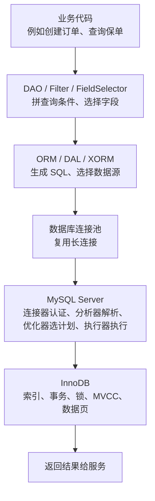

# Shopee Insurance 服务如何使用 MySQL


可视化页面：[company-service-db-usage.html](company-service-db-usage.html)
用途：把 MySQL 八股和公司服务实践对应起来，帮助理解“客户端、连接器、长连接、主从、分表、事务”这些概念在真实服务里是什么样子。

资料来源：

- Confluence：数据库管理
- Confluence：项目通用配置项解读
- Confluence：Mysql DAL 改造

## 1. 八股里的“客户端”在公司服务里是谁？

MySQL 八股里说的“客户端发送 SQL 到 MySQL”，在公司后端服务里通常不是指浏览器，而是指服务代码里的数据库访问层。

公司服务里的链路可以理解成：



所以回答 M1-01 时，可以把“客户端”理解成：

```text
在公司服务里，客户端通常是业务服务的 DAO/ORM 层。
它通过 MySQL driver 和连接池，把 SQL 请求发给 MySQL Server。
```

## 2. DB 配置和八股里的连接器怎么对应？

内部文档里的数据库配置大致长这样：

```ini
[db.source.main]
driver = "mysql"
host = "..."
port = 3306
user_name = "..."
password = "******"
db_name = "..."
charset = "utf8mb4"
max_idle = 100
max_open = 100
max_life_time = 1600
is_slave = false

[db.source.main.slave]
driver = "mysql"
host = "..."
port = 3306
user_name = "..."
password = "******"
db_name = "..."
charset = "utf8mb4"
max_idle = 100
max_open = 100
max_life_time = 1600
is_slave = true
```

这些字段和八股的对应关系：

| 配置项 | 公司服务里的作用 | 对应的 MySQL 八股知识 |
| --- | --- | --- |
| `driver = mysql` | 使用 MySQL 驱动 | 客户端通过协议连接 MySQL |
| `host` / `port` | 连接哪个 MySQL 地址 | 客户端到 MySQL Server 的 TCP 连接 |
| `user_name` / `password` | 数据库账号认证 | 连接器做用户名密码校验 |
| `db_name` | 使用哪个库 | SQL 执行时定位 schema |
| `charset` | 字符集 | SQL 字符串和结果集编码 |
| `max_idle` | 连接池最大空闲连接数 | 长连接复用 |
| `max_open` | 最大打开连接数 | 连接数上限，避免打爆 DB |
| `max_life_time` | 单个连接最长生命周期 | 长连接内存释放、连接刷新 |
| `is_slave` | 是否从库数据源 | 主从读写分离 |

面试理解重点：

```text
服务启动后会读取 DB 配置，初始化 MySQL driver 和连接池。
后续业务代码查库时，不是每次重新创建连接，而是从连接池里拿一个已有长连接。
这个连接到 MySQL Server 后，MySQL 的连接器会做认证和权限校验。
```

## 3. 长连接问题在公司服务里怎么体现？

八股里说“长连接会占用内存”，在服务里对应的就是连接池。

服务不会每查一次库就重新建连接，因为建连接有成本：

1. TCP 建连。
2. MySQL 用户认证。
3. 权限读取。
4. 初始化连接上下文。

所以服务通常维护连接池：

```text
max_idle：保留多少空闲连接
max_open：最多同时打开多少连接
max_life_time：连接最长活多久，到期后重建
```

这就是八股里“长连接”的真实落点。

如果 `max_open` 配太大，很多服务实例一起连 DB，可能把 MySQL 连接数打满。

如果 `max_life_time` 太长，连接长期不释放，可能带来内存、连接状态过旧等问题。

## 4. 主从配置和读写分离怎么对应？

内部框架支持主库和从库：

```ini
[db.source.main]
is_slave = false

[db.source.main.slave]
is_slave = true
```

可以理解成：

```text
写请求：走主库
读请求：默认可以走从库
事务中读：通常走主库，避免读到旧数据
```

内部文档里的读规则可以简化成：

1. 在事务中，读主库。
2. 不在事务中，如果配置了从库，优先读从库。
3. 可以强制读主库。

这对应 MySQL 八股里的：

- 主从复制。
- 读写分离。
- 主从延迟。
- 事务一致性。

面试里可以这样结合公司经验说：

```text
公司服务通常会配置 main 和 main.slave 两套数据源。
普通查询可以路由到从库，写操作走主库。
但如果在事务里，为了保证读到自己刚写入的数据，一般会读主库。
```

## 5. 分表配置和分库分表怎么对应？

内部框架支持按规则分表，例如：

```ini
[people_tab]
table.name.base = "people_tab"
db.source.name = "db.source.main"
db.source.slave.name = "db.source.main.slave"
sharding.rule = "UserNo%100"
suffix.format = "_00000000"
```

意思是：

```text
逻辑表：people_tab
真实表：people_tab_00000000 到 people_tab_00000099
分表规则：UserNo % 100
```

业务代码里可能只知道查 `people_tab`，框架根据 `UserNo` 算出真正要查哪张物理表。

这对应 MySQL 八股里的：

- 水平分表。
- 分片键。
- 路由规则。
- 为什么查询必须带分片键。
- 跨分片查询为什么贵。

重点记：

```text
分表后，如果 WHERE 条件里没有分片字段，框架无法定位单张表，可能要扫所有分表。
所以分库分表场景下，查询条件尽量带分片键。
```

## 6. 事务在公司服务里怎么对应？

内部框架提供事务模板：

```go
db.WithTransaction(func() {
    // 处理业务逻辑
})
```

它封装了：

1. 开启事务。
2. 执行业务逻辑。
3. 正常结束则提交。
4. 出错或 panic 则回滚。
5. 在事务上下文里绑定数据库会话。

这对应 MySQL 八股里的：

- ACID。
- 事务提交和回滚。
- 事务隔离级别。
- MVCC。
- 锁。
- `select ... for update`。

在公司服务里，如果 DAO 查询带 `forUpdate`，底层可能生成类似：

```sql
select ... for update;
```

这就会涉及行锁、事务隔离和并发控制。

## 7. 多活 / DR 改造和哪些八股有关？

内部文档里提到数据可以分为：

1. 地区数据。
2. 全局数据。

并且数据源名里会带上机房、单元、分库信息，例如：

```text
db.source.main.id-rz-unit0-db00000
db.source.main.slave.id-rz-unit0-db00000
db.source.main.id-gz-unit0
```

可以理解成：

```text
服务不是只连一个固定 MySQL。
DAL 会根据表、数据类型、account_id、region、读写操作，路由到不同的数据源。
```

这对应八股里的：

- 主从复制。
- 分库分表。
- 多活。
- 灾备切换。
- 主从延迟。
- 数据迁移。
- 全局数据和地区数据。

## 8. 把 M1-01 换成公司服务版本

面试时如果想结合公司实践，可以这样说：

```text
在公司服务里，一条查询通常不是业务代码直接手写 SQL 发给 MySQL，
而是业务代码调用 DAO，DAO 根据 Filter 和 FieldSelector 生成 SQL。
然后 DAL 根据分表配置、主从配置、事务上下文选择数据源。
服务通过 MySQL driver 和连接池复用长连接，把 SQL 发给 MySQL Server。

到 MySQL Server 后，还是走标准流程：
连接器负责认证和权限，分析器解析 SQL，优化器选择索引和执行计划，
执行器调用 InnoDB 读取数据，最后把结果返回给服务。

所以八股里的客户端，在公司服务里可以对应 DAO/ORM/连接池这一层；
八股里的长连接，对应连接池的 max_idle、max_open、max_life_time；
八股里的主从和分库分表，对应 db.source.main、db.source.main.slave 和 sharding 配置。
```

## 9. 这份实践能帮助你理解哪些八股题？

| 公司实践 | 对应八股 |
| --- | --- |
| DAO / ORM 生成 SQL | 一条 SQL 的执行流程 |
| DB 连接池 | 长连接、短连接、连接数打满 |
| `db.source.main` | 主库、写库 |
| `db.source.main.slave` | 从库、读写分离 |
| `max_open` | MySQL 最大连接数、连接池配置 |
| `max_life_time` | 长连接资源释放 |
| `sharding.rule` | 分库分表、分片键 |
| `db.WithTransaction` | 事务、提交、回滚、传播 |
| `for update` | 行锁、当前读、并发控制 |
| 地区数据 / 全局数据 | 多活、数据路由、灾备 |
