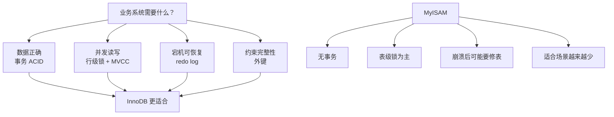

# M1-03 InnoDB 和 MyISAM 有什么本质区别？为什么 InnoDB 成为默认引擎？


可视化页面：[m1-03-innodb-vs-myisam.html](m1-03-innodb-vs-myisam.html)
分类：基础架构与存储引擎

难度：L2/L3

关键词：InnoDB、MyISAM、事务、行级锁、表级锁、MVCC、崩溃恢复、聚簇索引、外键

## 问题

InnoDB 和 MyISAM 有什么本质区别？为什么 InnoDB 后来成为 MySQL 的默认存储引擎？

## 面试官考察点

这道题不是让你背一张对比表，而是在考察你是否理解“存储引擎”决定了 MySQL 底层怎么存数据、怎么保证可靠性、怎么处理并发。

核心考点有：

1. InnoDB 为什么更适合 OLTP 业务系统。
2. 事务、锁、MVCC、redo log、undo log 分别解决什么问题。
3. MyISAM 为什么在并发写入和崩溃恢复上明显落后。
4. 两者索引结构的真实区别，尤其是聚簇索引和非聚簇索引。

## 先讲人话

可以把 InnoDB 理解成“适合业务系统的安全账本”：支持事务，写错了能回滚；机器宕机后能恢复；多人同时读写时尽量互不影响。

MyISAM 更像“早期简单文件表”：读起来轻量，但不支持事务，写入时通常锁整张表，机器异常崩溃后还可能需要修表。

所以 InnoDB 成为默认引擎，本质原因是现代业务系统更看重数据正确性、崩溃安全和高并发写入能力，而不是只看简单读性能。

## 前置概念

| 概念 | 小白解释 |
| --- | --- |
| 存储引擎 | MySQL 里真正负责“数据怎么存、怎么读、怎么加锁、怎么恢复”的模块。 |
| 事务 | 一组操作要么都成功，要么都失败，避免只改了一半。 |
| ACID | 事务的四个特性：原子性、一致性、隔离性、持久性。 |
| 行级锁 | 只锁住要改的行，其他行仍然可以被并发修改。 |
| 表级锁 | 一锁就是整张表，其他写入通常要等待。 |
| MVCC | 多版本并发控制，通过保留旧版本，让读写尽量不互相阻塞。 |
| redo log | InnoDB 的重做日志，用于宕机后恢复已经提交的修改。 |
| undo log | InnoDB 的回滚日志，保存旧版本，用于事务回滚和 MVCC。 |
| 聚簇索引 | 索引叶子节点直接存完整数据行。InnoDB 的主键索引就是聚簇索引。 |
| 非聚簇索引 | 索引叶子节点不直接存完整数据行，而是存指针或主键值。 |

## 30 秒短答

InnoDB 和 MyISAM 的本质区别是：InnoDB 是面向事务和高并发业务系统的存储引擎，MyISAM 是早期偏简单读场景的存储引擎。

InnoDB 支持 ACID 事务、行级锁、MVCC、redo log 崩溃恢复、undo log 回滚和外键；MyISAM 不支持事务，不支持 MVCC，不支持外键，主要是表级锁，崩溃后可能需要手动修复表。

InnoDB 成为默认引擎，最关键原因是它在并发写入、数据一致性和崩溃安全上更适合真实业务系统。现代 OLTP 场景里，可靠性和并发能力比 MyISAM 那种简单读性能优势更重要。

## 面试时可以直接这样回答

InnoDB 和 MyISAM 最大的区别在于它们解决问题的方向不同。

InnoDB 是面向事务型业务系统设计的。它支持 ACID 事务，事务提交后通过 redo log 保证持久性，事务回滚通过 undo log 保证原子性，隔离性主要依赖锁和 MVCC。MyISAM 不支持事务，所以不能回滚，也无法保证一组操作要么全部成功、要么全部失败。

并发能力上，InnoDB 支持行级锁，而且行锁是基于索引实现的。只要查询条件命中合适索引，通常可以只锁住目标行或较小范围。MyISAM 主要是表级锁，读写之间容易互斥，写入时会影响整张表的并发能力。所以在高并发读写场景里，InnoDB 明显更适合。

可靠性上，InnoDB 有 redo log，可以在数据库宕机后做崩溃恢复，把已经提交的修改恢复到一致状态。MyISAM 没有完整的崩溃恢复机制，异常崩溃后可能需要使用 `myisamchk` 修复表，并且存在数据损坏或丢失风险。

索引结构上，两者都可以使用 B+ 树，但数据组织方式不同。InnoDB 的主键索引是聚簇索引，叶子节点存完整数据行；二级索引叶子节点存主键值，所以通过二级索引查询非覆盖字段时需要回表。MyISAM 的数据和索引分开存，索引叶子节点存的是数据行在数据文件里的地址或行号，所有索引都通过这个地址去 `.MYD` 数据文件里找记录。

所以 InnoDB 成为默认引擎，核心原因不是它在所有单点能力上都绝对更快，而是它更符合现代业务系统对事务、一致性、并发和崩溃恢复的要求。MySQL 5.5 开始 InnoDB 成为默认存储引擎，MySQL 8.0 以后系统表也迁移到了 InnoDB，MyISAM 基本只剩少量历史兼容场景。

## 先用一张图看懂



## 核心对比表

| 维度 | InnoDB | MyISAM | 面试重点 |
| --- | --- | --- | --- |
| 事务 | 支持 ACID 事务 | 不支持事务 | 这是本质区别之一。 |
| 锁粒度 | 支持行级锁，也有表级意向锁 | 表级锁为主 | InnoDB 并发写入能力更强。 |
| MVCC | 支持，通过 undo log 等机制实现快照读 | 不支持 | InnoDB 普通读通常不阻塞写。 |
| 崩溃恢复 | 支持 redo log 崩溃恢复 | 崩溃后可能要修表 | InnoDB 更安全。 |
| 索引组织 | 主键索引是聚簇索引；二级索引存主键值 | 索引和数据分离；索引叶子节点存数据地址 | 不要把聚簇索引说反。 |
| 外键 | 支持 | 不支持 | InnoDB 能维护引用完整性。 |
| 文件结构 | 常见为 `.ibd` 表空间文件，存数据和索引 | `.MYD` 存数据，`.MYI` 存索引 | MyISAM 数据和索引分开。 |
| `count(*)` | 无条件统计通常也要扫描或利用优化路径估算执行 | 维护表行数，可快速返回无 WHERE 的 `count(*)` | MyISAM 在少数简单读场景有历史优势。 |

## 原理拆解

### 1. 事务：InnoDB 能保证一组操作的完整性

事务解决的是“不要只成功一半”的问题。

比如转账：

```sql
update account set balance = balance - 100 where id = 1;
update account set balance = balance + 100 where id = 2;
```

这两句必须一起成功或一起失败。InnoDB 支持事务，可以提交，也可以回滚。MyISAM 不支持事务，如果第一句成功、第二句失败，就很难靠引擎自身回滚到原状态。

InnoDB 对 ACID 的支撑可以这样记：

| 特性 | InnoDB 主要靠什么保证 |
| --- | --- |
| 原子性 | undo log，失败时可以回滚旧版本。 |
| 一致性 | 事务机制、约束、日志和应用层正确逻辑共同保证。 |
| 隔离性 | 锁 + MVCC。 |
| 持久性 | redo log，提交后宕机也能恢复。 |

### 2. 锁粒度：InnoDB 更适合高并发读写

MyISAM 的主要问题是表级锁。写入一张表时，其他读写很容易被阻塞。数据量和并发上来后，这会成为明显瓶颈。

InnoDB 支持行级锁，理想情况下只锁住需要修改的行。例如：

```sql
update policy set status = 'PAID' where id = 1001;
```

如果 `id` 是主键，InnoDB 可以通过索引定位这一行，并只锁住相关记录。其他事务更新不同 `id` 的记录，通常可以并发进行。

但要注意：InnoDB 的行锁依赖索引。如果 `WHERE` 条件没有命中索引，InnoDB 可能扫描大量记录并加锁，实际影响范围会变大。面试里不要简单说“InnoDB 永远只锁一行”。

### 3. MVCC：InnoDB 让普通读和写尽量不互相阻塞

MVCC 的直觉是：一行数据被修改时，InnoDB 会通过 undo log 保留旧版本。普通 `SELECT` 做快照读时，可以读到自己应该看到的那个版本，而不一定要等待正在写入的事务提交。

这对业务系统很重要。比如一边有用户在更新订单状态，另一边后台列表在查询订单，InnoDB 可以让很多普通查询不被写事务直接阻塞。

MyISAM 没有 MVCC，读写并发能力弱很多。

### 4. 崩溃恢复：InnoDB 更能保证数据安全

InnoDB 使用 redo log 记录数据页的物理修改。事务提交时，只要 redo log 按配置安全落盘，即使数据库还没来得及把脏页写回数据文件，宕机后也可以根据 redo log 恢复。

MyISAM 没有 InnoDB 这种完整的崩溃恢复机制。异常宕机后，表文件可能处于不一致状态，需要手动或自动修复，极端情况下会丢数据。

这也是线上业务更愿意使用 InnoDB 的重要原因：数据库不能只追求“平时跑得快”，还要保证“异常时能恢复”。

### 5. 索引结构：两者都用 B+ 树，但叶子节点存的东西不同

InnoDB 和 MyISAM 都可以使用 B+ 树索引，但数据组织方式不同。

InnoDB：

1. 主键索引是聚簇索引。
2. 主键索引的叶子节点存完整数据行。
3. 二级索引的叶子节点存主键值。
4. 通过二级索引查非覆盖字段时，需要根据主键再查一次主键索引，也就是回表。

MyISAM：

1. 数据文件和索引文件分开。
2. 数据存放在 `.MYD` 文件。
3. 索引存放在 `.MYI` 文件。
4. 索引叶子节点存的是数据行地址或行号，再根据地址去数据文件中读取记录。

这里最容易说错：InnoDB 的主键索引才是聚簇索引；MyISAM 是非聚簇索引结构。

## 结合项目怎么讲

如果结合业务项目，可以这样说：

> 在保险、订单、支付、营销活动这类业务表里，一次操作通常不只是查一行，而是会涉及状态更新、流水记录、库存或资格校验等多个步骤。我们更关心的是事务一致性、并发写入和异常恢复，所以这类 OLTP 表一般都会使用 InnoDB。比如更新保单状态或营销权益状态时，需要依赖事务保证多张表修改的一致性，也需要行锁减少不同用户请求之间的互相阻塞。

如果没有具体项目细节，可以保守表达：

> 我目前会优先从业务表是否需要事务、是否有并发写入、是否要求宕机恢复这几个角度判断。只要是核心业务数据，默认应该选择 InnoDB，而不是 MyISAM。

## 常见场景

- 订单、保单、支付、账户、库存、营销权益等核心业务表：优先 InnoDB。
- 高并发读写、需要事务、需要回滚、需要崩溃恢复：优先 InnoDB。
- 历史系统中已有 MyISAM 表：通常是兼容原因，不建议新系统继续选择。
- 读多写极少、无事务要求、历史遗留的简单报表表：MyISAM 可能还能见到，但现在很少作为新设计首选。

## 容易说错的点

1. 不要说“InnoDB 主键索引是非聚簇索引，MyISAM 是聚簇索引”。正确说法是：InnoDB 主键索引是聚簇索引，MyISAM 的索引叶子节点存数据地址，属于非聚簇组织。
2. 不要说“InnoDB 全面任何场景都比 MyISAM 快”。更准确是：InnoDB 在事务、一致性、并发和崩溃恢复上更适合现代业务系统。
3. 不要说“InnoDB 有行锁，所以一定不会锁表”。没有合适索引时，InnoDB 可能扫描并锁住大量记录，影响接近锁表。
4. 不要把 redo log、undo log、binlog 混在一起。redo log 用于崩溃恢复，undo log 用于回滚和 MVCC，binlog 属于 Server 层，主要用于复制和恢复。
5. 不要把 `count(*)` 的差异当成选择 MyISAM 的主要理由。核心业务选型首先看事务、可靠性和并发。

## 高频追问

### 追问 1：InnoDB 几乎取代 MyISAM 了，那 MyISAM 还有使用场景吗？

有，但非常少。

比较可能见到的是历史遗留系统、早期建的老表，或者极少写入、没有事务要求、只做简单读取的场景。MyISAM 的无条件 `count(*)` 可以很快返回，因为它维护了表行数；但这个优势不足以覆盖它在事务、并发写入和崩溃恢复上的短板。

面试可以这样说：

> 新业务系统里我基本不会主动选择 MyISAM。除非是兼容历史表，或者非常明确是只读、无事务、可接受崩溃修复风险的边缘场景。核心业务表应该默认使用 InnoDB。

### 追问 2：为什么说行级锁是 InnoDB 取代 MyISAM 的关键原因之一？

因为业务系统通常不是纯读，而是大量并发读写。

MyISAM 表级锁意味着一个写操作可能影响整张表，其他请求要等待。并发越高，等待越明显。

InnoDB 行级锁可以把冲突控制在较小范围内。比如用户 A 更新自己的订单，用户 B 更新另一笔订单，只要命中不同索引记录，通常可以并发执行。这对订单、账户、保单、库存这类 OLTP 场景很关键。

但回答时要补一句：InnoDB 行锁依赖索引，SQL 写得不好时仍然可能锁范围很大。

### 追问 3：InnoDB 的 `count(*)` 为什么不像 MyISAM 那样直接返回？

MyISAM 会维护表的精确行数。如果没有 `WHERE` 条件，`count(*)` 可以直接返回这个计数。

InnoDB 因为支持事务和 MVCC，不同事务在同一时刻“能看到的行数”可能不一样。例如一个事务还没提交的新增行，对另一个事务可能不可见。因此 InnoDB 不能简单维护一个全局行数来回答所有事务的 `count(*)`。

所以 InnoDB 做无条件 `count(*)` 通常需要扫描索引来统计当前事务可见的记录。优化器一般会选择较小的二级索引来扫，而不是扫描完整数据行。

### 追问 4：为什么 InnoDB 二级索引需要回表？

因为 InnoDB 的二级索引叶子节点存的是主键值，不是完整数据行。

例如有表：

```sql
create table user (
  id bigint primary key,
  name varchar(64),
  age int,
  index idx_age(age)
) engine = InnoDB;
```

执行：

```sql
select name from user where age = 18;
```

如果使用 `idx_age`，InnoDB 先在二级索引里找到满足 `age = 18` 的主键 `id`，再拿这些 `id` 去主键索引里找完整数据行，读取 `name`，这个过程就是回表。

如果查询的是：

```sql
select id, age from user where age = 18;
```

`idx_age` 里已经有 `age` 和主键 `id`，不需要再查主键索引，这叫覆盖索引。

## 记忆口诀

```text
事务、行锁、MVCC；
redo 恢复，undo 回滚；
主键聚簇，二级回表；
MyISAM 表锁、无事务、崩溃要修。
```
