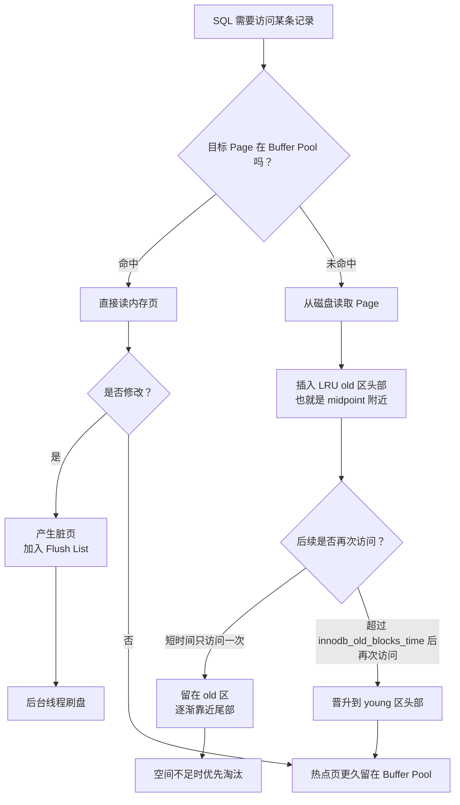

# M1-04 Buffer Pool 的工作原理是什么？为什么不用简单的 LRU 而用改进版本？

分类：基础架构与存储引擎

材料类型：interview question / knowledge topic

难度：L2/L3

优先级：P0

关键词：Buffer Pool、Page、LRU、young sublist、old sublist、预读、缓冲池污染、Free List、Flush List

复习状态：已成稿

## 问题

Buffer Pool 的工作原理是什么？为什么 InnoDB 不用简单的 LRU，而要使用改进版本？

## 面试官考察点

这道题表面问缓存，实际在考察你是否理解 InnoDB 为什么能减少磁盘 I/O，以及它如何在内存有限时保护热点数据。

核心考点有：

1. Buffer Pool 缓存的是什么，为什么读写都先经过它。
2. InnoDB 为什么以 Page 为单位管理数据。
3. 简单 LRU 在数据库场景下会有什么问题。
4. InnoDB 的 young/old 分区 LRU 如何解决预读失效和缓冲池污染。
5. 如何通过状态指标判断 Buffer Pool 是否健康。

## 先讲人话

Buffer Pool 可以理解成 InnoDB 在内存里的“数据页缓存”。磁盘很慢，内存很快，所以 InnoDB 会尽量把常用的数据页、索引页放在 Buffer Pool 里。查询时先看内存有没有，命中就不用读磁盘；更新时也先改内存页，变成脏页，后面再由后台线程刷回磁盘。

但是内存有限，不能什么都放，所以要淘汰不常用的页。简单 LRU 的想法是“最近用过的放前面，最久没用的从尾部淘汰”。这个思路在普通缓存里可以，但在数据库里会被全表扫描、批量报表、预读页打乱。大量只用一次的冷数据可能冲到 LRU 头部，把真正的热点页挤出去。

所以 InnoDB 做了改进：把 LRU 分成 young 区和 old 区。新读入的页不直接进入最热的位置，而是先进入 old 区头部。只有它在 old 区停留一段时间后又被访问，才有资格进入 young 区。这样短时间扫过的大量冷页就不容易污染热点数据。

## 前置概念

| 概念 | 小白解释 |
| --- | --- |
| Buffer Pool | InnoDB 的内存缓存区域，主要缓存数据页和索引页，减少读磁盘。 |
| Page | InnoDB 管理数据的基本单位，默认 16KB。一次缓存和淘汰通常不是按一行，而是按页。 |
| 数据页 | 存表记录的页。InnoDB 聚簇索引的叶子节点里存完整行数据。 |
| 索引页 | 存索引结构的页，例如 B+ 树的非叶子节点和二级索引页。 |
| 脏页 | Buffer Pool 中被修改过、但还没有写回磁盘的数据页。 |
| LRU | Least Recently Used，最近最少使用。越久没访问的缓存越容易被淘汰。 |
| 预读 | InnoDB 预测后续可能会读到一些页，于是提前把这些页加载进 Buffer Pool。 |
| 缓冲池污染 | 大量冷数据进入 Buffer Pool，把真正经常访问的热点页挤出去。 |
| Free List | 空闲页链表，管理还没被使用的 Buffer Pool 页框。 |
| LRU List | 管理已缓存页的链表，用于判断哪些页更热、哪些页更该淘汰。 |
| Flush List | 脏页链表，管理已经修改但尚未刷盘的页，服务于后台刷脏页和 checkpoint。 |

## 30 秒短答

Buffer Pool 是 InnoDB 在内存中维护的缓存区域，用来缓存数据页和索引页。读数据时，InnoDB 先查 Buffer Pool，命中就直接读内存；没命中才从磁盘读取页放入 Buffer Pool。写数据时，也先修改 Buffer Pool 中的数据页，形成脏页，再通过后台线程异步刷盘。

它不用简单 LRU，是因为数据库里有预读和全表扫描。简单 LRU 会把新读入的大量冷页放到链表头部，导致热点页被挤出去，出现预读失效和缓冲池污染。

InnoDB 的改进是把 LRU 分成 young 区和 old 区，默认 old 区约占 3/8。新页先插入 old 区头部，只有在 old 区停留超过 `innodb_old_blocks_time`，默认 1000ms，之后再次被访问，才会晋升到 young 区。这样只被短暂访问一次的冷页会留在 old 区，更容易被淘汰，热点数据能留在内存里。

## 面试时可以直接这样回答

Buffer Pool 是 InnoDB 性能的核心组件，它本质上是 InnoDB 在内存里开辟的一块缓存区域，主要缓存数据页和索引页。InnoDB 不是按一行一行从磁盘读写，而是按 Page 管理数据，默认页大小是 16KB。

当执行查询时，InnoDB 会先判断目标数据页是否已经在 Buffer Pool 中。如果在，就直接从内存读取；如果不在，就从磁盘把这个页读入 Buffer Pool，再访问里面的记录。执行更新时，InnoDB 也不是直接改磁盘，而是先修改 Buffer Pool 中的数据页，这个页就变成脏页。后续由后台线程在合适时机刷回磁盘。这样可以把频繁的随机磁盘读写变成更多内存访问和批量刷盘。

Buffer Pool 内部需要管理哪些页是空闲的、哪些页是缓存中的、哪些页是脏页。常见的结构有 Free List、LRU List 和 Flush List。Free List 管理空闲页框，LRU List 管理缓存页冷热，Flush List 管理脏页刷盘。

至于为什么不直接使用简单 LRU，是因为数据库访问有两个典型问题。第一个是预读失效，InnoDB 可能提前加载一些后续页面，但这些页面可能根本不会被真正访问。如果简单 LRU 把这些页放到最热位置，就会挤掉热点数据。第二个是缓冲池污染，例如全表扫描、`mysqldump`、大报表查询会把大量只访问一次的冷页加载进来，也可能把业务高频访问的热点页淘汰掉。

所以 InnoDB 使用改进版 LRU。它把 LRU 链表分成 young 区和 old 区，默认 old 区约占 3/8，young 区约占 5/8。新读入的页不会直接进入 young 区头部，而是先放到 old 区头部，也就是整个 LRU 的中点附近。只有这个页在 old 区停留超过 `innodb_old_blocks_time`，默认 1000ms，之后又被访问，才会被移动到 young 区。

这样设计的好处是：真正频繁访问的页可以进入 young 区长期保留；而全表扫描或预读带来的冷页通常只会短暂停留在 old 区，后续更容易被淘汰，不会严重污染 Buffer Pool。

## 先用一张图看懂



## 原理拆解

### 1. Buffer Pool 缓存的是 Page，不是单行记录

InnoDB 的数据组织以 Page 为单位，默认一个页 16KB。一个页里可能有多行记录，也可能是 B+ 树索引结构中的一个节点。

所以一次查询即使只查一行，底层也通常会把这一行所在的数据页读入 Buffer Pool。后续如果再访问同一页里的其他记录，就可以直接命中内存。

这就是为什么 Buffer Pool 命中率对 MySQL 性能影响很大：内存访问和磁盘 I/O 的延迟差距很大。

### 2. 查询和更新都会经过 Buffer Pool

读路径可以简化成：

```text
先找 Buffer Pool
命中：直接读内存页
未命中：从磁盘读 Page -> 放入 Buffer Pool -> 再读取记录
```

写路径可以简化成：

```text
先把目标 Page 放到 Buffer Pool
修改内存页
页变成脏页
写 redo log
后台线程再把脏页刷回磁盘
```

注意：脏页不是错误数据，也不是脏读。它只是表示“内存里的页已经更新，但磁盘上的对应页还没更新”。

### 3. Buffer Pool 内部常见三类链表

| 链表 | 管理对象 | 作用 |
| --- | --- | --- |
| Free List | 空闲页框 | 有新页要读入时，优先从这里拿空闲位置。 |
| LRU List | 已缓存页 | 按冷热程度管理页面，决定哪些页应该保留，哪些页可以淘汰。 |
| Flush List | 脏页 | 跟踪被修改过的页，便于后台线程按 checkpoint 和刷盘策略写回磁盘。 |

这里容易说错：Flush List 不是空闲页链表，它管理的是脏页。Free List 才是空闲页链表。

### 4. 简单 LRU 的问题一：预读失效

预读是为了减少磁盘 I/O 等待。比如 InnoDB 发现你在顺序扫描一些页，可能会提前把后续页读进 Buffer Pool。

问题是，预读只是预测，不代表一定会被访问。如果使用简单 LRU，新读入的预读页会被放到 LRU 头部，像热点页一样被保护起来。

如果这些页后面没有被访问，它们就白白占用了 Buffer Pool，还可能挤掉真正常用的页。这就是预读失效。

面试里可以这样说：

> 预读页不是一定有用。如果简单 LRU 把预读页直接放到最热位置，就会让“可能永远不会访问的页”挤掉真正的热点页。

### 5. 简单 LRU 的问题二：缓冲池污染

全表扫描、大报表、`mysqldump`、没有合适索引的查询，都可能短时间读取大量页面。

这些页面通常只访问一次，业务后续未必会再用。但简单 LRU 会因为“刚刚访问过”，把它们都放到头部。结果就是：

```text
大量冷页进入 LRU 头部
真正高频访问的热点页被挤到尾部
热点页被淘汰
后续核心查询又要读磁盘
```

这就是缓冲池污染。

### 6. InnoDB 的改进：midpoint insertion + young/old 分区

InnoDB 的 LRU 不是简单的一条链表头插淘汰，而是把链表分成两个区域：

| 区域 | 默认比例 | 含义 |
| --- | --- | --- |
| young sublist | 约 5/8 | 热数据区域，最近且多次访问的数据更容易留在这里。 |
| old sublist | 约 3/8 | 冷数据区域，新读入或短暂访问的数据先放这里。 |

关键规则：

1. 新读入的页先插入 old 区头部，也就是 LRU 的 midpoint 附近。
2. 如果页只被短暂访问一次，它会留在 old 区，逐渐向尾部移动。
3. 如果页在 old 区停留超过 `innodb_old_blocks_time` 后再次被访问，才会被移动到 young 区。
4. 当 Buffer Pool 空间不足时，old 区尾部的页更容易成为淘汰候选。

相关参数：

| 参数 | 默认值 | 作用 |
| --- | --- | --- |
| `innodb_old_blocks_pct` | `37` | old 区占 Buffer Pool 的近似比例，默认约 3/8。 |
| `innodb_old_blocks_time` | `1000` ms | 页进入 old 区后，至少停留多久才有资格因再次访问晋升到 young 区。 |

这套机制的核心目的可以概括为：

```text
让“一次性冷数据”留在 old 区
让“真正重复访问的数据”进入 young 区
```

### 7. 为什么这个改进能抗全表扫描

假设一个服务平时高频访问用户表、订单表里的少量热点页。突然执行一个大报表 SQL，全表扫描了很多历史记录。

如果是简单 LRU，大量历史页会因为刚读过而进入 LRU 头部，热点页被挤出内存。报表结束后，正常业务请求反而变慢。

使用改进 LRU 后，大量扫描页先进入 old 区。它们通常只是快速读一次，不会在 1 秒后再次访问，因此不会进入 young 区。等 Buffer Pool 需要空间时，这些 old 区冷页更容易被淘汰，热点业务页更可能保留下来。

### 8. Buffer Pool 预热是怎么做的

MySQL 支持保存和恢复 Buffer Pool 状态，用来缓解重启后的冷启动问题。

常见参数：

| 参数 | 作用 |
| --- | --- |
| `innodb_buffer_pool_dump_at_shutdown` | 关闭 MySQL 时记录 Buffer Pool 中一部分页面信息。 |
| `innodb_buffer_pool_load_at_startup` | 启动 MySQL 时根据之前记录的信息自动加载页面。 |
| `innodb_buffer_pool_dump_now` | 立即触发一次 Buffer Pool 状态转储。 |
| `innodb_buffer_pool_load_now` | 立即触发一次 Buffer Pool 预热加载。 |

注意：它保存的不是完整数据页内容，而是页标识信息。启动时根据这些信息重新把页面加载进 Buffer Pool。

## 结合项目怎么讲

如果结合业务系统，可以保守这样说：

> 在订单、保单、营销权益这类 OLTP 服务里，很多查询会反复访问近期活跃数据，例如最近订单、用户状态、活动资格等。这些数据如果能稳定留在 Buffer Pool，核心接口就可以减少磁盘 I/O。相反，如果某个后台报表、批量扫描或缺索引 SQL 把大量历史冷数据扫进 Buffer Pool，就可能把热点页挤出去，导致线上接口突然变慢。所以我理解 Buffer Pool 的重点不只是“内存越大越好”，还包括通过改进 LRU 保护热点页，避免一次性扫描污染缓存。

如果面试官继续问线上优化，可以补：

> 我会先看慢 SQL、执行计划、Buffer Pool 命中率、`Pages read ahead`、`Pages evicted without access`、`Pages made young/not young` 等指标，确认是不是大扫描或预读导致缓存污染。解决上优先优化 SQL 和索引，避免大范围扫描；必要时再评估 Buffer Pool 大小、`innodb_old_blocks_pct` 和 `innodb_old_blocks_time`。

## 常见场景

- `SELECT * FROM big_table` 或缺少索引导致全表扫描。
- 大报表、数据导出、`mysqldump` 读取大量历史数据。
- 批处理任务和在线 OLTP 流量共用同一 MySQL 实例。
- MySQL 重启后 Buffer Pool 为空，短时间内查询变慢。
- Buffer Pool 太小，热点数据集无法稳定留在内存。

## 排查和观察命令

```sql
-- 查看 InnoDB 状态，关注 BUFFER POOL AND MEMORY 部分
SHOW ENGINE INNODB STATUS\G

-- 查看 Buffer Pool 大小
SHOW VARIABLES LIKE 'innodb_buffer_pool_size';

-- 查看 old 区比例，默认 37，约等于 3/8
SHOW VARIABLES LIKE 'innodb_old_blocks_pct';

-- 查看 old 区晋升延迟，默认 1000 毫秒
SHOW VARIABLES LIKE 'innodb_old_blocks_time';

-- 查看是否配置多个 Buffer Pool 实例
SHOW VARIABLES LIKE 'innodb_buffer_pool_instances';

-- 查看 Buffer Pool 预热相关配置
SHOW VARIABLES LIKE 'innodb_buffer_pool_dump_at_shutdown';
SHOW VARIABLES LIKE 'innodb_buffer_pool_load_at_startup';

-- 查看 Buffer Pool 相关状态变量
SHOW STATUS LIKE 'Innodb_buffer_pool%';

-- MySQL 8.0+ 可查看更结构化的 Buffer Pool 统计
SELECT * FROM INFORMATION_SCHEMA.INNODB_BUFFER_POOL_STATS\G
```

常看指标：

| 指标 | 含义 | 怎么理解 |
| --- | --- | --- |
| `Buffer pool hit rate` | Buffer Pool 命中率 | 生产环境通常希望很高，但不要只看这一个数。 |
| `Pages read` | 从磁盘读入的页数 | 持续很高可能说明缓存不足或 SQL 扫描太多。 |
| `Pages made young` | old 区页面被晋升为 young 的次数 | 反映页面是否成为热点。 |
| `Pages made not young` | 页面没有晋升为 young 的次数 | 大扫描时这个值可能明显变化。 |
| `Pages read ahead` | 预读页数量 | 结合是否被访问判断预读是否有效。 |
| `Pages evicted without access` | 读入后未被访问就淘汰的页 | 高说明可能存在预读失效或冷数据扫描。 |
| `Modified db pages` | 脏页数量 | 脏页太多可能带来刷盘压力。 |
| `Pending writes flush list` | 等待从 Flush List 刷盘的页 | 持续偏高要关注 I/O 和刷盘压力。 |

## 容易说错的点

1. 不要把 Buffer Pool 和 MySQL 查询缓存混在一起。查询缓存是 Server 层旧功能，MySQL 8.0 已删除；Buffer Pool 是 InnoDB 的核心内存结构。
2. 不要说 Buffer Pool 只缓存数据页。更准确是：主要缓存表和索引数据页，还可能涉及 undo 页、自适应哈希索引等内部结构。
3. 不要说 InnoDB 新页直接放到 LRU 头部。准确说法是：新页先放到 old 区头部，也就是 midpoint 附近。
4. 不要说 Flush List 是空闲页链表。Free List 管空闲页，Flush List 管脏页。
5. 不要机械背“生产环境一定设成物理内存 80%”。如果是专用数据库服务器，80% 是常见经验值；如果机器上还有应用、代理、备份任务或容器限制，就要给其他进程和操作系统留足内存。
6. 不要只看 Buffer Pool 命中率。命中率高也可能有局部慢 SQL、锁等待、刷脏页压力或临时表问题。

## 高频追问

### 追问 1：Buffer Pool 可以设置多个实例吗？为什么？

可以。`innodb_buffer_pool_instances` 可以把 Buffer Pool 拆成多个实例。每个实例都有自己的 Free List、LRU List、Flush List 等结构，并由自己的 mutex 保护。

这样做的目的主要是减少高并发下多个线程同时访问同一套 Buffer Pool 管理结构造成的锁竞争。对于多 GB 级别的大 Buffer Pool，多个实例可能提升并发能力。

但也不是越多越好。实例太多会让每个实例太小，反而降低管理效率。MySQL 官方建议每个 Buffer Pool 实例至少 1GB。面试里不要简单说“设置成 CPU 核数就行”，更稳妥的说法是：结合 Buffer Pool 总大小、CPU 并发和实际压测指标配置。

### 追问 2：Buffer Pool 的预热是怎么做的？

MySQL 支持在关闭时把 Buffer Pool 中一部分页面的标识信息保存下来，启动时再按这些信息加载页面，减少重启后的冷启动时间。

常见参数是：

```sql
SHOW VARIABLES LIKE 'innodb_buffer_pool_dump_at_shutdown';
SHOW VARIABLES LIKE 'innodb_buffer_pool_load_at_startup';
```

如果这两个开启，MySQL 正常关闭时会 dump Buffer Pool 状态，启动时自动 load。也可以用 `innodb_buffer_pool_dump_now` 和 `innodb_buffer_pool_load_now` 手动触发。

### 追问 3：Buffer Pool 越大越好吗？

不是。Buffer Pool 大可以减少磁盘 I/O，但不能无限大。

如果 Buffer Pool 占用过多物理内存，操作系统可能发生 swap，性能会急剧下降。数据库服务器还要给连接线程、排序、临时表、redo log、binlog、操作系统页缓存、备份或监控进程留内存。

面试可以这样说：

> 专用 MySQL 服务器上，Buffer Pool 设为物理内存 60% 到 80% 是常见经验，但最终要结合机器角色、数据热点大小、连接数、是否发生 swap、磁盘 I/O 和压测结果来定。

### 追问 4：为什么全表扫描会影响正常业务查询？

全表扫描会把大量页面读入 Buffer Pool。如果这些页面是一次性冷数据，就会占用缓存空间，可能把热点页挤出去。热点页被淘汰后，正常业务查询再次访问这些热点数据时，就要重新读磁盘，接口延迟会上升。

InnoDB 的改进 LRU 可以缓解这个问题，但不能替代 SQL 优化。根本上还是要避免不必要的大扫描，比如补索引、拆分报表流量、使用只读库或离线数仓承接批量查询。

### 追问 5：Buffer Pool 命中率很高，还会慢吗？

会。

命中率高只说明大部分页读取来自内存，不代表 SQL 一定快。慢的原因还可能是：

1. SQL 扫描行数太多，即使都在内存里也要消耗 CPU。
2. 锁等待或事务阻塞。
3. 排序、临时表、Join 代价高。
4. 刷脏页或 redo log 写入压力大。
5. 返回结果集太大，网络传输慢。

所以 Buffer Pool 是重要指标，但不能代替完整的慢 SQL 和执行计划分析。

## 记忆口诀

```text
先页后行，先内存后磁盘；
读页进池，改页变脏；
Free 管空闲，LRU 管冷热，Flush 管脏页；
简单 LRU 怕预读和全扫；
新页进 old，复访进 young；
冷数据快淘汰，热点数据留下来。
```

## 参考资料

- [MySQL 8.4 Reference Manual: InnoDB Startup Options and System Variables](https://dev.mysql.com/doc/refman/8.4/en/innodb-parameters.html)
- [MySQL 8.4 Reference Manual: Configuring Multiple Buffer Pool Instances](https://dev.mysql.com/doc/refman/8.4/en/innodb-multiple-buffer-pools.html)
- [MySQL 9.7 Reference Manual: Buffer Pool](https://dev.mysql.com/doc/refman/9.7/en/innodb-buffer-pool.html)
- [MySQL 9.7 Reference Manual: Making the Buffer Pool Scan Resistant](https://dev.mysql.com/doc/refman/9.7/en/innodb-performance-midpoint_insertion.html)
