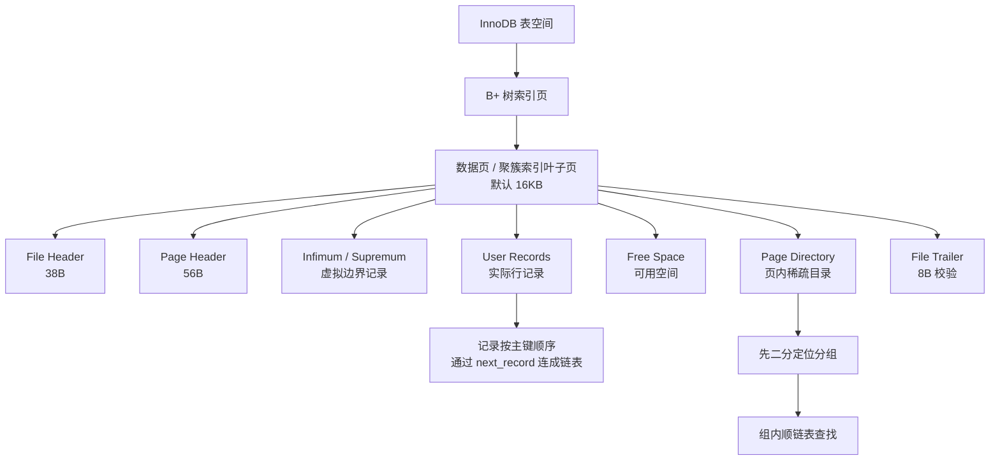

# M1-05 InnoDB 的数据页结构是怎样的？一页能存多少条记录？行格式有什么区别？

分类：基础架构与存储引擎

材料类型：interview question / knowledge topic

难度：L3

优先级：P0

关键词：InnoDB、Page、数据页、Page Directory、Row Format、COMPACT、DYNAMIC、溢出页、VARCHAR

复习状态：已成稿

可视化页面：[m1-05-innodb-page-row-format.html](m1-05-innodb-page-row-format.html)

## 问题

InnoDB 的数据页结构是怎样的？一页能存多少条记录？行格式有什么区别？

## 面试官考察点

这道题不是只问“页默认 16KB”这个结论，而是在考察你是否理解 InnoDB 的物理存储层。

核心考点有：

1. InnoDB 为什么以 Page 为单位管理磁盘和 Buffer Pool。
2. 一个数据页内部有哪些区域，以及用户记录、空闲空间、页目录分别负责什么。
3. 页内记录为什么既有链表，又有 Page Directory。
4. 一页能存多少行为什么没有固定答案，和行大小、页开销、溢出页有关。
5. COMPACT、DYNAMIC、COMPRESSED 等行格式对变长字段和大字段的处理差异。

## 先讲人话

InnoDB 不是一行一行从磁盘读写数据，而是一页一页读写。默认一页是 16KB，可以把它理解成 InnoDB 存储和缓存数据的基本格子。

一个数据页里不只是放用户数据，还要放页头、校验信息、页目录、虚拟最大最小记录等管理信息。真正的用户记录放在中间区域，随着插入不断占用空闲空间。

页内记录按主键顺序通过链表连起来，但如果只靠链表查找会很慢，所以 InnoDB 又维护了 Page Directory。Page Directory 像页内的小索引，先二分定位到一个记录分组，再在分组里顺着链表找。

一页能放多少行没有固定值。行越小，放得越多；行越大，放得越少。比如一行约 100 字节，16KB 页去掉一些固定开销后，大概能放 150 行左右。大字段放不下时，会把一部分内容放到溢出页。

行格式主要决定“一行内部怎么摆放字段”和“大字段怎么处理”。现在面试最常对比的是 COMPACT 和 DYNAMIC：COMPACT 对大字段会在本页保留前 768 字节和指针，DYNAMIC 更倾向于本页只保留 20 字节指针，把完整大字段放到溢出页。

## 前置概念

| 概念 | 小白解释 |
| --- | --- |
| Page | 页，InnoDB 管理数据、读写磁盘、放入 Buffer Pool 的基本单位，默认 16KB。 |
| 数据页 | 存放表记录的页。更准确地说，InnoDB 表数据放在聚簇索引 B+ 树中，叶子节点页就是常说的数据页。 |
| B+ 树 | MySQL 索引常用的数据结构。非叶子节点做导航，叶子节点存数据或索引项。 |
| 聚簇索引 | InnoDB 主键索引，叶子节点直接存完整行数据。没有显式主键时，InnoDB 会选择唯一非空索引或生成隐藏 row_id。 |
| Page Directory | 页目录，数据页内部的稀疏目录，用来加速页内查找。 |
| Infimum / Supremum | InnoDB 每个页里的两条虚拟记录，分别表示比任何记录都小、比任何记录都大。 |
| 溢出页 | 当一行里的大字段太长时，部分字段内容会放到额外页中，本页只保留前缀或指针。 |
| 行格式 | Row Format，决定一条记录内部如何存储字段、NULL、变长字段长度和大字段指针。 |

## 30 秒短答

InnoDB 默认页大小是 16KB，数据页是 InnoDB 管理数据和 Buffer Pool 缓存的基本单位。一个数据页内部主要包括 File Header、Page Header、Infimum 和 Supremum 虚拟记录、User Records、Free Space、Page Directory 和 File Trailer。

页内用户记录按主键顺序通过 `next_record` 形成单链表。为了避免每次都顺序遍历整页，Page Directory 会把记录分组，每个槽保存一组记录中最大记录的偏移量。查找时先对 Page Directory 二分，再在目标组内顺着链表找。

一页能存多少行取决于平均行大小。16KB 页去掉页头页尾和目录等开销后，如果一行约 100 字节，大概能存 150 行左右。InnoDB 要求 B+ 树页至少能容纳两条记录，所以单行在本页内存储的部分不能接近整页，过大的变长字段会放到溢出页。

行格式常见有 REDUNDANT、COMPACT、DYNAMIC、COMPRESSED。现在重点是 COMPACT 和 DYNAMIC。COMPACT 会在本页保存大字段前 768 字节加溢出页指针；DYNAMIC 更倾向于本页只保存 20 字节指针，完整大字段放到溢出页，因此更适合包含大字段的表。

## 面试时可以直接这样回答

InnoDB 的数据不是按单行直接管理的，而是按 Page 管理，默认页大小是 16KB。表数据在 InnoDB 里组织成聚簇索引 B+ 树，叶子节点页存完整行数据，所以我们常说的数据页，本质上就是聚簇索引的叶子页。

一个数据页内部大概可以分成几个部分。最前面是 File Header，大小 38 字节，里面有页号、校验和、前后页指针、页类型等信息。接着是 Page Header，大小 56 字节，记录页内槽数量、堆顶位置、记录数量、空闲链表等页内管理信息。然后是 Infimum 和 Supremum 两条虚拟记录，分别表示页内最小和最大边界。中间是 User Records，也就是实际用户记录，以及还没被使用的 Free Space。页尾附近是 Page Directory，用来做页内二分查找。最后是 File Trailer，大小 8 字节，用于页完整性校验。

页内记录本身不是数组，而是通过记录头里的 `next_record` 指针按主键顺序连成单链表。如果只靠链表，页内查找要从头遍历，效率不高。所以 InnoDB 维护了 Page Directory。它不是每条记录一个目录项，而是把多条记录分成一组，每个目录槽保存这一组最大记录的偏移量。查找时先对 Page Directory 做二分，定位到目标组，再在组内顺着链表遍历几条记录。这样既节省目录空间，又比纯链表快。

一页能存多少条记录没有固定答案，核心取决于行大小。可以粗略用“16KB 减去页内固定开销，再除以平均行大小和记录额外开销”来估算。比如一行大约 100 字节，16KB 数据页扣掉页头、页尾、页目录等开销后，大概能放 150 行左右。如果一行接近 1KB，可能只能放十几行。InnoDB 还要求 B+ 树页至少能容纳两条记录，否则页分裂和 B+ 树结构维护会出问题，所以单行在本页内存储的部分不能超过页面大小的大约一半。对于 TEXT、BLOB、很长的 VARCHAR 这类变长大字段，InnoDB 会使用溢出页存储。

行格式决定一条记录内部怎么存。常见行格式有 REDUNDANT、COMPACT、DYNAMIC、COMPRESSED。REDUNDANT 是早期老格式，现在基本只做历史了解。COMPACT 是 MySQL 5.0 之后的紧凑格式，它一行里会有变长字段长度列表、NULL 标记位、5 字节记录头、隐藏列和实际列数据。聚簇索引记录里常见隐藏列包括事务 ID `trx_id`、回滚指针 `roll_pointer`，如果表没有显式主键，还会有隐藏 `row_id`。

COMPACT 和 DYNAMIC 最大区别在大字段处理上。COMPACT 对溢出字段会在本页保留前 768 字节，再加 20 字节指针指向溢出页；DYNAMIC 更倾向于本页只保留 20 字节指针，把完整字段内容放到溢出页。这样 DYNAMIC 可以让数据页里容纳更多行，减少大字段把聚簇索引页撑大的问题。MySQL 5.7.9 之后和 MySQL 8.0 常见默认行格式是 DYNAMIC。

## 先用一张图看懂



## 原理拆解

### 1. 数据页在 InnoDB 存储层的位置

InnoDB 的存储层可以粗略理解为：

```text
表空间 -> 段 Segment -> 区 Extent -> 页 Page -> 行 Record
```

其中 Page 是最关键的读写单位。默认一个 Page 是 16KB，Buffer Pool 缓存的也是一个个 Page。

一次查询即使只命中一行，底层通常也会把这一行所在的整个 Page 读入 Buffer Pool。后续访问同一页里的其他行，就可以直接读内存。

注意：页不是只存数据行，也可能是索引页、undo log 页、系统页等。面试里说“数据页”时，通常指存放用户记录的 B+ 树叶子页。

### 2. 数据页内部结构

| 区域 | 大小 | 作用 |
| --- | --- | --- |
| File Header | 38 字节 | 记录页号、校验和、上一页/下一页指针、页类型、LSN 等文件层信息。 |
| Page Header | 56 字节 | 记录页内状态，例如目录槽数量、堆顶位置、记录数量、空闲链表、最近插入位置等。 |
| Infimum + Supremum | 固定存在 | 两条虚拟记录，表示页内最小和最大边界，方便统一链表逻辑。 |
| User Records | 不固定 | 实际存放用户行记录。 |
| Free Space | 不固定 | 尚未使用的空间，插入新记录时会从这里分配。 |
| Page Directory | 不固定 | 页目录，保存记录分组的偏移量，用于页内二分查找。 |
| File Trailer | 8 字节 | 保存校验信息，用于判断页是否完整。 |

页面空间的增长方向可以这样理解：

```text
页头部
File Header
Page Header
Infimum / Supremum
User Records  ---> 增长
Free Space
Page Directory <--- 增长
File Trailer
页尾部
```

User Records 从前往后占用空间，Page Directory 从页尾往前占用空间，中间的 Free Space 会逐渐变小。

### 3. 页内为什么既有链表，又有 Page Directory

InnoDB 页内记录通过 `next_record` 指针连成单链表，逻辑上按主键顺序排列。这样插入、删除时调整指针比较方便。

但单链表查找的问题是：如果页里有一两百条记录，纯顺序遍历成本太高。

所以 InnoDB 又加了 Page Directory。它会把记录分组，每个目录槽指向一组记录里的最大记录。一般一组会包含几条记录，常见是 4 到 8 条左右。

查找过程可以简化为：

```text
1. 对 Page Directory 做二分查找
2. 找到目标记录应该落在哪个分组
3. 从这个分组的起点开始，沿 next_record 顺序遍历
4. 找到目标记录或确认不存在
```

这就是“页内稀疏索引”的思路：目录不需要精确到每一条记录，但足够把查找范围缩小到一个很小的分组。

### 4. 一页到底能存多少条记录

没有固定答案，要看平均行大小。

粗略估算公式：

```text
每页可存行数 ~= (16KB - 页内固定开销 - Page Directory 开销) / 单行平均存储大小
```

其中单行平均存储大小不只是字段值本身，还包括：

1. 记录头信息。
2. NULL 标记位。
3. 变长字段长度列表。
4. 聚簇索引隐藏列。
5. 页目录槽带来的摊销开销。

简单估算：

| 平均行大小 | 16KB 页大概能存多少行 | 说明 |
| --- | --- | --- |
| 50 字节 | 250 到 300 行左右 | 很窄的表，页内记录数较多。 |
| 100 字节 | 140 到 160 行左右 | 面试常用估算，可以说 150 行左右。 |
| 1KB | 10 到 15 行左右 | 行变宽后，B+ 树叶子页能放的记录明显减少。 |
| 大字段很多 | 不好直接估算 | 取决于哪些字段被放到溢出页。 |

面试时不要死记“一个页能存多少行”。更好的回答是：

> 这取决于行大小。默认 16KB 页去掉页头、页尾、页目录等开销后，再除以平均行大小。比如每行约 100 字节，大概能放 150 行左右；如果行很宽，记录数会明显下降。

### 5. 为什么说单行不能接近整页大小

InnoDB 的 B+ 树页需要支持页分裂、页合并和树结构维护。一个页不能只有一条超大记录，否则 B+ 树会退化得很难维护。

所以 InnoDB 要求一个 B+ 树页至少能容纳两条记录。对于默认 16KB 页来说，单行在本页内存储的部分通常不能超过页面大小的大约一半，也就是大约 8KB 以内。实际可用值还要扣除页内管理开销。

如果一行里有 TEXT、BLOB、长 VARCHAR 这类变长字段，InnoDB 会把超出的字段内容放到溢出页，本页只保留前缀或指针。这里的重点是：

```text
限制的是“本页内存储的行内容”，不是说一整行所有逻辑字段加起来永远不能超过 8KB。
```

但如果表里有大量固定长度字段，或者很多字段都必须内联存储，就可能报类似 `Row size too large` 的错误。

### 6. COMPACT 行格式一行里面有什么

COMPACT 是 MySQL 5.0 之后常见的紧凑行格式。它相比 REDUNDANT 减少了一些冗余元信息。

一条聚簇索引记录可以简化成：

```text
变长字段长度列表
NULL 标记位
记录头信息（5 字节）
隐藏列（row_id / trx_id / roll_pointer）
实际列数据
```

各部分含义：

| 部分 | 说明 |
| --- | --- |
| 变长字段长度列表 | 记录 VARCHAR、VARBINARY、TEXT、BLOB 等变长字段实际占用长度，通常逆序存放。 |
| NULL 标记位 | 标记哪些允许为 NULL 的字段实际为 NULL。 |
| 记录头信息 | 5 字节，包含删除标记、最小记录标记、记录类型、`next_record` 等。 |
| `row_id` | 如果没有显式主键，也没有可用的唯一非空索引，InnoDB 会生成隐藏行 ID。 |
| `trx_id` | 事务 ID，用于 MVCC 判断记录版本。 |
| `roll_pointer` | 回滚指针，指向 undo log 中的旧版本。 |
| 实际列数据 | 用户定义的字段内容。 |

注意：隐藏列主要说的是聚簇索引记录。二级索引叶子节点存的是二级索引列和主键值，不等同于完整数据行。

### 7. 四种常见行格式对比

| 行格式 | 特点 | 大字段处理 | 面试重点 |
| --- | --- | --- | --- |
| REDUNDANT | 老格式，MySQL 5.0 之前常见，记录额外信息较多。 | 旧式处理，空间利用率不如新格式。 | 了解即可，历史兼容。 |
| COMPACT | 紧凑格式，MySQL 5.0 之后常见。 | 大字段溢出时，本页保留前 768 字节和 20 字节指针，其余放溢出页。 | 要会说一行内部结构。 |
| DYNAMIC | Barracuda 文件格式支持，MySQL 5.7.9+ 和 8.0 常见默认。 | 大字段溢出时，本页通常只保留 20 字节指针，完整内容放溢出页。 | 适合大字段，能让本页放更多记录。 |
| COMPRESSED | 支持页压缩，通常配合 `KEY_BLOCK_SIZE`。 | 类似 DYNAMIC，同时对页进行压缩。 | 节省空间和 I/O，但增加 CPU 成本，线上使用要评估。 |

最常被追问的是 COMPACT 和 DYNAMIC：

```text
COMPACT：本页放大字段前 768 字节 + 20 字节溢出页指针
DYNAMIC：本页主要放 20 字节溢出页指针，大字段完整内容放溢出页
```

不过要注意，DYNAMIC 不是说所有 VARCHAR 都一定放到溢出页。只有记录太大、字段适合外部存储时，InnoDB 才会选择把变长字段放出去。

### 8. varchar(255) 和 varchar(256) 有什么差异

这个问题要先强调：`VARCHAR(n)` 里的 `n` 是字符数，不是字节数。真正影响 InnoDB 存储长度字段的是“最大可能字节数”。

常见面试回答：

> 在变长字段长度列表中，如果字段最大字节长度不超过 255 字节，通常用 1 字节记录长度；如果最大字节长度超过 255 字节，通常需要 2 字节记录长度。所以在 `latin1` 字符集下，`varchar(255)` 最大 255 字节，长度字段可以用 1 字节；`varchar(256)` 最大 256 字节，长度字段需要 2 字节。

但要补一句更严谨的话：

> 如果是 `utf8mb4`，一个字符最多 4 字节，`varchar(255)` 最大可能是 1020 字节，也已经超过 255 字节，所以不能机械地按 255 和 256 个字符判断，要看字符集下的最大字节长度。

## 结合项目怎么讲

如果结合业务项目，可以保守这样说：

> 在业务表设计里，我会关注单行宽度对 InnoDB 页利用率和索引高度的影响。比如订单、保单、营销权益这类高频查询表，如果把很多大 JSON、TEXT 或长备注字段都放在主表里，会让聚簇索引叶子页变胖，同样 16KB 能放的记录变少，Buffer Pool 命中效率也会下降。更稳妥的做法是把高频查询字段和低频大字段拆开，必要时用扩展表存大字段，并优先使用 DYNAMIC 这类更适合大字段的行格式。

可以结合自己的经历补充：

```text
待补充：具体项目中是否有订单表、保单表、营销活动表、配置表、大字段表拆分或字段瘦身经历。
```

## 术语表

| 术语 | 解释 |
| --- | --- |
| `FIL_PAGE_PREV` / `FIL_PAGE_NEXT` | File Header 中的前后页指针，用来把同一层级的 B+ 树页连起来，范围扫描时很重要。 |
| `next_record` | 记录头里的指针，指向页内下一条逻辑记录。 |
| `delete_mask` | 记录头中的删除标记。删除记录时通常先做标记删除，后续再清理。 |
| `n_owned` | 记录头中的字段，表示 Page Directory 中某个槽管理的记录数量。 |
| off-page | 字段内容不完整放在当前数据页，而是放到额外的溢出页。 |
| inline | 字段内容直接存储在当前记录所在的数据页内。 |

## 常见场景

- 宽表中包含很多 `VARCHAR`、`TEXT`、`BLOB`、JSON 字段，需要关注行大小和溢出页。
- 高频查询列表页只需要少量字段，不应频繁读取大字段。
- 索引字段过长会降低单页索引项数量，增加 B+ 树高度和 I/O。
- 大字段从主表拆到扩展表，可以减少聚簇索引页膨胀，提高热点数据缓存效率。
- 表迁移或升级时，需要确认 `ROW_FORMAT` 是否符合预期，例如是否为 `DYNAMIC`。

## 容易说错的点

1. 不要说“数据页里只有用户记录”。页里还有 File Header、Page Header、虚拟记录、Free Space、Page Directory 和 File Trailer。
2. 不要说“Page Directory 是每条记录一个槽”。它是稀疏目录，通常一个槽管理一组记录。
3. 不要说“页内记录是数组，所以可以直接按下标查”。页内记录通过 `next_record` 链接，目录只负责加速定位分组。
4. 不要死记“一页固定存 150 行”。150 行只是每行约 100 字节时的粗略估算。
5. 不要说“单行最大就是 16KB”。B+ 树页需要至少容纳两条记录，本页内存储部分通常不能超过半页左右。
6. 不要说“DYNAMIC 一定把所有变长字段都放到溢出页”。只有需要外部存储的大字段才会放出去。
7. 不要忽略字符集。`varchar(255)` 和 `varchar(256)` 的长度字节差异，要按最大字节长度判断，不是只看字符数。
8. 不要把 `trx_id`、`roll_pointer` 说成所有索引记录里都完整存在。它们主要是聚簇索引记录里的隐藏 MVCC 信息。

## 高频追问

### 追问 1：为什么 InnoDB 要求单行数据不能超过页面大小的一半？

因为 InnoDB 的表数据组织在 B+ 树里，B+ 树页需要能进行页分裂、页合并和结构维护。如果一个页只能放下一条记录，B+ 树就很难保持正常的树形结构，容易退化。

所以默认 16KB 页下，单行在本页内存储的部分通常不能超过大约 8KB。对于很长的 VARCHAR、TEXT、BLOB 字段，InnoDB 会通过溢出页处理，让当前页只保留前缀或指针。

面试可以这样说：

> 这个限制主要是为了保证 B+ 树页至少能放两条记录，便于页分裂和树结构维护。大字段不会都硬塞在当前页里，会通过溢出页存储。

### 追问 2：varchar(255) 和 varchar(256) 有什么存储差异？

短答：

> 差异主要在变长字段长度列表里。字段最大字节长度不超过 255 字节时，长度通常用 1 字节记录；超过 255 字节时通常需要 2 字节记录。

更完整回答：

> 在 `latin1` 下，一个字符 1 字节，所以 `varchar(255)` 最大 255 字节，长度字段可用 1 字节；`varchar(256)` 最大 256 字节，长度字段需要 2 字节。但如果是 `utf8mb4`，一个字符最多 4 字节，`varchar(255)` 最大可能是 1020 字节，也可能需要 2 字节，所以要按最大字节数判断。

### 追问 3：Page Directory 为什么不直接记录每一条记录的位置？

因为页内记录数量并不大，且每条记录都建一个目录槽会浪费空间。Page Directory 使用稀疏目录，只记录每组最大记录的位置。

这样查找时先二分定位到分组，再组内遍历几条记录，性能和空间之间比较平衡。

可以这样说：

> Page Directory 本质是页内稀疏索引。它不是为了做到一次定位到具体记录，而是为了把链表遍历范围缩小到很小的一组记录。

### 追问 4：COMPACT 和 DYNAMIC 怎么选择？

现在一般优先使用 DYNAMIC，尤其是表里有 TEXT、BLOB、长 VARCHAR、JSON 这类大字段时。

DYNAMIC 的优势是大字段可以更彻底地放到溢出页，本页只保留指针，聚簇索引叶子页能放更多记录，Buffer Pool 对热点行的缓存效率更好。

但也不是说 DYNAMIC 永远没有代价。访问大字段时可能需要额外读取溢出页，所以高频查询最好避免 `select *` 把大字段一起查出来。

## 记忆口诀

```text
页有头尾目录表，记录链表按键排；
目录二分找分组，组内顺链再展开；
一页多少看行宽，大字段溢出别硬塞；
COMPACT 留前缀，DYNAMIC 留指针。
```
