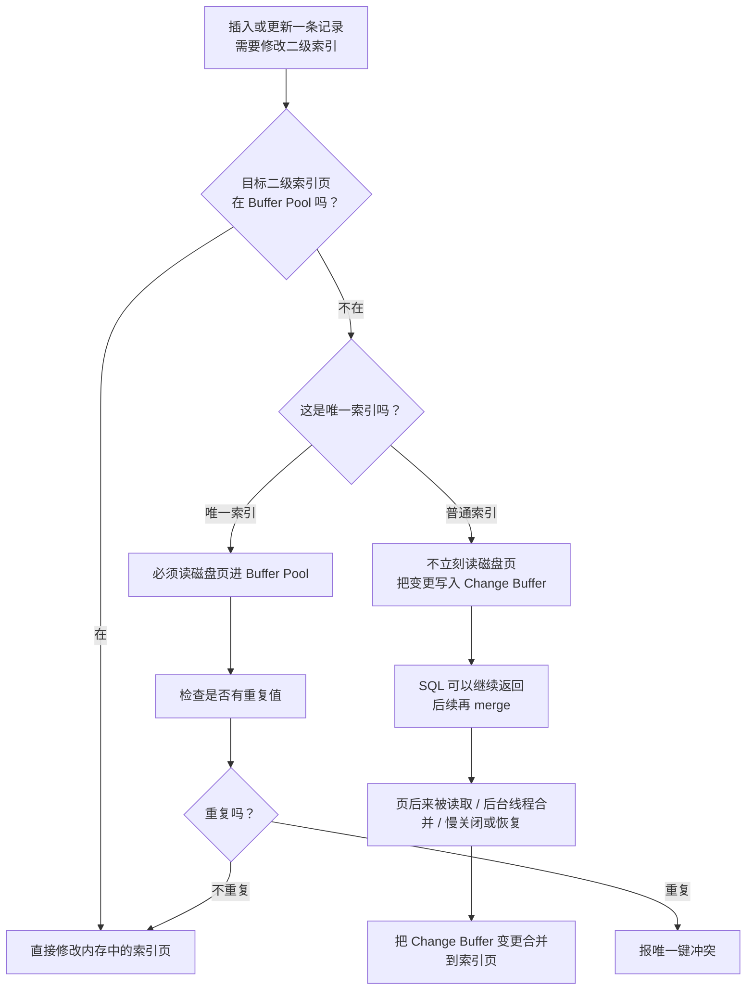

# M1-06 Change Buffer 是什么？为什么唯一索引不能用 Change Buffer？

分类：基础架构与存储引擎

材料类型：interview question / knowledge topic

难度：L2/L3

优先级：P0

关键词：Change Buffer、Buffer Pool、二级索引、唯一索引、普通索引、随机 I/O、merge

复习状态：已成稿

可视化页面：[m1-06-change-buffer-unique-index.html](m1-06-change-buffer-unique-index.html)

## 问题

Change Buffer 是什么？为什么唯一索引不能用 Change Buffer？

这道题表面问 Change Buffer，实际在考：

```text
普通二级索引写入为什么可能比唯一二级索引更快？
InnoDB 为什么可以延迟更新普通二级索引页？
唯一性约束为什么会破坏这个延迟优化？
```

## 先讲人话

把二级索引页想成一本很大的“目录”。插入一行数据时，如果这个目录页已经在内存里，直接改就行。

麻烦在于：目标目录页不在内存里。正常做法是先从磁盘把这个页读进 Buffer Pool，再修改它。但磁盘随机读很贵。

Change Buffer 的优化思路是：

```text
如果只是普通二级索引，不需要马上判断有没有重复值。
那就先别读磁盘页了，把“将来要改这个索引页”的操作记到 Change Buffer。
等以后这个索引页因为查询被读进内存，或者后台线程空闲时，再把修改合并进去。
```

唯一索引不行，因为插入唯一索引前必须立刻确认“这个值是不是已经存在”。要确认是否存在，就必须把对应索引页读到内存里检查。既然页已经读进来了，就直接更新页，没有必要再把修改缓存到 Change Buffer。

一句话：

```text
普通索引可以先欠账，唯一索引必须先查账。
```

## 前置概念

| 概念 | 小白解释 |
| --- | --- |
| Buffer Pool | InnoDB 的内存缓存，缓存数据页和索引页，减少磁盘 I/O。 |
| Page | InnoDB 管理数据的基本单位，默认 16KB。读写通常以页为单位，不是一行一行直接读磁盘。 |
| 二级索引 | 非主键索引。比如主键是 `id`，给 `email`、`status` 建的索引通常就是二级索引。 |
| 普通索引 | 不要求值唯一的索引。多个记录可以有同一个索引值。 |
| 唯一索引 | 要求索引值不能重复的索引。插入或更新时必须检查唯一性。 |
| Change Buffer | InnoDB 用来缓存部分二级索引变更的结构，等对应索引页进入 Buffer Pool 后再合并。 |
| merge | 把 Change Buffer 里暂存的索引变更，真正应用到对应二级索引页上的过程。 |

## 30 秒短答

Change Buffer 是 InnoDB 的一种写优化机制。它主要用于二级索引页不在 Buffer Pool 中的场景：如果要修改的是普通二级索引，InnoDB 可以不立刻从磁盘读入索引页，而是先把这次插入、删除标记或清理操作缓存到 Change Buffer。等以后这个页被读取到 Buffer Pool，或者后台线程合并时，再把变更应用到索引页上。

它的价值是减少随机磁盘 I/O，尤其适合数据量大、二级索引页不常驻内存、写多读少的场景。

唯一索引不能用 Change Buffer，核心原因是唯一索引写入前必须检查唯一性。为了判断有没有重复值，InnoDB 必须把目标索引页读到 Buffer Pool 中检查。既然页已经被读进内存了，就可以直接更新这个页，Change Buffer 也就没有省随机读的价值。

## 面试时可以直接这样回答

Change Buffer 是 InnoDB 针对二级索引写入的一种优化。因为二级索引的插入、删除、更新通常不是按索引页顺序发生的，如果每次修改一个不在 Buffer Pool 里的二级索引页，都要先从磁盘随机读入这个页，写入成本会很高。

所以 InnoDB 对普通二级索引做了延迟处理：当目标二级索引页不在 Buffer Pool 中时，可以先把这次索引变更记录到 Change Buffer，不马上读取磁盘页。等后续查询刚好需要这个索引页，把它读进 Buffer Pool 时，再把 Change Buffer 里的变更合并进去；后台线程在空闲时也可能做合并。这样可以避免大量立即发生的随机读，把多次离散修改攒到后面批量处理。

唯一索引不能这么做，是因为唯一索引有唯一性约束。插入或更新唯一索引值时，InnoDB 必须马上确认这个值是否已经存在。要做这个检查，就必须访问对应的索引页；如果页不在 Buffer Pool 中，也必须先从磁盘读进来。既然已经把页读到内存了，就直接修改索引页即可，Change Buffer 无法再省掉这次随机读。

所以普通索引和唯一索引在写性能上的关键差异是：普通索引可以延迟维护二级索引页，而唯一索引为了保证约束正确性，必须实时检查并更新。

## 先用一张图看懂



## 原理拆解

### 1. Change Buffer 优化的不是主键索引，而是二级索引

InnoDB 表的数据按聚簇索引组织。通常主键索引的叶子节点存完整行数据，二级索引的叶子节点存二级索引值和主键值。

Change Buffer 面向的是二级索引页。更准确地说，它缓存的是二级索引页上的变更，而不是缓存整行数据。

注意：不是所有索引都适合 Change Buffer。聚簇索引、全文索引、空间索引不属于这套优化的重点。

### 2. 为什么二级索引写入容易产生随机 I/O

假设有一张订单表：

```sql
create table orders (
  id bigint primary key,
  user_id bigint,
  status varchar(32),
  created_at datetime,
  index idx_user_id(user_id),
  index idx_status(status)
);
```

插入一条订单时，除了写主键索引，还要维护 `idx_user_id`、`idx_status` 这些二级索引。

主键如果是趋势递增的，写入位置可能比较集中。但二级索引值往往是分散的，比如不同用户、不同状态、不同时间范围对应不同索引页。目标二级索引页可能不在 Buffer Pool 中。

如果每次都立刻把目标索引页从磁盘读进内存，就会产生很多随机读。

### 3. 普通索引为什么可以先写 Change Buffer

普通索引允许重复值。

比如 `idx_status(status)` 里可以有很多 `PAID`、很多 `CREATED`。插入一个新的 `PAID` 时，InnoDB 不需要先确认“是否已经有 PAID”，因为有也没关系。

所以当目标普通二级索引页不在 Buffer Pool 中时，InnoDB 可以先记录一条类似这样的变更：

```text
将来把 (status = PAID, primary key = 1001) 插入到 idx_status 的某个索引页
```

这条变更先进入 Change Buffer，后续再合并到真正的索引页。

这个优化省掉的是：

```text
为了立刻修改二级索引页而发生的一次随机磁盘读
```

### 4. 唯一索引为什么不能先写 Change Buffer

唯一索引不允许重复值。

比如：

```sql
create unique index uk_email on users(email);
```

插入 `email = 'a@example.com'` 前，InnoDB 必须立刻知道这个 email 是否已经存在。

如果目标唯一索引页不在 Buffer Pool 中，InnoDB 不能说“先记到 Change Buffer，之后再查”。因为如果之后合并时才发现重复，前面的事务可能已经提交了，唯一性约束就被破坏了。

所以唯一索引必须走这条路径：

```text
读入目标唯一索引页
检查是否重复
不重复再插入
重复则报错
```

既然为了检查唯一性已经把页读进来了，就直接更新这个页。Change Buffer 最重要的收益，也就是“省一次随机读”，在这里不存在了。

### 5. 普通索引和唯一索引的写路径对比

| 场景 | 目标索引页在 Buffer Pool 中 | 目标索引页不在 Buffer Pool 中 |
| --- | --- | --- |
| 普通二级索引 | 直接修改内存页 | 可以写入 Change Buffer，后续再 merge |
| 唯一二级索引 | 检查唯一性后修改内存页 | 必须先从磁盘读页进 Buffer Pool，检查唯一性，再决定插入或报错 |

面试里要抓住这个对比：

```text
普通索引不需要马上判断重复，所以可以延迟。
唯一索引必须马上判断重复，所以不能延迟。
```

### 6. Change Buffer 的 merge 时机

常见 merge 时机：

1. 查询访问到对应二级索引页，这个页被读入 Buffer Pool 后，InnoDB 会把相关变更合并进去。
2. InnoDB 后台任务在系统相对空闲时做合并。
3. 慢关闭或崩溃恢复过程中，会继续处理已经持久化的 Change Buffer 变更。

面试中可以说“页被读入时和后台线程会触发 merge”。不要把它理解成只在事务提交时合并。事务提交后，Change Buffer 里的变更仍然可能还没有全部合并到最终二级索引页。

### 7. Change Buffer 的空间和配置

Change Buffer 在内存中占用 Buffer Pool 的一部分，在磁盘上属于系统表空间的一部分。

常见参数：

| 参数 | 作用 |
| --- | --- |
| `innodb_change_buffering` | 控制是否对 insert、delete mark、purge 等操作启用 Change Buffer。 |
| `innodb_change_buffer_max_size` | 控制 Change Buffer 最大占 Buffer Pool 的比例。 |

版本提醒：

1. 常见 MySQL 8.0 面试语境里，`innodb_change_buffering` 经常按默认 `all` 来记。
2. MySQL 8.4 官方文档中，`innodb_change_buffering` 默认值已经是 `none`，但可选值仍包括 `none`、`inserts`、`deletes`、`changes`、`purges`、`all`。
3. MySQL 8.4 中 `innodb_change_buffer_max_size` 默认值是 `25`，最大值是 `50`。

面试时不需要一上来背版本差异，除非面试官追问参数。核心仍然是机制：普通二级索引可以延迟，唯一索引必须检查唯一性。

## 结合项目怎么讲

可以结合写多读少的业务表来讲，例如日志表、操作记录表、状态流水表：

> 如果一张表写入很多，且有多个普通二级索引，而数据量又大到索引页不可能全部常驻 Buffer Pool，那么 Change Buffer 可以减少二级索引维护时的随机读。像日志类、流水类、操作记录类表，通常写多读少，这类场景更容易体现它的价值。

如果被问“业务能保证唯一，还要不要建唯一索引”，可以这样讲：

> 如果唯一性只是性能优化角度讨论，普通索引的写入可能更好，因为它可以利用 Change Buffer；唯一索引必须做唯一性检查，页不在内存时也要读页。但是生产设计不能只看性能。如果这个字段的唯一性是数据正确性的底线，比如用户邮箱、业务单号、幂等 key，数据库唯一索引能兜住并发和异常重试下的脏数据，通常不应该为了 Change Buffer 轻易去掉唯一约束。

项目里可以保守表达：

> 我会先判断这个唯一性是强约束还是业务侧可接受的弱约束。如果是强一致的业务身份字段，我倾向保留唯一索引；如果只是普通查询过滤字段，且写入压力大，可以用普通索引并关注 Buffer Pool、二级索引数量和写入放大。

## 常见场景

| 场景 | Change Buffer 是否更有价值 |
| --- | --- |
| 写多读少，二级索引页不常驻内存 | 价值较高，可以减少随机读。 |
| 全量数据和索引基本都在 Buffer Pool 中 | 价值较低，因为页本来就在内存里。 |
| 表上二级索引很多，DML 很频繁 | 可能有价值，但也要关注 merge 带来的后续 I/O。 |
| SSD 随机读很快，或者读写混合很高 | 收益可能下降，需要压测验证。 |
| 唯一索引、主键索引 | 不适合用 Change Buffer。 |

## 容易说错的点

1. 不要说 Change Buffer 缓存的是完整行数据。它缓存的是二级索引页的变更。
2. 不要说所有索引都能用 Change Buffer。重点是普通二级索引，不是主键索引，也不是唯一索引。
3. 不要说唯一索引不能用是因为“不支持”。面试要说出根因：必须立刻检查唯一性，所以必须读页。
4. 不要说 Change Buffer 一定提升性能。它减少前台随机读，但后续 merge 也会产生 I/O；如果数据集都在 Buffer Pool 里，收益就很小。
5. 不要为了写性能轻易把强业务约束从唯一索引改成普通索引。性能和数据正确性要分开判断。

## 高频追问

### 追问 1：如果业务能保证不会插入重复数据，建唯一索引还是普通索引性能更好？

只从写性能看，普通索引通常更好。因为普通二级索引在目标页不在 Buffer Pool 时可以使用 Change Buffer，避免立刻随机读页；唯一索引为了检查唯一性，必须读页。

从查询角度看，唯一索引和普通索引差异通常很小。唯一索引找到一条就可以停止，普通索引找到第一条后还需要判断下一条是否也满足条件，但这个差异一般不是主要矛盾。

不过真实项目里要补一句：

> 如果唯一性是数据正确性的强约束，不建议只为了写性能改成普通索引。业务层保证唯一在并发、重试、补偿任务、历史脏数据场景下更容易出问题。

### 追问 2：Change Buffer 和 Insert Buffer 有什么区别？

Insert Buffer 是 Change Buffer 的前身，早期主要针对二级索引插入做缓存。

MySQL 5.5 之后，能力扩展成 Change Buffer，不只覆盖 insert，还可以覆盖 delete mark 和 purge 等二级索引相关变更。可以简单记：

```text
Insert Buffer：只偏插入
Change Buffer：扩展到插入、删除标记、清理等变更
```

### 追问 3：Change Buffer 什么时候会带来负面影响？

如果写入很多、合并跟不上，Change Buffer 可能积累较多变更。后续查询读到相关索引页时，需要先 merge，查询可能变慢；后台 merge 也会增加磁盘 I/O。

另外，如果热点数据和索引基本都在 Buffer Pool 中，Change Buffer 的收益有限，因为它只在目标页不在 Buffer Pool 时才有明显价值。

### 追问 4：Change Buffer 和 redo log 是一回事吗？

不是。

| 组件 | 解决的问题 |
| --- | --- |
| Change Buffer | 减少二级索引页不在内存时的随机读，属于写性能优化。 |
| redo log | 保证事务提交后的修改在宕机后可以恢复，属于崩溃恢复机制。 |

Change Buffer 自身的变更也需要通过 redo log 保证崩溃恢复，但两者不是同一个概念。

## 复习要点

1. Change Buffer 只记住一句：普通二级索引页不在内存时，先缓存变更，后续再合并。
2. 它的核心收益：省掉立即读取二级索引页的一次随机 I/O。
3. 唯一索引不能用的核心原因：必须马上检查唯一性，必须读页。
4. 普通索引和唯一索引的写性能差异，主要出现在目标索引页不在 Buffer Pool 的时候。
5. 生产设计要区分性能优化和数据正确性，不要轻易把强唯一约束改成普通索引。

## 记忆口诀

```text
普通可欠账，唯一先查账。
页在直接改，页不在看索引。
普通写变更，后面再合并。
唯一要查重，读页不可省。
```

## 参考资料

- [MySQL 8.4 Reference Manual: Change Buffer](https://dev.mysql.com/doc/refman/8.4/en/innodb-change-buffer.html)
- [MySQL 8.4 Reference Manual: InnoDB Startup Options and System Variables](https://dev.mysql.com/doc/refman/8.4/en/innodb-parameters.html)
- [MySQL 8.4 FAQ: InnoDB Change Buffer](https://dev.mysql.com/doc/refman/8.4/en/faqs-innodb-change-buffer.html)
