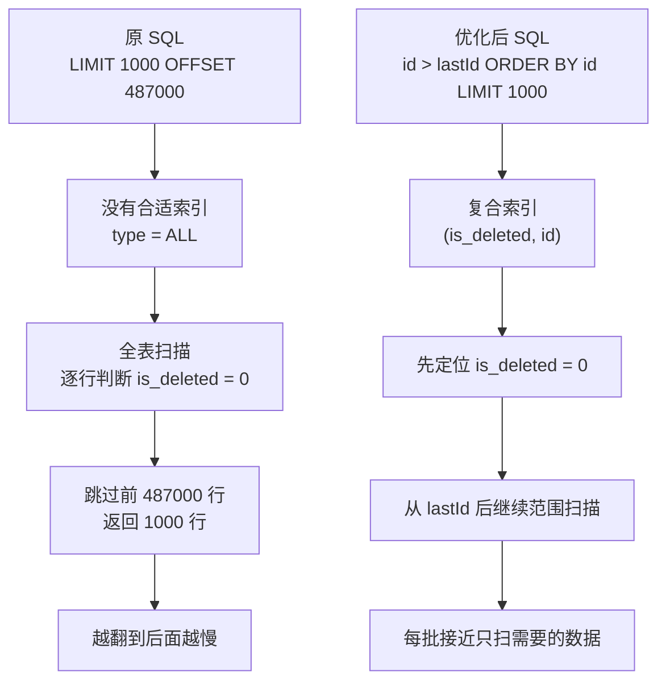

# M4-01 深分页慢查询怎么优化？为什么要改成游标分页并加复合索引？


可视化页面：[m4-01-deep-pagination-index-optimization.html](m4-01-deep-pagination-index-optimization.html)
分类：SQL 优化与执行计划

难度：L2/L3

优先级：P0

关键词：慢查询、EXPLAIN、全表扫描、深分页、OFFSET、游标分页、复合索引、回表

复习状态：已成稿

## 问题

面试官问：

> 你遇到过慢 SQL 吗？如果看到一条 `LIMIT 1000 OFFSET 487000` 的查询很慢，你会怎么优化？为什么？

这次项目里的慢 SQL 是：

```sql
SELECT *
FROM es_sync_config_tab
WHERE 1 = 1
  AND is_deleted = 0
LIMIT 1000 OFFSET 487000;
```

`EXPLAIN` 现象：

```text
type: ALL
possible_keys: NULL
key: NULL
rows: 807527
filtered: 10.00
Extra: Using where
```

核心优化点：

1. 把 `LIMIT ... OFFSET ...` 深分页改成基于主键的游标分页：`WHERE id > lastId ORDER BY id LIMIT 1000`。
2. 给查询条件补复合索引：`(is_deleted, id)`。

## 先讲人话

这条 SQL 慢，主要不是因为只返回 1000 行，而是因为它要先跳过前面 487000 行。

可以把 `OFFSET 487000` 理解成：

```text
先从头翻到第 487000 条，再拿后面 1000 条。
```

数据越往后，翻页成本越高。第一页可能很快，到了第 488 页就要反复扫大量前置数据。

游标分页的思路是换一种问法：

```text
不要问“跳过前 487000 条后给我 1000 条”
而是问“从上次最后一个 id 后面开始，给我 1000 条”
```

这样 MySQL 可以沿着主键或索引继续往后走，不需要每次从头数。

复合索引 `(is_deleted, id)` 的作用是给 MySQL 一条更明确的路：

```text
先找到 is_deleted = 0 的有效数据，再按 id 顺序往后取。
```

没有这个索引时，MySQL 只能全表扫描，再用 `WHERE is_deleted = 0` 一行行过滤。

## 前置概念

| 概念 | 小白解释 |
| --- | --- |
| 慢查询 | 执行时间超过阈值的 SQL，通常需要看扫描行数、索引使用和等待情况。 |
| EXPLAIN | MySQL 用来查看 SQL 执行计划的工具，可以看是否走索引、预计扫描多少行。 |
| 全表扫描 | 从表头扫到表尾，逐行判断是否符合条件。数据量大时成本高。 |
| 索引 | 类似书的目录，让数据库可以更快定位数据。InnoDB 常见索引底层是 B+ 树。 |
| 复合索引 | 多个字段一起组成的索引，例如 `(is_deleted, id)`。字段顺序会影响能否高效使用。 |
| 深分页 | 使用很大的 `OFFSET` 翻到很靠后的页面，比如 `OFFSET 487000`。 |
| 游标分页 | 记住上一页最后一条记录的位置，比如 `lastId`，下一页查 `id > lastId`。 |
| 回表 | 通过二级索引找到主键后，再回到聚簇索引取完整行。`SELECT *` 通常需要回表。 |

## 30 秒短答

这条 SQL 慢的原因有两个：第一，它没有可用索引，`EXPLAIN` 里 `type = ALL`、`key = NULL`，说明在全表扫描；第二，它用了很大的 `OFFSET`，MySQL 即使只返回 1000 行，也要先扫描并丢弃前面 487000 行，越翻到后面越慢。

优化上我会把深分页改成游标分页，比如 `WHERE id > ? AND is_deleted = 0 ORDER BY id LIMIT 1000`，每次用上一批最后一个 `id` 继续查。然后加 `(is_deleted, id)` 复合索引，让 MySQL 能先按 `is_deleted` 过滤，再按 `id` 做范围扫描。这样扫描量从几十万行级别下降到接近每批 1000 行级别。

## 面试时可以直接这样回答

我遇到过一个配置表加载场景的慢 SQL。原查询是按 `is_deleted = 0` 过滤，然后用 `LIMIT 1000 OFFSET 487000` 分批拉取。`EXPLAIN` 显示 `type = ALL`、`possible_keys = NULL`、`key = NULL`、预计扫描 80 多万行，这说明 MySQL 没有合适索引，只能全表扫描再做过滤。

这个 SQL 有两个问题。第一个是深分页，`OFFSET 487000` 并不是直接跳到第 487000 行，而是要先读出并丢弃前面的记录，再返回后面的 1000 行。所以越往后翻页，扫描成本越高。第二个是过滤条件 `is_deleted = 0` 没有合适索引，MySQL 没有办法快速定位有效数据。

我的优化是把分页方式从 offset 分页改成游标分页。代码里记录上一批最后一条记录的 `id`，下一批查：

```sql
SELECT *
FROM es_sync_config_tab
WHERE id > ?
  AND is_deleted = 0
ORDER BY id
LIMIT 1000;
```

这样每次都从上一次结束的位置继续往后读，避免反复扫描和丢弃前面的几十万行。

同时建议加复合索引：

```sql
ALTER TABLE es_sync_config_tab
ADD INDEX idx_es_sync_config_deleted_id (is_deleted, id);
```

这个索引的顺序是有原因的：`is_deleted` 是等值过滤条件，放在前面可以先缩小到未删除数据；`id` 放在后面，可以继续支持 `id > ?` 的范围扫描和 `ORDER BY id`。虽然 `SELECT *` 可能还需要回表，但回表的行数主要是当前批次的 1000 行，而不是几十万行。

总结来说，这次优化不是单纯“加个索引”，而是同时解决了访问路径和分页模型两个问题：索引负责让 MySQL 找数据更快，游标分页负责避免深分页反复跳过大量数据。

## 先用一张图看懂



## 原理拆解

### 1. EXPLAIN 里这些字段说明了什么

原执行计划里最关键的是：

```text
type = ALL
possible_keys = NULL
key = NULL
rows = 807527
filtered = 10.00
Extra = Using where
```

可以这样理解：

| 字段 | 含义 | 这次说明什么 |
| --- | --- | --- |
| `type = ALL` | 访问类型是全表扫描 | MySQL 几乎要从头扫到尾。 |
| `possible_keys = NULL` | 优化器认为没有可用索引 | 当前条件没有匹配到能用的索引。 |
| `key = NULL` | 实际没有使用索引 | 最终执行也没有走索引。 |
| `rows = 807527` | 预计要扫描的行数 | 扫描规模接近全表。 |
| `filtered = 10.00` | 预计过滤后保留比例 | 大量扫描出来的行会被过滤掉。 |
| `Using where` | 需要执行 WHERE 过滤 | 不是直接从索引拿到最终结果。 |

这里的信号很明确：不是小范围索引扫描，而是大范围扫描后过滤。

### 2. 为什么 `OFFSET` 深分页慢

很多人会误以为：

```sql
LIMIT 1000 OFFSET 487000
```

意思是 MySQL 可以瞬间跳到第 487000 行。

实际更接近：

```text
读取符合条件的前 488000 行
丢弃前 487000 行
返回后 1000 行
```

所以第 1 页：

```sql
LIMIT 1000 OFFSET 0
```

只需要拿前 1000 行。

但第 488 页：

```sql
LIMIT 1000 OFFSET 487000
```

需要处理接近 488000 行。

如果程序从第 1 页循环查到最后一页，每一页都用 offset，整体成本会变成：

```text
第 1 页扫 1000
第 2 页扫 2000
第 3 页扫 3000
...
第 488 页扫 488000
```

后面的页会越来越重。

### 3. 为什么游标分页能优化

游标分页要记住上一批最后一条数据的位置：

```text
lastId = 上一批最后一条记录的 id
```

下一批直接查：

```sql
SELECT *
FROM es_sync_config_tab
WHERE id > ?
  AND is_deleted = 0
ORDER BY id
LIMIT 1000;
```

它的优势是：

1. 不需要跳过前面已经读过的数据。
2. `id > ?` 是范围条件，可以沿着索引往后扫描。
3. `ORDER BY id` 保证每批结果顺序稳定，不容易漏数据或重复读。

这类查询适合后台批量加载、数据迁移、全量扫描、任务分批处理。

但要注意：游标分页适合“下一页、下一批”这种连续读取，不适合用户随便跳到第 500 页的产品需求。如果要随机跳页，仍然要结合其他方案。

### 4. 为什么索引是 `(is_deleted, id)`，不是只加 `is_deleted`

原条件是：

```sql
WHERE is_deleted = 0
```

优化后的条件是：

```sql
WHERE id > ?
  AND is_deleted = 0
ORDER BY id
```

如果只加 `is_deleted` 索引，MySQL 可以找到 `is_deleted = 0` 的数据，但仍然可能要在这些数据里处理排序和范围过滤。由于 `is_deleted` 通常只有 0 和 1 两种值，区分度很低，单独建索引的效果有限。

复合索引 `(is_deleted, id)` 更适合这个查询：

```text
第一列 is_deleted：等值过滤，先定位未删除数据
第二列 id：范围扫描，继续找 id > lastId 的数据，并天然按 id 有序
```

它对应的索引扫描逻辑类似：

```text
在索引里找到 is_deleted = 0 且 id > lastId 的位置
从这个位置开始向后读 1000 条
```

这比全表扫描后再过滤要直接得多。

### 5. 为什么还要保留 `ORDER BY id`

游标分页一定要有稳定顺序，否则每次查询返回顺序可能不稳定。

如果没有 `ORDER BY id`，即使使用了 `id > lastId`，MySQL 也不承诺返回顺序一定是主键顺序。实际中可能看起来是稳定的，但不能依赖这个偶然现象。

所以推荐写成：

```sql
WHERE id > ?
ORDER BY id
LIMIT ?
```

这样 `lastId` 才有明确含义：上一批结果中最大的 `id`。

### 6. `SELECT *` 还有没有问题

有问题，但不是这次的第一优先级。

如果查询只需要少量字段，最好不要 `SELECT *`，因为：

1. 读取列越多，网络传输越多。
2. 大字段会增加 IO 和内存压力。
3. 如果字段都在索引里，可以走覆盖索引，避免回表。

但这个场景需要加载完整配置内容，`content` 字段本身就要取出来，所以 `SELECT *` 可以先保留。关键是让 MySQL 先用索引定位到当前批次，再回表取完整行。

## 结合项目怎么讲

这次可以结合 `canal-adapter` 里的配置加载来讲。

项目中 `EsSyncConfigDAO.query` 会从 `es_sync_config_tab` 批量加载 ES 同步配置。因为配置表数据量增长到了几十万级，原来的 offset 分页在靠后页会出现慢查询：

```sql
SELECT *
FROM es_sync_config_tab
WHERE is_deleted = 0
LIMIT 1000 OFFSET 487000;
```

我通过 `EXPLAIN` 看到它没有走索引，访问类型是 `ALL`，预计扫描 80 多万行。这个执行计划说明慢点不在返回 1000 行，而在全表扫描和深分页丢弃大量行。

代码层面我把分页改成了主键游标分页：

```java
int lastId = 0;

SELECT *
FROM es_sync_config_tab
WHERE id > ?
  AND is_deleted = 0
ORDER BY id
LIMIT ?;
```

每次读取一批后，把最后一条记录的 `id` 作为下一批的 `lastId`。这样全量加载配置时，不会每一批都从表头重新跳过大量数据。

数据库层面建议加：

```sql
ALTER TABLE es_sync_config_tab
ADD INDEX idx_es_sync_config_deleted_id (is_deleted, id);
```

这样 MySQL 能按照 `is_deleted = 0` 和 `id > lastId` 做索引范围扫描。后续应该用新的 SQL 再跑一次 `EXPLAIN`，期望看到不再是 `type = ALL`，而是走 `idx_es_sync_config_deleted_id`，扫描行数明显下降。

## 常见场景

1. 后台管理页面翻到很靠后的页。
2. 定时任务分批扫描大表。
3. 数据迁移、数据校验、配置全量加载。
4. 导出大量数据时用 `LIMIT/OFFSET` 一页页导出。

这些场景里，如果不需要随机跳页，优先考虑游标分页。

## 容易说错的点

1. 不要说 `LIMIT 1000` 就只扫描 1000 行。带大 `OFFSET` 时，MySQL 还要处理前面被跳过的行。
2. 不要只说“加索引就行”。如果继续用深分页，后面页仍然会有跳过大量索引记录的成本。
3. 不要只给 `is_deleted` 单列索引。`is_deleted` 区分度低，通常要结合排序字段或范围字段建复合索引。
4. 游标分页需要稳定排序字段，不能省略 `ORDER BY id`。
5. `SELECT *` 可能导致回表，但这次核心收益来自减少扫描行数，不是覆盖索引。

## 高频追问

### 追问 1：为什么 `(is_deleted, id)` 的顺序不能反过来？

这条 SQL 同时有：

```sql
is_deleted = 0
id > ?
ORDER BY id
```

`is_deleted` 是等值条件，`id` 是范围条件。复合索引常见设计原则是：等值条件放前面，范围和排序字段放后面。

`(is_deleted, id)` 可以先定位 `is_deleted = 0` 这段索引，再在其中按 `id` 向后扫。

如果是 `(id, is_deleted)`，MySQL 可以按 `id > ?` 扫，但 `is_deleted = 0` 只能在扫描过程中继续过滤。对“只取未删除数据”这个目标来说，不如 `(is_deleted, id)` 贴合。

### 追问 2：加了 `(is_deleted, id)` 后一定不会回表吗？

不一定。

因为 SQL 是 `SELECT *`，而索引里只有 `is_deleted` 和 `id`，其他字段比如 `name`、`content`、`md5` 不在这个索引里。MySQL 通过二级索引找到主键后，通常还需要回到聚簇索引取完整行，这叫回表。

但优化仍然有效，因为回表数量主要是当前批次返回的 1000 行，而不是先扫描几十万行再过滤。

### 追问 3：游标分页有什么限制？

它不适合随机跳页，比如用户直接输入“跳到第 500 页”。因为它依赖上一页最后一个 `id`。

它更适合：

1. 后台任务连续扫描。
2. 无限滚动列表。
3. 数据导出。
4. 数据同步和迁移。

另外，如果分页过程中有新数据插入或旧数据删除，要结合业务要求判断是否允许本次扫描看到这些变化。对配置全量加载这类场景，一般按主键递增扫描是可接受的。

### 追问 4：如果 `id` 不连续，会不会漏数据？

不会。

`id > lastId` 不要求 `id` 连续。比如上一批最后是 `1000`，下一条可能是 `1005`，查询 `id > 1000` 仍然能读到 `1005`。

真正需要注意的是排序字段必须唯一且稳定。主键 `id` 通常满足这个要求。

## 记忆口诀

```text
慢分页，看两点：
一看 EXPLAIN 有没有全表扫；
二看 OFFSET 是否很深。

优化两步走：
OFFSET 改游标，避免反复跳过；
条件加复合索引，减少扫描范围。
```
