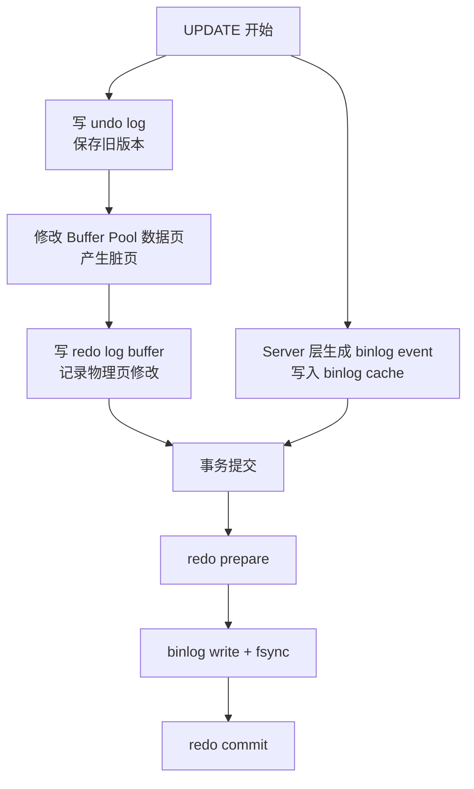

# M5-01 redo log、undo log 和 binlog 各自的作用是什么？它们之间是什么关系？


可视化页面：[m5-01-redo-undo-binlog.html](m5-01-redo-undo-binlog.html)
分类：日志、复制与高可用

难度：L2/L3

优先级：P0

关键词：redo log、undo log、binlog、WAL、Buffer Pool、两阶段提交、崩溃恢复、主从复制

复习状态：已成稿

来源题号：LC100 M4-01

## 问题

`redo log`、`undo log` 和 `binlog` 分别解决什么问题？一条 `UPDATE` 执行时，它们之间怎么配合？

## 面试官考察点

这道题主要考察你能不能把三类日志的边界讲清楚。很多人会把 `redo log` 和 `binlog` 都说成“记录 SQL 的日志”，这就是高风险错误。

面试官通常想听到：

1. `redo log` 是 InnoDB 引擎层日志，用于崩溃恢复。
2. `undo log` 是 InnoDB 引擎层日志，用于回滚和 MVCC。
3. `binlog` 是 Server 层日志，用于主从复制和归档恢复。
4. `redo log` 和 `binlog` 需要两阶段提交保证一致。

## 先讲人话

可以把一次事务理解成“改账本”：

1. `undo log` 像后悔药：改之前先记下旧值，后面要回滚就按旧值恢复。
2. `redo log` 像保险单：账本页还没真正写回磁盘，只要保险单落盘，宕机后也能重新补上。
3. `binlog` 像流水档案：记录这笔业务变更，给从库同步，也给以后按时间点恢复数据用。

所以三者不是互相替代，而是各管一块。

## 前置概念

| 概念 | 小白解释 |
| --- | --- |
| InnoDB 引擎层 | 真正负责数据页、索引、事务、锁、Buffer Pool 的存储引擎。 |
| Server 层 | MySQL 通用层，负责 SQL 解析、优化、执行调度、binlog。 |
| 物理日志 | 记录“某个数据页的某个位置怎么改”，更贴近磁盘页。 |
| 逻辑日志 | 记录“执行了什么业务变更”，如一条 SQL 或一行数据变化。 |
| Buffer Pool | InnoDB 的内存缓存，数据页先在内存里修改。 |
| 脏页 | 内存里已经改了、磁盘上还没改的数据页。 |
| 崩溃恢复 | MySQL 异常宕机重启后，把数据恢复到一致状态。 |

## 30 秒短答

`redo log` 是 InnoDB 的物理重做日志，用于保证事务持久性和崩溃恢复；`undo log` 是 InnoDB 的回滚日志，记录旧版本，用于事务回滚和 MVCC；`binlog` 是 Server 层的逻辑归档日志，用于主从复制和按时间点恢复。

一条 `UPDATE` 会先写 `undo log` 保存旧值，再修改 Buffer Pool 里的数据页并写 `redo log`，Server 层同时记录 `binlog`。事务提交时通过两阶段提交让 `redo log` 和 `binlog` 对同一个事务保持一致。

## 面试时可以直接这样回答

这三个日志分别解决不同问题。

`undo log` 记录修改前的旧版本。比如把 `name` 从 `A` 改成 `B`，undo 里会记录原来的值。它有两个作用：事务回滚时按旧值恢复；快照读时通过版本链读到历史版本，所以它也是 MVCC 的基础。

`redo log` 是 InnoDB 的物理日志，记录数据页层面的修改。InnoDB 修改数据时通常先改 Buffer Pool 中的数据页，数据页变成脏页，不会马上刷回磁盘。只要提交时 redo log 已经刷盘，即使 MySQL 宕机，重启后也能根据 redo log 把已提交事务的修改重新做一遍。

`binlog` 是 Server 层的逻辑日志，记录所有数据变更。它主要用于主从复制、数据订正和按时间点恢复。它和 redo log 最大区别是层次、内容和用途不同：redo 是 InnoDB 独有、物理日志、循环写；binlog 是 Server 层、逻辑日志、追加写。

一条 `UPDATE` 的配合关系是：先写 undo 保存旧值，修改 Buffer Pool 中的数据页，写 redo log buffer；Server 层生成 binlog event。提交时先把 redo 写成 prepare，再刷 binlog，最后把 redo 标记 commit。这样崩溃恢复时可以根据 redo 状态和 binlog 是否完整判断事务该提交还是回滚。

## 先用一张图看懂



## 三类日志对比

| 维度 | redo log | undo log | binlog |
| --- | --- | --- | --- |
| 所属层次 | InnoDB 引擎层 | InnoDB 引擎层 | Server 层 |
| 日志类型 | 物理日志 | 逻辑旧版本日志 | 逻辑变更日志 |
| 核心作用 | 崩溃恢复、持久性 | 回滚、MVCC | 主从复制、归档恢复、审计 |
| 写入方式 | 固定文件循环写 | 写入 undo 表空间/段 | 追加写 |
| 是否长期保留 | 不是，循环覆盖 | 事务结束后可被 purge | 可以按保留策略归档 |
| 典型追问 | 为什么 crash-safe | 如何支持 MVCC | Row/Statement 怎么选 |

## 原理拆解

### 1. 为什么 `undo log` 要先写

事务还没提交时，可能发生两件事：

1. 用户主动 `ROLLBACK`。
2. MySQL 崩溃，重启后发现事务没有提交。

这两种情况都需要知道“改之前是什么样子”。`undo log` 就是旧版本记录。

它不仅用于回滚，还用于 MVCC。一个事务做快照读时，如果当前行版本对它不可见，就可以沿着 undo 版本链找到它应该看到的历史版本。

### 2. 为什么 `redo log` 不是记录 SQL

`redo log` 面向的是崩溃恢复。崩溃恢复最关心的是：哪些数据页修改已经提交但还没写回磁盘。

如果只记录 SQL，恢复时要重新执行 SQL，可能遇到执行计划变化、函数不确定、上下文缺失等问题。而 redo 记录的是页级修改，可以更直接地把数据页恢复到正确状态。

### 3. 为什么 `binlog` 不能替代 `redo log`

`binlog` 主要服务于复制和归档，它不是 InnoDB 的页级恢复日志。

原因有三个：

1. `binlog` 是逻辑日志，不记录 Buffer Pool 脏页的物理状态。
2. `binlog` 在 Server 层，不知道 InnoDB 内部数据页细节。
3. 崩溃恢复需要从 checkpoint 后快速恢复脏页，redo 更合适。

## 结合项目怎么讲

如果被问到项目经验，可以这样讲：

> 在项目里我会把这三个日志对应到不同风险：redo 关系到单机崩溃后能不能恢复已提交事务；binlog 关系到主从复制、数据订正和按时间点恢复；undo 关系到事务回滚和长事务对版本链的影响。排查数据一致性问题时，我会先看事务提交是否成功、binlog 是否完整、主从是否延迟，再结合业务侧是否有重试或幂等问题。

项目事实需要补充：

- 待补充：你实际接触的 MySQL 版本。
- 待补充：是否配置主从、是否使用 binlog 做数据订正。
- 待补充：是否遇到过长事务、主从延迟、误删恢复。

## 容易说错的点

1. 说 `binlog` 用于 InnoDB 崩溃恢复。
2. 说 `redo log` 记录的是 SQL。
3. 说 `undo log` 只用于回滚，漏掉 MVCC。
4. 说三者都是 InnoDB 层日志。
5. 说事务提交后数据页一定已经刷到磁盘。

## 高频追问

### 追问 1：为什么有了 binlog 还需要 redo log？

因为 `binlog` 不具备 InnoDB 数据页级别的 crash-safe 能力。崩溃恢复要恢复的是 Buffer Pool 中已提交但未刷盘的脏页，`redo log` 记录页级修改，更快更准确。

### 追问 2：为什么有了 redo log 还需要 binlog？

因为 `redo log` 是 InnoDB 独有并且循环写，会覆盖旧日志，不能用于长期归档和主从复制。`binlog` 是追加写，能保留完整逻辑变更历史。

### 追问 3：一条 UPDATE 的日志顺序是什么？

可以简化为：

```text
写 undo -> 改 Buffer Pool -> 写 redo log buffer -> 写 binlog cache ->
提交时 redo prepare -> binlog 刷盘 -> redo commit
```

## 记忆口诀

```text
undo 记旧值，redo 保崩溃，binlog 做复制；
undo 管回滚，redo 管恢复，binlog 管归档。
```

