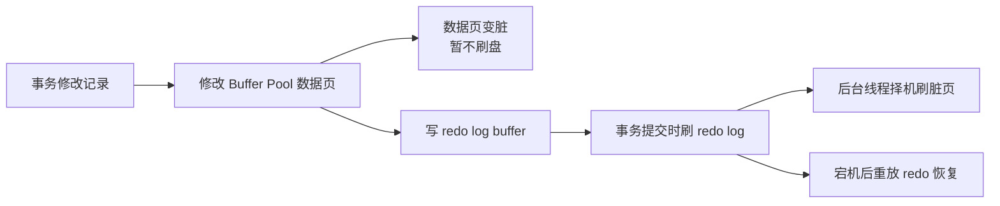

# M5-02 WAL 机制的原理是什么？为什么顺序写日志比随机写数据页快？


可视化页面：[m5-02-wal.html](m5-02-wal.html)
分类：日志、复制与高可用

难度：L2/L3

优先级：P0

关键词：WAL、redo log、脏页、顺序写、随机写、checkpoint、group commit

复习状态：已成稿

来源题号：LC100 M4-02

## 问题

MySQL/InnoDB 为什么采用 WAL？为什么事务提交时不直接把数据页刷盘，而是先刷 redo log？

## 先讲人话

如果每次转账都立刻翻开巨大账本找到对应页、擦掉再重写，速度会很慢。更好的方式是先在流水本上顺序记一笔：“第几页改了什么”。只要流水本安全落盘，真正的大账本可以晚点统一整理。

`WAL` 就是这个思路：先写日志，再写数据页。

## 前置概念

| 概念 | 小白解释 |
| --- | --- |
| WAL | Write-Ahead Logging，先写日志，再写数据页。 |
| redo log | WAL 在 InnoDB 中的核心载体。 |
| 脏页 | Buffer Pool 中已修改但未刷回磁盘的数据页。 |
| 顺序写 | 在日志文件末尾连续追加，磁盘寻址成本低。 |
| 随机写 | 数据页分散在磁盘不同位置，写入前要定位位置。 |
| checkpoint | 表示哪些 redo 对应的脏页已经刷盘，之前的 redo 空间可以复用。 |
| group commit | 多个事务合并一次 fsync，降低磁盘同步次数。 |

## 30 秒短答

WAL 的核心是先把修改写入 redo log 并刷盘，再把数据页异步刷盘。这样事务提交只需要等待一小段顺序写日志，而不用等待分散的数据页随机写。

它的好处有三个：第一，顺序写比随机写快；第二，同一数据页多次修改可以合并成一次刷盘；第三，多个事务可以通过组提交合并 fsync。只要 redo log 落盘，崩溃后就能重放 redo 恢复已提交事务。

## 面试时可以直接这样回答

WAL 是 InnoDB 保证性能和持久性的核心机制。InnoDB 修改数据时，先在 Buffer Pool 里修改数据页，数据页变成脏页；然后把这次修改写到 redo log。事务提交时，只需要确保 redo log 按刷盘策略落盘，数据页可以由后台线程之后再刷。

这样做比每次提交都刷数据页快很多。因为数据页通常分散在不同位置，刷数据页是随机写，而且一个页 16KB；redo log 是顺序追加写，内容也更小。更重要的是，如果同一个数据页在短时间内被改了很多次，最终只需要刷一次最新页，而不是每次修改都刷盘。

另外，MySQL 还能用 group commit，把多个事务的 redo fsync 合并成一次，进一步降低 IO 次数。代价是 redo log 空间有限，如果写入太快、checkpoint 推进太慢，redo log 写满后会阻塞更新并强制刷脏页。

## 先用一张图看懂



## 原理拆解

### 1. 为什么随机写数据页慢

InnoDB 的数据以页为单位存放，默认一页 `16KB`。一次事务可能修改多个页，这些页在磁盘上可能相距很远。

如果事务提交时必须把所有脏页刷盘，就会出现：

1. 写入位置分散。
2. 每个页都要完整写入。
3. 多事务并发时 IO 抖动明显。

这就是随机写成本高的原因。

### 2. 为什么顺序写 redo 快

redo log 是固定文件组上的循环写，写入路径接近追加写：

```text
write pos 向前推进 -> 写 redo record -> 必要时 fsync
```

顺序写的好处是磁盘定位成本低，操作系统和硬件也更容易合并写入。

### 3. WAL 如何合并多次修改

假设同一个数据页被连续改了 10 次：

```text
无 WAL：可能刷 10 次数据页
有 WAL：写 10 次 redo，最终数据页刷 1 次最新状态
```

这就是写入合并。对热点页、频繁更新场景很重要。

### 4. redo log 写满会怎样

redo log 是循环写的，有两个关键位置：

| 位置 | 含义 |
| --- | --- |
| `write pos` | 当前 redo 写到哪里。 |
| `checkpoint` | checkpoint 前的 redo 对应脏页已刷盘，可以覆盖。 |

如果 `write pos` 追上 `checkpoint`，说明 redo 空间满了。MySQL 必须暂停或拖慢更新，先刷一批脏页推进 checkpoint。

这就是为什么生产环境 redo log 太小会导致写入毛刺。

## 结合项目怎么讲

可以这样落到项目：

> 在写入高峰时，我会关注 redo log 空间、checkpoint 推进、脏页比例和磁盘 fsync 延迟。如果出现周期性写入卡顿，不只看 SQL 本身，也会怀疑 redo log 太小、刷脏页压力大或者磁盘同步延迟高。

待补充：

- 实际 MySQL 实例是否出现过写入抖动。
- 是否看过 `SHOW ENGINE INNODB STATUS` 或监控中的 checkpoint/dirty page 指标。

## 容易说错的点

1. 说 WAL 是不刷数据页。正确说法是“不在事务提交时同步刷所有数据页，后台仍然会刷”。
2. 说 redo log 永远追加写。正确说法是固定大小循环写。
3. 说事务提交只写内存。是否刷盘取决于 `innodb_flush_log_at_trx_commit`。
4. 忽略 redo log 写满会阻塞更新。

## 高频追问

### 追问 1：redo log 写满了怎么办？

MySQL 会推进 checkpoint，也就是把一批脏页刷回磁盘，释放 redo log 空间。此时更新请求可能明显变慢，甚至短时间被阻塞。

### 追问 2：group commit 是什么？

多个事务提交时，不是每个事务都单独 fsync，而是把一组事务的日志合并为一次 fsync。这样吞吐更高，但可能带来极小等待。

### 追问 3：WAL 会不会丢数据？

WAL 本身是保证已提交事务不丢的机制。是否丢数据取决于刷盘参数。如果每次提交 redo 都 fsync，安全性最高；如果放宽刷盘，系统宕机可能丢最近一小段事务。

## 记忆口诀

```text
提交先保 redo，脏页慢慢刷；
顺序写换随机写，group commit 降 fsync。
```

