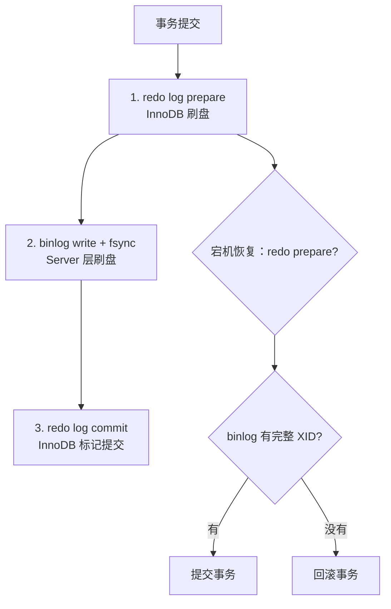

# M5-03 两阶段提交是怎么保证 redo log 和 binlog 一致性的？崩溃恢复时怎么判断？


可视化页面：[m5-03-two-phase-commit.html](m5-03-two-phase-commit.html)
分类：日志、复制与高可用

难度：L3

优先级：P0

关键词：两阶段提交、redo prepare、redo commit、binlog、XID、崩溃恢复、主从一致性

复习状态：已成稿

来源题号：LC100 M4-03

## 问题

`redo log` 和 `binlog` 是两个不同日志系统。MySQL 如何保证它们对同一个事务保持一致？如果提交过程中宕机，恢复时怎么判断事务该提交还是回滚？

## 先讲人话

MySQL 有两本关键账：

1. InnoDB 的 `redo log`：决定主库重启后数据页怎么恢复。
2. Server 层的 `binlog`：决定从库和备份恢复能看到哪些变更。

如果两本账记得不一样，就会出现主库和从库不一致。两阶段提交就是让这两本账对同一笔事务达成一致。

## 前置概念

| 概念 | 小白解释 |
| --- | --- |
| redo prepare | InnoDB 先把 redo 写好，但事务暂时不算最终提交。 |
| binlog fsync | Server 层把 binlog 写入并同步到磁盘。 |
| redo commit | binlog 成功后，InnoDB 把 redo 标记为提交。 |
| XID | 事务 ID，用来关联 redo log 和 binlog 中的同一个事务。 |
| crash-safe | 宕机重启后仍能恢复到一致状态。 |

## 30 秒短答

两阶段提交流程是：先写 `redo log prepare`，再写并刷 `binlog`，最后写 `redo log commit`。崩溃恢复时，如果 redo 是 commit 状态，直接提交；如果 redo 是 prepare 状态，就检查 binlog 里是否有完整事务记录，有则提交，无则回滚。

binlog 刷盘成功被当成事务提交的重要判断标准，因为 binlog 一旦完整，就可能被从库或恢复流程消费。主库必须和 binlog 保持一致，否则会主从不一致。

## 面试时可以直接这样回答

两阶段提交解决的是 redo log 和 binlog 不一致的问题。redo log 属于 InnoDB，binlog 属于 Server 层，它们不是一个日志。如果没有协调，可能出现 redo 写成功但 binlog 没写，主库崩溃恢复后有数据，从库却没有；也可能 binlog 写成功但 redo 没提交，主从结果不一致。

MySQL 的做法是把提交拆成三个关键步骤：第一，InnoDB 写 redo log，并标记为 prepare；第二，Server 层写 binlog 并刷盘；第三，InnoDB 把 redo 标记为 commit。

崩溃恢复时，如果看到 redo 已经 commit，说明事务确定提交。如果 redo 只有 prepare，就通过 XID 去 binlog 里找对应事务：binlog 完整就提交 redo；binlog 不完整或没有，就回滚事务。这样可以保证主库恢复后的结果和 binlog 代表的复制结果一致。

## 先用一张图看懂



## 崩溃点推演

| 崩溃时间点 | redo 状态 | binlog 状态 | 恢复决策 | 原因 |
| --- | --- | --- | --- | --- |
| redo prepare 前宕机 | 没有 prepare | 没有 | 回滚/忽略 | 事务没有进入提交阶段。 |
| redo prepare 后、binlog 前宕机 | prepare | 没有完整记录 | 回滚 | binlog 不存在，从库也不会有这笔变更。 |
| binlog 写入中宕机 | prepare | 不完整 | 回滚 | 不完整 binlog 不能作为提交依据。 |
| binlog 完整后、redo commit 前宕机 | prepare | 完整 XID | 提交 | binlog 已经代表事务成功，主库必须跟它一致。 |
| redo commit 后宕机 | commit | 完整 | 提交 | 正常已提交事务。 |

## 原理拆解

### 1. 为什么不能只写 redo 再写 binlog

如果先提交 redo，再写 binlog，中间宕机：

```text
主库恢复：根据 redo 有这条数据
从库恢复：没有 binlog，所以没有这条数据
```

结果就是主从不一致。

### 2. 为什么不能只写 binlog 再写 redo

如果 binlog 写成功，redo 没写成功，中间宕机：

```text
从库可能已经拿到 binlog
主库恢复却没有这条数据
```

仍然会主从不一致。

### 3. 为什么 prepare 状态要看 binlog

`redo prepare` 表示 InnoDB 已经做好提交准备，但还要等 Server 层的 binlog 成功。

binlog 完整说明这笔事务已经进入复制/归档体系。为了让主库和从库一致，恢复时必须提交它。

## 结合项目怎么讲

可以这样结合项目：

> 如果线上出现主从数据不一致，我会优先区分是业务重试/幂等问题，还是数据库复制链路问题。数据库层面会看 binlog 是否完整、从库 relay log 是否执行、主从位点和延迟。两阶段提交本身解决的是单事务在主库 redo 和 binlog 之间的一致性，但不代表从库一定实时同步。

待补充：

- 是否有主从延迟监控。
- 是否做过 binlog 位点恢复。
- 是否遇到过从库延迟导致读到旧数据。

## 容易说错的点

1. 说 redo prepare 就代表事务已经提交。
2. 说 binlog 不完整也可以重放。
3. 忽略 XID 关联 redo 和 binlog。
4. 说两阶段提交解决了所有主从延迟问题。它只解决提交一致性，不解决异步复制延迟。

## 高频追问

### 追问 1：为什么 binlog 写成功后，redo prepare 的事务要提交？

因为 binlog 已经可能被从库或备份恢复流程消费。如果主库回滚，从库却执行了这条 binlog，就会主从不一致。

### 追问 2：两阶段提交是不是分布式事务的 2PC？

思想类似，都是协调两个参与方的一致性。但这里的参与方是 MySQL 内部的 InnoDB redo 和 Server 层 binlog，不是跨服务的分布式事务协调器。

### 追问 3：性能问题怎么优化？

核心是 group commit。多个事务可以合并 redo fsync 和 binlog fsync，降低每个事务独立刷盘的成本。

## 记忆口诀

```text
先 prepare，后 binlog，最后 commit；
prepare 遇崩溃，binlog 有就提交，没有就回滚。
```

