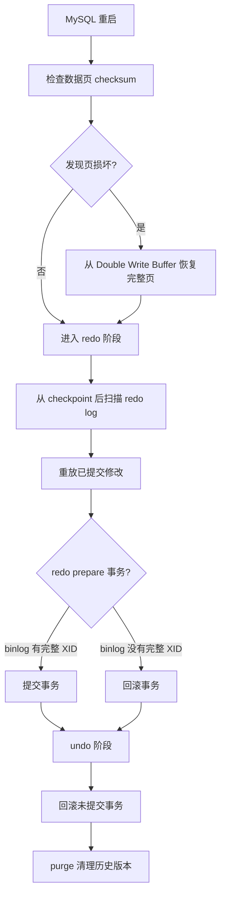

# M5-05 MySQL 崩溃恢复的完整流程是怎样的？


可视化页面：[m5-05-crash-recovery.html](m5-05-crash-recovery.html)
分类：日志、复制与高可用

难度：L3

优先级：P0

关键词：Crash Recovery、redo、undo、checkpoint、doublewrite、两阶段提交、purge、长事务

复习状态：已成稿

来源题号：LC100 M4-05

## 问题

MySQL 异常宕机后，InnoDB 重启时如何恢复数据？`redo log`、`undo log`、`binlog`、doublewrite 分别参与哪些阶段？

## 先讲人话

崩溃恢复像整理事故现场：

1. 先检查账本页有没有写坏，坏了就用备份页修好。
2. 再看保险单 `redo log`，把已经承诺成功但没写进账本的修改补上。
3. 对卡在提交中间的事务，看 `binlog` 判断到底算不算成功。
4. 最后把没提交的事务按 `undo log` 回滚。

## 前置概念

| 概念 | 小白解释 |
| --- | --- |
| Crash Recovery | 崩溃恢复，MySQL 异常退出后启动时自动执行。 |
| checkpoint | redo 中从哪里开始恢复的参考点。 |
| Redo 阶段 | 前滚，把已提交修改重新应用到数据页。 |
| Undo 阶段 | 回滚，把未提交事务撤销。 |
| Double Write Buffer | 防止数据页只写了一半导致页损坏的保护机制。 |
| purge | 后台清理不再需要的 undo 历史版本。 |

## 30 秒短答

MySQL 崩溃恢复主要分为：先用 doublewrite 修复可能损坏的数据页；再从 checkpoint 后读取 redo log 做前滚，恢复已提交事务的修改；遇到 redo prepare 的事务时，通过 binlog 中是否有完整 XID 判断提交还是回滚；最后用 undo log 回滚崩溃时未提交的事务，并由 purge 线程清理无用 undo。

恢复耗时主要取决于 checkpoint 到 redo 末尾的距离，以及未提交长事务需要回滚多少数据。

## 面试时可以直接这样回答

InnoDB 崩溃恢复可以分成几个阶段。

第一是页完整性修复。因为数据库页默认 16KB，而操作系统或磁盘写入可能不是原子 16KB，如果宕机发生在写页中间，可能出现半页写。InnoDB 会通过 checksum 发现坏页，并尝试从 doublewrite buffer 中恢复完整页。

第二是 redo 前滚。InnoDB 从最近 checkpoint 开始扫描 redo log，把已经记录到 redo 但数据页还没刷盘的修改重新应用到数据页上。这样可以保证已提交事务不会因为脏页没刷盘而丢失。

第三是结合两阶段提交处理 prepare 状态事务。如果 redo 已经 commit，直接提交；如果 redo 是 prepare，就检查 binlog 是否有完整 XID。有完整 binlog 就提交，否则回滚。

第四是 undo 回滚。崩溃时还没提交的事务，需要根据 undo log 把它们改过的数据撤回。恢复完成后，后台 purge 线程会继续清理不再需要的 undo 历史版本。

## 先用一张图看懂



## 原理拆解

### 1. Double Write 为什么在 redo 前

redo 是基于“数据页结构完整”的前提重放的。如果数据页本身只写了一半，redo 可能无法正确应用。

所以恢复时要先确认页是否完整。若页损坏，就从 doublewrite buffer 中找该页的完整副本恢复，再应用 redo。

### 2. Redo 阶段恢复什么

Redo 阶段恢复的是：

```text
事务已经提交，但对应脏页还没刷盘的修改
```

从 checkpoint 开始是因为 checkpoint 之前的脏页已经刷盘，对应 redo 不需要重放。

### 3. Prepare 事务如何判断

两阶段提交中可能出现：

```text
redo prepare 成功
binlog 也成功
redo commit 还没来得及写
```

这时恢复不能简单回滚，因为 binlog 已经可能被从库使用。所以要检查 binlog 的 XID。

### 4. Undo 阶段回滚什么

Undo 阶段处理的是崩溃时仍未提交的事务。它们可能已经改了 Buffer Pool，也可能部分修改被 redo 记录了，但事务没有提交，所以最终必须撤销。

## 恢复耗时取决于什么

| 因素 | 影响 |
| --- | --- |
| checkpoint 到 redo 末尾的距离 | 越长，需要重放的 redo 越多。 |
| 脏页比例 | 脏页多通常说明 checkpoint 推进压力大。 |
| 未提交长事务 | undo 回滚时间可能很长。 |
| 磁盘 IO 能力 | 影响读取 redo、恢复页、写回数据的速度。 |
| binlog 检查量 | prepare 事务越多，判断成本越高。 |

## 结合项目怎么讲

可以这样讲：

> 如果线上 MySQL 异常重启很慢，我会重点看两类问题：一是 redo 需要重放的量是不是太大，比如 checkpoint 推进慢、脏页太多；二是有没有大事务或长事务导致 undo 回滚很慢。平时要通过监控控制长事务、关注脏页比例和 redo checkpoint 年龄。

待补充：

- 是否遇到过数据库重启恢复时间较长。
- 是否有长事务监控。
- 是否有异常重启后的恢复日志样例。

## 容易说错的点

1. 说崩溃恢复只靠 redo，不需要 undo。
2. 忽略 doublewrite 对半页写的保护。
3. 说所有 redo prepare 都提交。
4. 说 checkpoint 之前的 redo 也全部重放。
5. 忽略长事务会拖慢 undo 回滚。

## 高频追问

### 追问 1：崩溃恢复为什么可能很慢？

主要看 redo 重放量和 undo 回滚量。checkpoint 太旧、脏页太多、长事务未提交都会拖慢恢复。

### 追问 2：Double Write Buffer 是不是为了性能？

主要是为了可靠性，防止部分写导致数据页损坏。它会带来额外写入，但换来页完整性。

### 追问 3：恢复完成后 undo log 会立刻清理吗？

不会一定立刻全部清理。无用的 undo 历史版本由 purge 线程后台逐步清理，还要考虑是否有老事务仍需要历史版本。

## 记忆口诀

```text
先修坏页，再 redo 前滚；
prepare 看 binlog，未提交用 undo 回滚。
```

