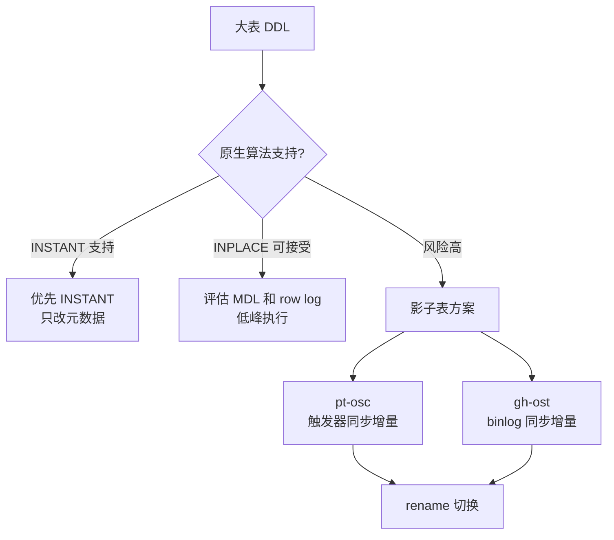

# M5-07 Online DDL 的实现原理是什么？大表加字段用 pt-osc 和 gh-ost 有什么区别？


可视化页面：[m5-07-online-ddl.html](m5-07-online-ddl.html)
分类：日志、复制与高可用

难度：L3

优先级：P1

关键词：Online DDL、MDL、COPY、INPLACE、INSTANT、pt-osc、gh-ost、影子表、binlog

复习状态：已成稿

来源题号：LC100 M4-07

## 问题

MySQL 大表做 DDL 为什么危险？Online DDL 是怎么降低影响的？`pt-online-schema-change` 和 `gh-ost` 有什么区别？

## 先讲人话

大表改结构像给高速路换车道。如果直接封路施工，所有车都堵住。Online DDL 和影子表工具的目标是：大部分时间让车继续跑，只在最后切换时短暂拦一下。

但“Online”不等于完全无锁。DDL 仍然会涉及元数据锁，长事务可能让 DDL 卡住，DDL 卡住后还可能挡住后续查询和更新。

## 前置概念

| 概念 | 小白解释 |
| --- | --- |
| DDL | 改表结构，如加字段、加索引、改字段类型。 |
| DML | 改数据，如 INSERT、UPDATE、DELETE。 |
| MDL | Metadata Lock，元数据锁，保护表结构不被并发破坏。 |
| 影子表 | 新建一张结构变更后的表，把数据同步过去，最后交换表名。 |
| row log | Online DDL 期间记录并发 DML 增量的日志。 |
| 触发器 | 表上发生 INSERT/UPDATE/DELETE 时自动执行的逻辑。 |

## 30 秒短答

MySQL Online DDL 常见算法有 `COPY`、`INPLACE`、`INSTANT`。`COPY` 会复制整表且锁影响大；`INPLACE` 在 InnoDB 内部执行，部分操作允许并发 DML，但开始和提交阶段仍需要 MDL；`INSTANT` 只改元数据，速度最快，但只支持部分操作。

`pt-osc` 通过影子表加触发器同步增量，最后 rename 切换；`gh-ost` 也用影子表，但通过读取 binlog 同步增量，不用触发器，可控性通常更强。MySQL 8.0 支持 INSTANT 的场景优先用原生能力，否则大表变更更偏向 gh-ost。

## 面试时可以直接这样回答

Online DDL 不是完全无锁，而是尽量缩短强锁时间。MySQL 原生 DDL 有三类算法。

`COPY` 是创建临时表、复制数据、交换表名，过程中对 DML 阻塞明显，风险最高。`INPLACE` 是在 InnoDB 内部尽量原地做变更，执行阶段允许并发 DML，并用 row log 记录增量，最后短暂加 MDL 排他锁合并增量。`INSTANT` 是 MySQL 8.0 后引入的能力，部分加列操作只改数据字典，不重建表，速度非常快。

如果原生 DDL 风险大，可以用影子表工具。`pt-osc` 创建影子表，在原表上建触发器，把增量 DML 同步到影子表，同时分批复制历史数据，最后 rename。`gh-ost` 不用触发器，而是伪装成从库读取 binlog，把原表变更回放到影子表。相比 pt-osc，gh-ost 对主库侵入更小，支持暂停、限速、动态调整，通常更适合大表。

上线前我会检查表大小、主键、外键、触发器、长事务、主从延迟、磁盘空间和回滚方案。

## 先用一张图看懂



## 原生 Online DDL 算法

| 算法 | 怎么做 | 是否复制整表 | 对 DML 影响 | 典型风险 |
| --- | --- | --- | --- | --- |
| `COPY` | 建临时表、复制、切换 | 是 | 大 | 锁表、耗时长、回滚困难 |
| `INPLACE` | InnoDB 内部执行，必要时重建 | 视操作而定 | 执行阶段可并发，首尾仍有锁 | row log 过大、MDL 等待 |
| `INSTANT` | 只改元数据 | 否 | 极小 | 只支持部分操作 |

## pt-osc vs gh-ost

| 维度 | pt-osc | gh-ost |
| --- | --- | --- |
| 增量同步 | 触发器 | 读取 binlog |
| 对主库侵入 | 较高，触发器在主库执行 | 较低，不依赖触发器 |
| 可控性 | 支持限速，但灵活性较弱 | 支持暂停、限速、动态调整 |
| 表已有触发器 | 不适合 | 通常不受影响 |
| 额外空间 | 需要影子表空间 | 需要影子表空间 |
| 最后切换 | rename，需要短暂锁 | rename，需要短暂锁 |

## 大表 DDL 上线检查清单

1. 确认 MySQL 版本和 DDL 算法：能否 `ALGORITHM=INSTANT`。
2. 确认表大小、主键、唯一索引、外键和触发器。
3. 检查是否有长事务持有 MDL 读锁。
4. 预估额外磁盘空间，影子表通常接近原表大小。
5. 设置限速和暂停阈值，如主从延迟、负载、Threads_running。
6. 低峰执行，准备回滚和中止方案。
7. 切换前确认影子表数据追平，切换后验证行数和关键查询。

## MDL 为什么危险

DDL 需要 MDL 写锁。普通查询和 DML 会持有 MDL 读锁，通常很快释放；但如果有长事务一直不提交，MDL 读锁就不会释放。

危险链路是：

```text
长事务持有 MDL 读锁
DDL 等待 MDL 写锁
后续 SELECT/UPDATE 排在 DDL 后面
整张表访问被堵住
```

所以大表 DDL 前要查长事务，必要时先 kill 或设置等待超时。

## 结合项目怎么讲

可以这样说：

> 我不会直接对大表执行 ALTER。会先确认版本是否支持 INSTANT；如果不支持，再评估 gh-ost 或 pt-osc。执行前会检查长事务和主从延迟，执行中设置限速和暂停阈值，切换阶段控制在低峰，完成后验证数据一致性和业务查询。

待补充：

- 是否有真实大表 DDL 经历。
- 表规模、字段变更类型、使用原生 DDL 还是工具。
- 是否遇到过 MDL 等待或主从延迟。

## 容易说错的点

1. 说 Online DDL 完全无锁。
2. 说 INPLACE 一定不重建表。
3. 说 INSTANT 支持所有 DDL。
4. 忽略 MDL 等待对后续查询的阻塞。
5. 忽略影子表需要额外磁盘空间。

## 高频追问

### 追问 1：为什么 gh-ost 通常比 pt-osc 更可控？

因为 gh-ost 通过 binlog 同步增量，不在原表上建触发器，对主库写路径侵入更小，并且支持暂停、限速和动态调整。

### 追问 2：DDL 卡住时怎么办？

先查是否有长事务持有 MDL 读锁，再决定 kill 长事务还是 kill DDL。不要盲目等待，因为 DDL 排队可能阻塞后续所有访问。

### 追问 3：加字段一定能 INSTANT 吗？

不一定。取决于 MySQL 版本、表结构、字段位置、是否涉及默认值或其他限制。上线前要用 `EXPLAIN ALTER` 或测试环境验证实际算法。

## 记忆口诀

```text
Online 不是无锁，MDL 是关键；
能 INSTANT 就 INSTANT，不能再看 gh-ost。
```

