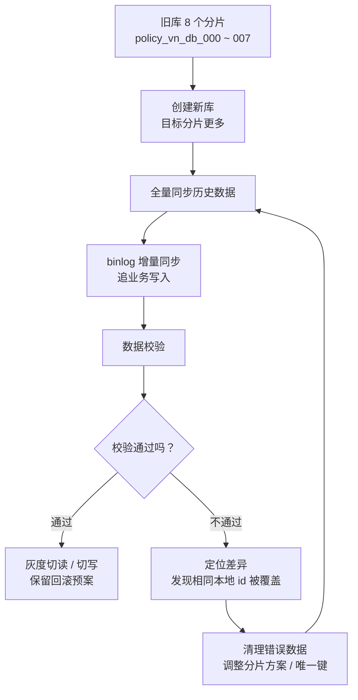

# M6-01 做过数据库扩容吗？分库扩容怎么做？遇到过什么坑？

分类：分库分表

难度：L3/L4

优先级：P0

关键词：分库扩容、分片键、全局唯一键、本地自增 ID、全量同步、binlog 增量同步、数据校验、倍数扩容

复习状态：已成稿

可视化页面：[m6-01-sharding-expansion-migration-case.html](m6-01-sharding-expansion-migration-case.html)

## 问题

面试官问：

> 你有没有做过数据库扩容？一般 MySQL 扩容怎么做？过程中遇到过什么难题，最后是怎么解决的？

可以结合一次 `policy vn` 分库扩容案例来讲：原库是 8 个分片，迁移到新库时目标分片数一开始不是旧分片数的整数倍，数据校验发现同步异常。

## 面试官考察点

这道题不是只考“会不会背分库分表”，而是在看你是否理解真实扩容里的风险：

1. 为什么要扩容，是容量、性能、连接数还是单分片过大。
2. 扩容怎么做：新建目标库、全量同步、增量同步、数据校验、灰度切流、回滚预案。
3. 分片键和数据库主键是不是同一个概念。
4. 本地自增 `id` 为什么不能默认当作全局唯一键。
5. 非倍数扩容为什么更容易触发数据重分布风险。
6. 出现数据不一致时，怎么定位根因、止损和重跑迁移。

## 先讲人话

数据库扩容可以理解成“仓库不够用了，要把货搬到更多仓库里”。

如果只是把一个仓库变大，这是垂直扩容。如果是从 8 个仓库变成 20 个或 24 个仓库，就是水平扩容，也就是分库扩容。

搬仓库时最怕两件事：

1. 货搬丢了。
2. 两件不同的货被系统误认为是同一件，后搬的把先搬的覆盖了。

这次问题就是第二种。旧库里每个分片都有自己的自增 `id`，所以不同旧库都可能有 `id = 100`。在旧库里没事，因为它们分别在不同库。但迁移到新库时，数据被重新分布，如果两个不同旧库里的 `id = 100` 被搬到同一个新库，而同步工具又只用 `id` 判断是不是同一条数据，就会发生覆盖。

## 前置概念

| 概念 | 小白解释 |
| --- | --- |
| 垂直扩容 | 把单台数据库机器配置变大，比如加 CPU、内存、磁盘。 |
| 水平扩容 | 增加数据库分片数量，把数据拆到更多库或表里。 |
| 分库分表 | 把一张大表或一个大库按规则拆成多个库、多个表。 |
| 分片键 | 决定一条数据应该落到哪个库的字段，比如 `policy_id`、`order_id`。 |
| 本地自增 ID | 每个库自己生成的自增主键，只保证当前库内唯一，不保证所有库全局唯一。 |
| 全局唯一键 | 在所有分片里都唯一的字段，比如全局生成的 `policy_id`。 |
| 全量同步 | 把旧库历史数据整体搬到新库。 |
| 增量同步 | 迁移期间业务还在写，用 binlog 把新增、修改、删除继续同步到新库。 |
| 数据校验 | 对比新旧库的数据是否一致，比如行数、checksum、业务主键抽样。 |
| 倍数扩容 | 新分片数是旧分片数的整数倍，比如 `8 -> 16`、`8 -> 24`。 |

## 30 秒短答

我理解的 MySQL 分库扩容一般是先评估容量和访问压力，再设计新的分片数和分片键，然后新建目标库，通过全量同步搬历史数据，再用 binlog 做增量追平，最后做数据校验和灰度切流。

我们遇到过一个典型坑：旧库是 8 个分片，目标扩容一开始不是倍数扩容。同步工具默认用 MySQL 表主键 `id` 判断数据唯一，但这个 `id` 只是单库自增，不是全局唯一。不同旧库里可能都有 `id = 100`，迁移后如果落到同一个新库，工具会误以为是同一条记录，导致数据覆盖。

最后的处理方向是清理已经同步错的新库数据，调整目标分片方案，补齐分片，并让 DBA 支持后重新同步和校验。同时复盘出一条经验：分库扩容前必须审表结构，确认每张表的分片键和全局唯一键，不能默认用自增 `id`。

## 面试时可以直接这样回答

我参与过一次 MySQL 分库扩容相关的问题处理。背景是业务数据增长后，原来的 `policy vn` 库分片数不够，需要迁移到新的分片结构。整体方案是比较标准的扩容迁移流程：先创建目标库，再用 scaling 工具做全量数据同步；同步期间业务还在写，所以继续通过 binlog 做增量同步；等增量追平后，再开启数据校验，确认新旧库一致，最后才考虑切流。

这次比较典型的问题出在唯一键判断上。原库是 8 个分片，目标分片数一开始不是旧分片数的整数倍。我们的业务分片规则使用的是业务字段，但同步工具默认使用 MySQL 表主键 `id` 来判断一行数据是不是同一条记录。问题是这个 `id` 在分库场景里只是每个库内部自增，不是全局唯一。不同旧库中都可能存在 `id = 100`，它们在旧库里没有冲突，因为分布在不同库。但迁移到新库时，新分片规则会重新分布数据，不同旧库的相同 `id` 可能落入同一个目标库。同步工具只看 `id`，就会误以为它们是同一条记录，导致后同步的数据覆盖先同步的数据。

这个问题不是线上切流后才发现的，而是在数据校验阶段发现的。定位后我们判断根因是“非倍数扩容导致数据重分布，再叠加同步唯一键选错”。当时讨论过两个方案：第一是清空新库数据，重新配置 scaling，改用业务唯一键做同步；第二是调整目标分片方案，改成更可控的倍数扩容，清理错误数据后重新同步。后来检查发现部分表没有可靠的业务唯一键，第一种方案无法覆盖所有表，所以最后走的是清理已同步数据、补齐目标分片、通过 DBA 工单支持后重新同步，再重新做数据校验。

这次之后我的经验是：分库扩容前不能只看分片数量，还要提前审每张表的主键、唯一键和分片键。尤其要区分数据库自增主键和业务全局唯一键。单库里 `id` 是唯一的，但分库后每个库都可能有同样的 `id`。迁移工具如果拿它做 upsert 或去重依据，就有数据覆盖风险。

## 先用一张图看懂



## 原理拆解

### 1. 一般 MySQL 扩容怎么做

扩容前先判断瓶颈是什么：

1. 磁盘快满：可能需要扩磁盘、归档、拆分大表。
2. QPS 太高：可能要读写分离、加缓存、加从库、分库分表。
3. 单表太大：可能要按业务键分表或分库。
4. 单分片热点：可能要调整分片键或拆热点数据。

如果是分库扩容，常见流程是：

```text
评估容量和流量
-> 设计新分片数和分片键
-> 创建目标库
-> 全量同步历史数据
-> binlog 增量同步
-> 数据校验
-> 灰度切流
-> 观察和回滚预案
```

这里最关键的是两个检查：

1. 分片键是否稳定、均匀、业务查询常用。
2. 同步唯一键是否全局唯一，不能误把不同数据当成同一条。

### 2. 分片键和同步唯一键不是一回事

这次最容易混淆的点是：路由到哪个库，和同步时判断是不是同一条记录，是两件事。

路由通常类似：

```text
旧库位置 = hash(policy_id) % 8
新库位置 = hash(policy_id) % 20 或 % 24
```

这里的 `policy_id` 是业务分片键。

但同步工具做 upsert 或 reallocate 时，可能默认看表主键：

```text
唯一判断 = id
```

如果 `id` 是每个库本地自增，就会出现：

```text
旧库 0: id = 100, policy_id = A
旧库 1: id = 100, policy_id = B
旧库 2: id = 100, policy_id = C
```

这三条数据不是同一条，只是不同库里刚好都有 `id = 100`。

如果迁移后它们落入同一个新库，同步工具又只看 `id`，就可能变成：

```text
第一次写入：id = 100, policy_id = A
第二次写入：id = 100, policy_id = B，覆盖 A
第三次写入：id = 100, policy_id = C，覆盖 B
```

最后新库只剩一条，数据就丢了。

### 3. 为什么 `8 -> 24` 比 `8 -> 20` 更可控

这个问题要用一个很简单的数学性质理解。

如果旧分片数是 8，新分片数是 24：

```text
24 = 8 * 3
```

对于任意一条数据，如果：

```text
旧库 = hash(key) % 8
新库 = hash(key) % 24
```

那么新库编号再对 8 取模，结果一定等于旧库编号：

```text
(hash(key) % 24) % 8 = hash(key) % 8
```

所以旧库 0 的数据只会去新库：

```text
0, 8, 16
```

旧库 1 的数据只会去新库：

```text
1, 9, 17
```

不同旧库的数据不会混到同一组新库里。

但如果是 `8 -> 20`：

```text
20 不是 8 的倍数
```

这个性质就没了。举个例子：

```text
hash = 24: 24 % 8 = 0, 24 % 20 = 4
hash = 4:   4 % 8 = 4,  4 % 20 = 4
```

第一条原来在旧库 0，第二条原来在旧库 4，但迁移后都去了新库 4。

这说明非倍数扩容会让不同旧分片的数据在新分片里重新混合。如果这些数据还有相同的本地自增 `id`，同步工具就可能误判成同一条记录。

准确说，不是 `8 -> 20` 天生一定错，而是：

```text
非倍数扩容
+ 本地自增 id 不全局唯一
+ 同步工具用 id 做唯一判断
= 数据覆盖风险
```

### 4. 这次案例里具体发生了什么

群里这次 `policy vn` 的异常可以总结成四步：

1. 周末已经完成了数据同步。
2. 刚开启数据校验，就发现异常。
3. 定位发现 scaling 默认用 MySQL 表主键 `id` 做唯一判断。
4. 由于 `policy vn` 这次不是简单倍数扩容，旧库中相同 `id` 的不同数据可能进入同一个新库，出现覆盖。

当时提到 `policy id`、`order vn` 没有这个问题，是因为它们是倍数扩容，旧分片到新分片的映射更可控。

### 5. 他们怎么解决

讨论过两个方向：

第一种：清空 `policy vn` 新库数据，重新创建 scaling，使用业务唯一键同步。

这个方向理论上最直接，因为业务唯一键才是真正能识别一条业务数据的字段。比如 `policy_id`、`policy_no`、`order_id`。

但后面检查发现有些表没有合适的唯一键，所以 scaling 没法自动设置类似 `Reallocate ID Tables` 的能力。也就是说，不能保证所有表都能安全地按业务唯一键重放。

第二种：清理已经同步错的新库数据，调整目标分片方案，补齐目标分片，让目标库满足更可控的迁移规则，再重新同步。

群里后续走的是这个方向：让 DBA/SRE 支持清理已有 DB 数据，补几个新分片，然后重新跑同步和校验。具体群聊里提到过 `policy_v2_vn_db` 已有 `000 - 021`，再增加 `022 - 025`。数字本身面试时不需要死背，因为可能包含预留库或特殊库；真正要讲清楚的是原则：清掉错误数据，调整分片形态，避免同样的数据覆盖问题，再重跑校验。

## 结合项目怎么讲

### 1 分钟版本

我参与过一次 `policy vn` 库扩容迁移的问题处理。整体流程是新建目标库，通过 scaling 工具做全量同步和 binlog 增量同步，然后做数据校验，确认一致后再切流。

问题出在数据校验阶段。原库是 8 个分片，目标扩容一开始不是倍数扩容。同步工具默认用 MySQL 主键 `id` 判断唯一，但这个 `id` 是每个分库内自增的，不是全局唯一。不同旧库里都可能有 `id = 100`。非倍数扩容会把不同旧库的数据重新打散，导致相同本地 `id` 的不同业务数据进入同一个新库。同步工具只看 `id`，就可能把它们当成同一条记录，产生覆盖。

最后我们没有直接切流，而是先停止使用这批错误同步数据，清理新库，调整目标分片方案并补齐分片，走 DBA 工单支持后重新同步。复盘后我们明确了扩容前要审表结构，确认每张表的分片键和全局唯一键，不能默认用本地自增 `id` 做迁移唯一键。

### 3 分钟版本

这次扩容背景是 `policy vn` 数据量增长，需要从旧分片迁移到新的分片结构。我们采用的是旁路迁移，不是直接在原库上改：先建新库，再把旧库数据全量同步过去；同步期间业务还在写，所以用 binlog 做增量同步；等增量追平之后，开启数据校验。

校验阶段发现数据不一致。排查后发现 scaling 工具使用 MySQL 表主键 `id` 做唯一判断，但在分库场景下这个 `id` 只是库内唯一，不是全局唯一。比如旧库 0 和旧库 1 都可能有 `id = 100`，它们代表完全不同的保单数据。旧架构下没问题，因为它们在不同库。迁移时如果目标分片数不是旧分片数的倍数，数据会重新混合，不同旧库的相同 `id` 可能落到同一个新库。同步工具按 `id` upsert，就会把后来的数据覆盖前面的数据。

我们当时讨论了两类修复方案。一类是重新配置同步任务，用业务唯一键作为判断依据，这样就不会被本地自增 `id` 误导。另一类是调整目标分片数，让扩容成为倍数扩容，减少不同旧分片数据混到同一目标分片的风险。后来检查发现部分表没有可靠的业务唯一键，所以不能完全依赖第一种方案。最终处理方式是清理已经同步错的新库数据，补齐目标分片，通过 DBA 工单支持后重新同步，再重新跑数据校验。

我的收获是，分库扩容最容易出问题的不是“怎么把数据搬过去”，而是迁移前的建模和校验：分片键是什么，主键是不是全局唯一，目标分片数是否会导致数据重分布，工具的 upsert key 是什么。只有这些提前确认，迁移才安全。

### 表达边界

如果你不是这次扩容的主负责人，面试时不要说“我主导了这次扩容”。更稳妥的说法是：

> 我参与过一次分库扩容问题的排查和复盘，当时从群内同步、数据校验异常和 DBA/SRE 的处理方案里，梳理了这次问题的根因和修复路径。

这样既真实，也能体现你理解了技术问题。

## 常见场景

- 单库数据量太大，需要拆成多个分片。
- 原来 8 个分片容量不够，扩到 16、24 或更多。
- 老系统使用本地自增主键，新系统需要重新分片。
- 迁移工具默认用主键 upsert，但主键不是全局唯一。
- 迁移后数据校验发现行数不一致、checksum 不一致、业务记录缺失。

## 容易说错的点

1. 不要说“`id` 是主键，所以一定全局唯一”。在分库场景里，本地自增 `id` 通常只保证单库内唯一。
2. 不要说“`8 -> 20` 一定不行”。准确说法是：非倍数扩容会带来更复杂的数据重分布，如果同步唯一键又选错，就容易出覆盖风险。
3. 不要把分片键和同步唯一键混在一起。分片键决定去哪个库，同步唯一键决定是不是同一条记录。
4. 不要只讲“扩容就是加库”。面试里要讲完整迁移链路：全量、增量、校验、切流、回滚。
5. 不要说“重新同步就行”。如果不修正唯一键或分片方案，重跑还会遇到同样问题。

## 高频追问

### 追问 1：为什么 `8 -> 24` 比 `8 -> 20` 更安全？

因为 `24` 是 `8` 的倍数。旧库 `i` 的数据迁移后只会落到新库 `i`、`i + 8`、`i + 16` 这一组里，不同旧库的数据不会混到同一组新库。这样即使不同旧库都有相同的本地自增 `id`，也不容易在同一个目标库里撞。

`20` 不是 `8` 的倍数，旧库数据会重新混合。比如一个 hash 值原来 `% 8 = 0`，另一个原来 `% 8 = 4`，它们迁移后都可能 `% 20 = 4`。如果它们又都有相同的本地 `id`，同步工具就可能误覆盖。

### 追问 2：如果分片键就是 `id`，还会有这个问题吗？

要看这个 `id` 是不是全局唯一。

如果 `id` 是全局唯一 ID，比如雪花算法生成的全局 ID，那么用它分片、用它做同步唯一键通常没问题。

但如果 `id` 是每个库自己的自增主键，就不是全局唯一。旧库 0 有 `id = 100`，旧库 1 也可以有 `id = 100`。这种情况下，直接拿 `id` 做跨库迁移唯一键就有风险。

### 追问 3：数据校验一般怎么做？

可以从粗到细做：

1. 表级行数对比：新旧库每张表总行数是否一致。
2. 分片级行数对比：每个分片的数据量是否符合预期。
3. checksum 对比：按批次计算关键字段摘要。
4. 业务唯一键抽样：按 `policy_id`、`order_id` 抽样比对完整字段。
5. 异常数据专项校验：重复、缺失、覆盖、主键冲突。

面试里可以说：行数只能发现明显问题，真正保险的是按业务唯一键做字段级或 checksum 级校验。

### 追问 4：扩容迁移怎么保证不停机？

常见方式是旁路建新库：

```text
旧库继续服务线上
-> 新库后台全量同步
-> 用 binlog 追增量
-> 校验通过后灰度切读
-> 再切写
```

因为旧库一直在服务，业务不需要长时间停机。风险点是切写后如果要回滚，需要考虑新库写入的数据如何处理，所以切流前要有回滚预案。

### 追问 5：如果已经发生覆盖，怎么止损？

先不要切流，也不要继续基于错误数据做后续操作。应该先冻结这次迁移结果，确认旧库是否还完整保留，然后定位覆盖范围。一般处理是清理目标库错误数据，修正同步唯一键或分片方案，再从可信源重新同步。最后必须重新跑数据校验。

### 追问 6：扩容前怎么避免这个坑？

扩容前做四个检查：

1. 每张表的分片键是什么。
2. 每张表有没有全局唯一业务键。
3. 同步工具的 upsert key 或唯一判断字段是什么。
4. 新旧分片数是不是倍数关系，如果不是，要评估数据重分布和主键冲突风险。

## 术语表

| 术语 | 解释 |
| --- | --- |
| sharding | 分片，把数据按规则拆到多个库或表。 |
| shard key | 分片键，决定数据落到哪个分片的字段。 |
| upsert | 有就更新，没有就插入。迁移工具常用它写目标库。 |
| reallocate | 重新分配数据，把旧分片的数据按新规则迁移到新分片。 |
| checksum | 数据摘要校验，用来快速判断两批数据是否一致。 |
| dry run | 正式操作前的演练，用小流量或测试环境提前发现问题。 |

## 记忆口诀

```text
扩容先审键：
分片键决定去哪，
唯一键决定是谁；
本地 id 不是全局 id，
非倍数扩容要防数据混流；
全量增量都跑完，
校验通过再切流。
```
