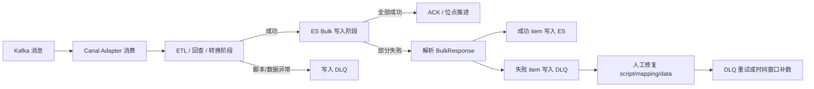

# Canal DLQ / 同步阻塞优化专项

> 返回：[Canal / ES 同步架构梳理](./canal-es-sync-architecture.md)
>
> 图解：[Canal / ES 同步架构图解](./canal-es-sync-architecture.html)
>
> 项目索引：[Canal 项目材料](./README.md)

## 一、这篇文档解决什么问题

这篇专门背 Canal/ES 同步阻塞优化。面试官如果问：

- “Canal 同步异常怎么处理？”
- “一条坏数据会不会阻塞整个消费链路？”
- “DLQ 是怎么设计的？”
- “Bulk 写 ES 部分失败怎么处理？”
- “怎么保证异常可恢复、可观测？”

就用这篇。

## 二、先讲人话

Canal 链路里最怕的是：**一条异常数据让整个 partition 一直卡住**，或者为了不阻塞而直接 ACK，结果异常数据丢了、后面也补不回来。

所以优化目标不是“永远不失败”，而是：

1. 好数据继续同步。
2. 坏数据不要拖垮整条链路。
3. 坏数据要能进入 DLQ，后续可查、可修、可重试。
4. ES 集群类异常不能随便 ACK，否则可能丢消息。
5. 最终失败要能留下时间窗口，方便后续补数。

面试一句话：

> Canal 同步阻塞优化的核心是异常分层：可重试异常继续重试或阻塞保护；脚本、mapping、脏数据这类局部异常进入 DLQ；ES Bulk 部分失败要解析失败 item，让好数据继续写，坏数据可观测、可重试、可补数。

## 三、重点架构



## 四、异常分类怎么讲

| 异常类型 | 例子 | 处理方式 | 面试说法 |
| --- | --- | --- | --- |
| 可重试异常 | 临时网络抖动、ES 短暂不可用、连接池异常 | 重试或暂停推进，避免直接 ACK 丢消息。 | 这类异常不是单条数据问题，不能简单丢到 DLQ 后继续跑。 |
| 脚本异常 | SQL 字段不存在、join 条件错误、数据类型转换失败 | 定位 config/script，异常 item 进 DLQ。 | 脚本问题要让好数据继续同步，同时留下异常上下文。 |
| mapping 异常 | 字段类型不匹配、range/term 查询类型不对、写入类型冲突 | DLQ + 修 mapping / 重建索引 / 补刷。 | mapping 问题通常不是改一行代码就完，要考虑索引重建和历史补数。 |
| 脏数据异常 | 单条数据不符合脚本假设、空值未处理、JSON 结构异常 | 失败 item 进 DLQ，修数据后重试。 | 不能让一条脏数据拖住整个 partition。 |
| ES Bulk 部分失败 | 一批写入里部分 document 成功、部分失败 | 解析 BulkResponse，只处理失败 item。 | 不能因为一条失败就重复提交整批，也不能忽略部分失败。 |

## 五、优化前后对比

| 维度 | 优化前风险 | 优化后口径 |
| --- | --- | --- |
| 单条坏数据 | 可能卡住同批次或同 partition。 | 失败 item 单独进入 DLQ，好数据继续走。 |
| ACK 安全性 | 为了继续消费可能 ACK，导致异常数据难恢复。 | 区分异常类型，ES 集群异常不能轻易 ACK。 |
| Bulk 写入 | 可能只知道整批失败，不知道哪条失败。 | 解析 BulkResponse，提取失败 item。 |
| 可观测性 | 排障依赖日志，难统计影响面。 | DLQ 产生、重试成功、最终失败都有指标。 |
| 补数能力 | 修复后不知道从哪里补。 | 记录失败窗口，支持 DLQ 重试或时间窗口 ETL。 |

## 六、面试 1 分钟回答

> Canal 同步链路里最关键的优化是避免单条异常消息拖垮整个消费链路。我们会把异常分层处理：如果是 ES 集群不可用、网络超时这类整体性问题，就不能简单 ACK，需要重试或阻塞保护；如果是脚本、mapping、单条数据问题，就把失败 item 写入 DLQ，让正常数据继续同步。对于 ES Bulk 写入，还要解析 BulkResponse，因为一批里可能部分成功、部分失败。DLQ 里保留 destination、config file、index、异常类型等上下文，修复 script、mapping 或数据后可以重试，最终失败还要记录时间窗口方便补数。

## 七、常见追问

### DLQ 会不会导致数据不一致？

会有短暂不一致，因为 ES 是查询视图，本来就是最终一致。DLQ 的价值是把异常显性化，让它可查、可补、可追踪。事实源仍然是 owner MySQL。

### 为什么 ES 集群异常不能直接进 DLQ？

ES 集群异常通常影响一批或一段时间内的所有数据，不是某一条数据坏了。如果直接 ACK 并继续消费，可能导致大范围 ES 缺数据。更稳的是暂停推进、重试或触发告警。

### BulkResponse 为什么重要？

Bulk API 可能一部分 document 成功，一部分失败。只看整体请求结果会误判。解析 BulkResponse 可以把失败 item 拆出来，避免重复写成功数据，也避免漏掉失败数据。

### DLQ 之后怎么恢复？

先修根因：script、mapping、数据、ES index 或 datasource。然后按 DLQ 消息重试；如果最终失败或影响范围不清楚，就按失败时间窗口做 ETL 补数。

## 八、排障口诀

```text
先看 lag，再看日志；
能重试的不丢，坏数据进 DLQ；
Bulk 要拆 item，失败要留窗口；
修完根因再重试，必要时 ETL 补数。
```

## 九、资料来源

- Confluence：`同步阻塞优化`，页面 ID `3045066306`。
- Confluence：`ES以及Canal同步工具维护说用`，页面 ID `1857867981`。
- 本地配置：`/Users/si.chen/GolandProjects/canal-adapter/conf/live/application.yml`
- 本地代码：`/Users/si.chen/GolandProjects/canal-adapter/es6x/`
- 本地代码：`/Users/si.chen/GolandProjects/canal-adapter/es7x/`
