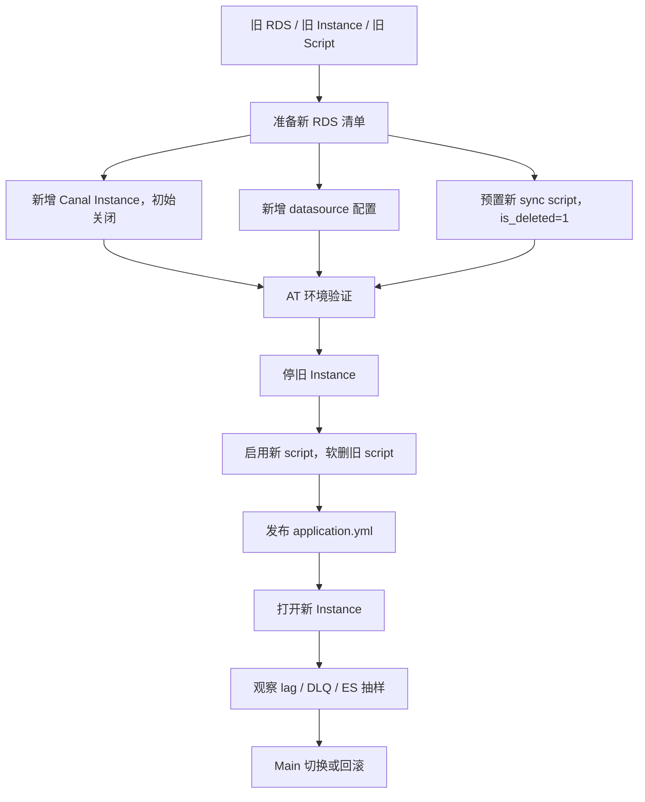
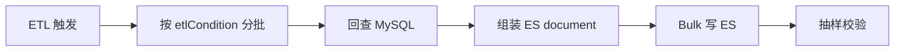
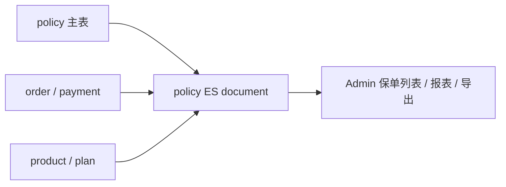

# Canal 重点架构：RDS 切换、ETL、ES 宽表

> 返回：[Canal / ES 同步架构梳理](./canal-es-sync-architecture.md)
>
> 图解：[Canal / ES 同步架构图解](./canal-es-sync-architecture.html)
>
> 项目索引：[Canal 项目材料](./README.md)

## 一、这篇文档适合回答什么

这篇专门背 Canal 的重点架构场景：

- RDS 扩容 / 迁移切换怎么做。
- 新旧 instance、datasource、script 怎么切。
- ETL 和增量同步架构有什么区别。
- ES 宽表为什么容易出覆盖问题。
- 切换怎么保证可回滚。

## 二、全链路架构

核心边界：

- MySQL 是事实源。
- Canal 是同步基础设施。
- ES 是查询视图。
- O-BFF/Admin 是使用方。

## 三、RDS 切换架构

### 切换重点

| 点 | 面试怎么讲 |
| --- | --- |
| 新 instance 初始关闭 | 防止准备阶段提前消费或重复同步。 |
| 新 script 初始 `is_deleted=1` | 先预置，切换时再启用，降低发布窗口风险。 |
| 旧 script 软删 | 不硬删，保留回滚依据。 |
| topic 尽量稳定 | 避免影响下游消费和大范围配置。 |
| 不随便停整个 region topic | 粒度太大，可能影响不在本次切换范围内的模块。 |
| AT 先完整闭环 | 先验证 instance、datasource、script、ES 写入、Admin 查询，再 Main。 |

### 回滚要准备什么

- 旧 instance 状态。
- 旧 datasource 配置。
- 旧 sync script。
- 回滚 SQL 或配置更新语句。
- 抽样验证 SQL / ES 查询。
- Kafka lag / DLQ / Adapter 日志观察点。

## 四、ETL 架构

增量同步走 binlog，ETL 走历史 SQL 扫描。

### ETL 为什么容易出问题

| 问题 | 原因 | 解决思路 |
| --- | --- | --- |
| 深分页慢 | 大表 `limit offset` 越往后越慢。 | 用 ID、时间或业务字段切片。 |
| 聚合覆盖 | 一个业务文档的数据跨多个批次。 | 按业务主键分批，或小表不分批。 |
| SQL 超时 | join 多、条件无索引、批次太大。 | 优化索引、减小 batch、拆分条件。 |
| 历史漏刷 | etlCondition 覆盖范围不完整。 | 明确起止范围和抽样校验。 |

## 五、ES 宽表架构

ES 宽表常把多张 MySQL 表的信息合成一个查询 document。

### 宽表设计重点

| 设计点 | 为什么重要 |
| --- | --- |
| `_id` 稳定 | 决定写入是更新同一 document 还是生成重复 document。 |
| 主表清晰 | 增量回查要知道以哪张表的变更为触发点。 |
| 关联键稳定 | 跨表 join 不能依赖不稳定推导。 |
| 冗余必要字段 | ES 查询视图可以适度冗余，减少运行时跨服务查询。 |
| mapping 先行 | 字段类型错会影响写入、查询和后续补刷。 |

面试口径：

> ES 宽表不是把所有字段无脑堆进去，而是为了 Admin 查询把必要字段提前组织成 document。设计时要保证 `_id` 稳定、主表清晰、关联键稳定、mapping 正确。ETL 时尤其要注意分批字段，不能让一个业务 document 被不同批次覆盖成不完整状态。

## 六、重点架构追问

### 为什么 RDS 切换要同时改 instance、datasource、script？

因为 instance 决定从哪个 RDS 订阅 binlog，datasource 决定 Adapter 回查哪个库，sync script 决定回查 SQL 和写哪个 ES index。三者不一致就会出现消费到了新变更，但回查旧库，或者写错 index 的问题。

### 为什么新 script 要先 `is_deleted=1`？

这是灰度和回滚思路。提前把配置准备好但不生效，等切换窗口再启用，降低临时改配置的风险。

### 为什么不能用 ES 判断数据是否存在？

ES 是最终一致查询视图。同步链路中任何阶段延迟或失败都会导致 ES 暂时缺数据。事实判断要回到 owner MySQL。

### ETL 怎么验证？

至少做三层：

1. MySQL 源数据数量和抽样。
2. ES document 是否写入、`_id` 是否符合预期。
3. Admin/O-BFF 查询是否能查到正确展示字段。

## 七、面试 1 分钟项目说法

> 我熟悉 Canal RDS 切换和 ETL 的整体架构。RDS 切换不是只改一个 DB host，而是要同时处理 Canal Instance、Adapter datasource 和 ES sync script。新 instance 一般先关闭，新 script 先预置为 disabled，AT 验证后再停旧 instance、启用新 script、发布 datasource、打开新 instance，并观察 Kafka lag、DLQ、Adapter 日志和 ES 抽样数据。ETL 方面，我会特别关注 `etlCondition` 和业务主键，避免深分页和聚合宽表跨批覆盖。

## 八、资料来源

- Confluence：`ES以及Canal同步工具维护说用`，页面 ID `1857867981`。
- Confluence：`ES设计规范`，页面 ID `2083164892`。
- 本地 RDS 扩容 TD：`/Users/si.chen/GolandProjects/canal-adapter/docs/id_vn_rds_expansion_canal_td.md`
- 本地 RDS 扩容清单：`/Users/si.chen/GolandProjects/canal-adapter/docs/id_vn_rds_expansion_canal_checklist.md`
- 本地 ETL 聚合问题：`/Users/si.chen/GolandProjects/canal-adapter/docs/canal-adapter-etl-group-by-fix.md`
