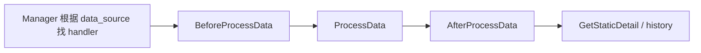
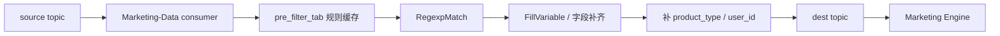

# Marketing-Data Handler / pre-filter 深挖

> 返回：[Marketing-Data 架构梳理](./marketing-data-architecture.md)
>
> 图解：[Marketing-Data 架构图解](./marketing-data-architecture.html)
>
> 项目索引：[Marketing-Data 项目材料](./README.md)

## 一、为什么这块容易被深挖

面试官可能追问：

- DataSource handler 怎么插件化？
- ES handler、File handler、Hive/Insight handler 差别是什么？
- BloomFilter 去重解决什么？
- pre-filter 和离线抽取有什么不同？
- 实时消息预过滤怎么降低 Marketing 主链路压力？

## 二、Handler 生命周期



| 阶段 | 作用 |
| --- | --- |
| `BeforeProcessData` | 初始化上下文、解析条件、准备文件/DSL/元数据。 |
| `ProcessData` | 拉取数据、过滤、去重、格式化、推 Kafka。 |
| `AfterProcessData` | 收尾、统计、错误信息、文件路径等。 |
| `GetStaticDetail` | 给 history 或 Admin 查询展示统计详情。 |

## 三、DataSource 类型

| 来源 | 处理方式 | 风险 |
| --- | --- | --- |
| ES | 解析 group_condition -> DSL，scroll 拉取，按 key 去重。 | DSL 错、mapping 错、scroll 太大、ES 超时。 |
| File / S3 / CSV | 读取文件，按 mapping 转字段，正则/日期过滤。 | 文件路径错、字段缺失、格式异常、编码问题。 |
| Hive File | 读取离线产物文件，再映射和过滤。 | 产物延迟、字段不一致、文件太大。 |
| Insight File | 读取 Insight 产物，转换成 Marketing 消息。 | 上游格式变化、字段语义不清。 |

面试说法：

> Handler 插件化的价值是把不同数据源差异封装起来。Manager 只关心 data_source，具体 ES、文件、Hive、Insight 的读取和过滤逻辑由 handler 自己处理。

## 四、ES Handler 深挖

```text
group_condition
  -> 转 DSL
  -> 校验 max length
  -> scroll batch 拉取
  -> custom tag / 字段转换
  -> BloomFilter 去重
  -> FormatOfflineRawResult
  -> PushWithTopic
```

重点追问：

| 问题 | 回答 |
| --- | --- |
| 为什么不用 QueryEsList 大批量查？ | QueryEsList 是 Admin 预览接口，限制 size；大批量用异步 handler 和 scroll。 |
| ES 查不到怎么办？ | 先看 DSL，再看 mapping，再看 Canal 同步和 owner MySQL。 |
| 去重为什么重要？ | 同一用户可能被多个条件命中，重复推送会导致重复触达。 |
| max length 是什么思路？ | 给抽取规模设上限，避免异常配置拖垮服务。 |

## 五、File / Hive / Insight Handler 深挖

重点：

- 文件路径是否正确。
- CSV/header/mapping 是否匹配。
- 字段类型和日期格式是否符合预期。
- 正则过滤和日期过滤是否正确。
- 大文件是否分批读取。
- 错误详情是否写入 history。

回答模板：

> 文件类 handler 的核心不是“读文件”，而是把外部离线产物标准化成 Marketing 能消费的消息，同时处理字段 mapping、过滤、去重、错误记录和执行统计。

## 六、pre-filter 链路

pre-filter 处理的是实时消息预过滤，不是离线 batch 抽取。



面试说法：

> pre-filter 的作用是把实时消息先按规则过滤和字段补齐，再转发给 Marketing。这样 Marketing 主引擎消费到的是已经整理过的消息，减少主链路负担。

## 七、离线抽取 vs pre-filter

| 维度 | 离线抽取 | pre-filter |
| --- | --- | --- |
| 触发 | Marketing plan batch 调用。 | Kafka source topic 实时消息。 |
| 数据来源 | ES / S3 / CSV / Hive / Insight。 | 实时消息流。 |
| 幂等重点 | `batch_id` history。 | 消息重复和过滤规则。 |
| 输出 | 目标 topic 的离线人群消息。 | 过滤/补齐后的实时消息。 |
| 排障入口 | batch history。 | source topic、规则缓存、consumer、dest topic。 |

## 八、容易被问倒的点

| 追问 | 稳妥回答 |
| --- | --- |
| Handler 注册失败怎么办？ | data_source 找不到 handler 时应报错并写入 history，不能静默成功。 |
| 文件字段少了怎么办？ | mapping/校验阶段失败，错误详情写 history。 |
| pre-filter 规则更新如何生效？ | 通过规则表和 cache update task；具体生效机制以代码和配置为准。 |
| 去重会不会误伤？ | 取决于去重 key，必须和业务语义一致。 |
| ES 数据延迟怎么办？ | ES 是最终一致视图，必要时回查 owner MySQL 和 Canal 链路。 |

## 九、1 分钟回答

> Marketing-Data 的 handler 是按 data_source 插件化的。Manager 只负责校验、幂等和调度，具体 ES、File、Hive、Insight 的拉取逻辑由 handler 承接。Handler 通常有 Before、Process、After 几个阶段，Process 里会拉数据、过滤、去重、格式化并推 Kafka。pre-filter 是另一条实时消息预处理链路，它消费 source topic，根据规则缓存做正则匹配和字段补齐，再推到 dest topic 给 Marketing 使用。

## 十、代码和资料证据

- Handler 接口：`/Users/si.chen/GolandProjects/insurance-marketing-data/src/handler/offline_data_fetch_handler.go`
- Handler 实现：`/Users/si.chen/GolandProjects/insurance-marketing-data/src/handler/offline_data_fetch/impl/`
- ES Repo：`/Users/si.chen/GolandProjects/insurance-marketing-data/src/repo/elasticsearch/`
- pre-filter consumer：`/Users/si.chen/GolandProjects/insurance-marketing-data/src/mq/consumer/impl/consumer_impl.go`
- pre-filter task：`/Users/si.chen/GolandProjects/insurance-marketing-data/src/task/`
