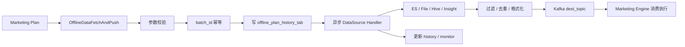

# Marketing-Data 核心知识深挖

> 返回：[Marketing-Data 架构梳理](./marketing-data-architecture.md)
>
> 图解：[Marketing-Data 架构图解](./marketing-data-architecture.html)
>
> 项目索引：[Marketing-Data 项目材料](./README.md)

## 一、面试先背这 10 个点

1. Marketing-Data 是从 Marketing 主服务拆出来的离线/批量数据服务。
2. Marketing 主服务负责计划执行和营销动作，Marketing-Data 负责离线人群和数据预处理。
3. 核心入口是 `OfflineDataFetchAndPush`。
4. 请求里最关键的是 `plan_id`、`batch_id`、`data_source`、`group_condition`、`dest_topic`。
5. `batch_id` 是离线任务幂等键，防止重复抽取和重复推送。
6. 执行前先写 `offline_plan_history_tab`，异步执行后更新 success/failed。
7. DataSource handler 插件化，支持 ES、File、Hive、Insight 等来源。
8. Admin 的 `QueryEsList` 只适合预览，限制 `size <= 100`，不是大批量入口。
9. pre-filter 负责实时消息预过滤和字段补齐，降低 Marketing 主链路压力。
10. Kafka publish 失败不能夸成强一致，需要如实说当前依赖日志/错误记录，后续可加 DLQ/重试/失败落表。

## 二、整体架构



面试版：

> Marketing-Data 承担的是离线数据抽取链路。Marketing 生成计划批次后，把 plan、batch、data source、条件和目标 topic 传给 Marketing-Data。Marketing-Data 先校验参数，用 batch_id 做幂等，先写 history，再异步选择对应 handler 拉数据、过滤、去重、推 Kafka，最后更新执行结果和监控。

## 三、为什么要从 Marketing 拆出来

| 原因 | 面试怎么说 |
| --- | --- |
| 大查询和文件处理重 | 不适合阻塞 Marketing 主执行链路。 |
| 离线数据功能相对稳定 | 独立服务减少 Marketing 主服务发版影响。 |
| 执行历史需要可查 | batch history 独立沉淀状态、数量、错误和耗时。 |
| pre-filter 可独立演进 | 实时消息预处理从主引擎拆出，降低耦合。 |
| 数据源扩展多 | ES/File/Hive/Insight 用 handler 插件化承接。 |

## 四、OfflineDataFetchAndPush 深挖

### 入参怎么讲

| 字段 | 作用 | 追问点 |
| --- | --- | --- |
| `plan_id` | 哪个营销计划。 | 用于查询 history 和关联 Marketing plan。 |
| `batch_id` | 哪次执行批次。 | 幂等键，避免重复抽取。 |
| `dest_topic` | 推给哪个 Kafka topic。 | topic 错会导致 Marketing 收不到。 |
| `data_source` | 从哪里拉数据。 | 决定选择哪个 handler。 |
| `group_condition` | 人群条件。 | ES DSL / 文件过滤 / 规则解析都依赖它。 |
| `user_group_id` | 用户组信息。 | 用于人群语义和 history 关联。 |

### 主流程

```text
校验必填参数
  -> batch_id 查询 history
  -> 已存在：直接返回
  -> 不存在：创建 init history
  -> 异步执行 handler
  -> handler 拉数、过滤、去重、推 Kafka
  -> 更新 success / failed / total / unique_total / err_detail
  -> 上报监控
```

## 五、Marketing 和 Marketing-Data 边界

| 问题 | Marketing | Marketing-Data |
| --- | --- | --- |
| 什么时候触发 | 是 | 否 |
| 对谁执行 | 规则筛选和最终判断 | 离线人群抽取和预处理 |
| 做什么动作 | 发券、通知、PNAR、弹窗 | 不直接做营销动作 |
| 执行历史 | plan/handler 相关 | offline batch history |
| 大数据来源 | 消费结果 | ES/S3/CSV/Hive/Insight 抽取 |

不要说：

> Marketing-Data 负责发券/通知/PNAR。

更稳：

> Marketing-Data 负责把人群数据准备好并推给 Marketing，具体营销动作由 Marketing Handler 执行。

## 六、深挖题速答

| 问题 | 回答抓手 |
| --- | --- |
| 为什么 `batch_id` 重要？ | 调度/RPC/人工重试可能重复触发，batch_id 保证同一批不重复抽取和推送。 |
| 为什么先写 history？ | 异步任务必须可观测，失败后能按 batch_id 查状态、数量和错误。 |
| 新增 data source 怎么做？ | 实现 `OfflineDataFetchHandler`，注册 data_source -> initFunc，主流程不用大改。 |
| QueryEsList 为什么限量？ | Admin 预览接口不能承担大批量抽取，防止拖慢 ES 和服务。 |
| 推 Kafka 失败怎么办？ | 如实说当前需要看日志/错误记录，强一致要补 DLQ、重试或失败落表。 |
| 怎么排查一批没执行？ | batch_id 查 history，再看 data_source handler、ES/S3/Hive、Kafka topic、Marketing 消费端。 |

## 七、1 分钟回答

> Marketing-Data 是 Marketing 的离线数据服务，核心是把重数据处理从 Marketing 主执行链路拆出来。主入口 `OfflineDataFetchAndPush` 接收 plan_id、batch_id、data_source、group_condition 和 dest_topic，先做参数校验和 batch_id 幂等，再写 offline history，然后异步选择 ES、File、Hive 或 Insight handler 拉数、过滤、去重并推 Kafka，最后更新 history 和监控。它不直接发券或通知，真正营销动作仍由 Marketing Handler 执行。

## 八、代码和资料证据

- Internal Service：`/Users/si.chen/GolandProjects/insurance-marketing-data/src/service/marketing_data_internal_service.go`
- Manager：`/Users/si.chen/GolandProjects/insurance-marketing-data/src/manager/impl/offline_data_fetch_manager_impl.go`
- Handler 接口：`/Users/si.chen/GolandProjects/insurance-marketing-data/src/handler/offline_data_fetch_handler.go`
- Handler 实现：`/Users/si.chen/GolandProjects/insurance-marketing-data/src/handler/offline_data_fetch/impl/`
- History Repo：`/Users/si.chen/GolandProjects/insurance-marketing-data/src/repo/repo_dao/impl/offline_plan_history_repo_dao_impl.go`
