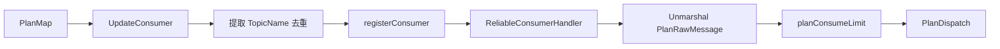
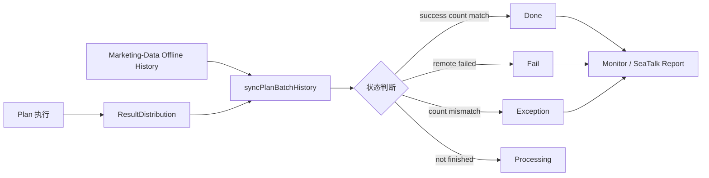

# Marketing Consumer / Batch History 可靠性深挖

> 返回：[Marketing Engine 架构梳理](./marketing-engine-architecture.md)
>
> 项目索引：[Marketing 项目材料](./README.md)

## 一、为什么这块重要

Marketing 是事件驱动系统，稳定性不只在业务代码里，还在：

- Kafka consumer 是否正常注册。
- 消费并发是否受控。
- 单条消息失败是否影响整条链路。
- Batch history 是否能反映执行结果。
- Marketing-Data 离线批次和 Marketing 执行结果是否对得上。

## 二、Consumer 注册和执行链路

代码重点：

- `UpdateConsumer` 从 planMap 中收集 topic。
- topic 去重后注册 consumer。
- 同一个 topic 复用 reliable consumer handler。
- 消费时生成 executeId 并注入日志上下文。
- JSON 反序列化使用 UseNumber，避免数字精度问题。
- 可按配置开关绕过 consume limit。

## 三、消费并发限制

`planConsumeLimit` 做了 topic 级别并发控制：

| 点 | 代码口径 |
| --- | --- |
| 默认最大并发 | `maxConcurrent = 2`。 |
| 可配置覆盖 | `TopicConsumeConcurrencyMap[topic]`。 |
| 等待上限 | 10 秒。 |
| 轮询间隔 | 100 ms。 |
| 超时结果 | panic `CommonInsideSysConsumeTimeout`。 |
| 计数存储 | `PlanConsumeLimitRepoCao`，带 expire。 |

面试说法：

> Marketing consumer 不是无限并发执行 PlanDispatch，而是按 topic 做并发限制。默认并发较小，可以按 topic 配置，避免某个大计划或高流量 topic 把服务打爆。

## 四、Batch History 架构

Batch History 要合并两部分信息：

- Marketing-Data 抽取结果：`UniqueTotal`、`ResultStatus`、`ErrDetail`。
- Marketing Engine 执行结果：result distribution、success/fail count。

## 五、状态判断怎么讲

| 状态 | 含义 |
| --- | --- |
| Init | 批次刚创建。 |
| Processing | 抽取或执行还没完全结束。 |
| Done | 抽取成功，并且 batch count 和执行结果数量匹配。 |
| Fail | Marketing-Data 侧抽取失败。 |
| Exception | 数量不匹配、超时未完成或最终状态后还有消费。 |

深挖点：

> Marketing 的批次完成不是只看 Marketing-Data 抽取成功，还要看 Engine 执行结果数量是否和 batch count 对得上。否则可能出现抽取完成但部分消息还没消费、或最终状态后仍有消费的异常。

## 六、锁和最终一致

`syncPlanBatchHistory` 用 batch_id 维度锁保护同步过程，避免多个任务同时更新同一个批次。

同时它处理：

- 终态直接返回。
- 未完成超时转 exception。
- 查询 Marketing-Data history。
- 读取 result distribution。
- success/fail count 对比。
- 更新 batch status。

面试说法：

> Batch history 是最终一致汇总，不是单点同步返回。它需要周期性同步 Marketing-Data 抽取状态和 Marketing 执行分布，用锁避免同批次并发更新。

## 七、异常检测

代码里还有一个关键保护：`updateOfflineFinalException`。

它会检查：

- 批次已经 Done。
- 结束 10 分钟后再次看 result distribution。
- 如果 history 成功/失败数和最新 distribution 不一致，就把批次改成 Exception 并上报。

面试说法：

> 这可以发现“批次看似完成，但后面还有消息在消费”这类异常，避免成功状态掩盖迟到消费或统计不一致。

## 八、深挖追问

| 追问 | 回答 |
| --- | --- |
| 为什么要 consume limit？ | 防止某个 topic 的大量消息并发执行，把服务、下游或内存打爆。 |
| 为什么要 batch history？ | 单条日志不能说明整批执行结果，history 能按 batch 汇总成功失败和错误分布。 |
| Marketing-Data 成功是否等于 Marketing 成功？ | 不等于。Marketing-Data 成功代表抽取完成，Marketing 还要消费并执行 Handler。 |
| 数量不一致怎么办？ | 标记 Exception，上报监控/SeaTalk，再按 batch_id、result distribution、consumer 日志排查。 |
| 为什么需要 executeId？ | 串联单条消息的消费和执行日志，方便排查。 |

## 九、1 分钟回答

> Marketing 的可靠性不仅在 Handler，也在 consumer 和 batch history。Consumer 会按 plan 的 topic 动态注册，并用 reliable consumer handler 处理消息。执行时会生成 executeId 注入日志，并按 topic 做并发限制，默认并发较小，避免高流量计划把服务打爆。批次结果不是只看 Marketing-Data 抽取成功，还要汇总 Marketing Engine 的 result distribution，比较 batch count、success/fail count，发现不一致会标记 exception 并上报。

## 十、资料来源

- Consumer：`/Users/si.chen/GolandProjects/insurance-marketing/src/engine/consumer/inner/default_consumer.go`
- Plan batch history：`/Users/si.chen/GolandProjects/insurance-marketing/src/engine/internal/biz/impl/plan_batch_history_biz_impl.go`
- Engine event：`/Users/si.chen/GolandProjects/insurance-marketing/src/engine/event/engine_event.go`
- Monitor：`/Users/si.chen/GolandProjects/insurance-marketing/src/common/monitor/`
