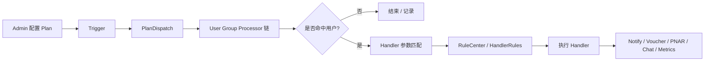

# Marketing Engine 核心知识深挖

> 返回：[Marketing Engine 架构梳理](./marketing-engine-architecture.md)
>
> 图解：[Marketing Engine 架构图解](./marketing-engine-architecture.html)
>
> 项目索引：[Marketing 项目材料](./README.md)

## 一、面试先背这 10 个点

1. Marketing Engine 是事件驱动 + 定时调度的营销规则引擎。
2. 核心抽象是 `Plan = Trigger + User Group + Handler`。
3. Trigger 决定什么时候触发：定时、MQ、实时事件。
4. User Group Processor 决定对谁执行：用户列表、实时 AND/OR、额外过滤。
5. Handler 决定做什么动作：通知、发券、PNAR、弹窗、指标清洗、组合动作。
6. RuleCenter 是通用条件判断中心，Trigger、Processor、Handler 都可能复用。
7. Processor / Handler / Rule 通过注册表插件化，新增能力尽量不改主流程。
8. Marketing-Data 负责离线人群抽取，Marketing 负责计划执行和营销动作。
9. 重复触达是核心风险，要靠规则过滤、幂等、防重复、执行记录一起防。
10. OOM / 消费堆积 / 大查询要按 Trigger、Processor、Handler、外部依赖分层排查。

## 二、核心架构



面试版：

> Marketing Engine 不是写死的活动代码，而是把营销计划抽象成 Plan。Plan 定义触发方式、目标用户筛选和执行动作。触发后先进入 PlanDispatch，再用 Processor 链判断用户是否命中，命中后由 Handler 执行发通知、发券、PNAR 等动作。RuleCenter 提供通用条件判断，避免规则散落在每个 Handler 里。

## 三、Plan 怎么讲

```text
Plan
├── TriggerType      -> 定时 / MQ / 实时事件
├── UserGroup        -> 目标人群
│   └── Processor[]  -> 筛选条件链
├── HandlerName      -> 执行动作
├── HandlerParams    -> 动作参数
├── HandlerRules     -> 执行前规则校验
└── TriggerRuleParam -> 触发前规则校验
```

| 字段 | 深挖点 |
| --- | --- |
| TriggerType | 定时适合批量计划，MQ/实时事件适合事件触发。 |
| UserGroup | 决定“对谁”，要能解释 Processor 组合方式。 |
| HandlerName | 决定“做什么”，通过注册表找到具体 handler。 |
| HandlerParams | 运营配置化参数，要注意 JSON 解析和兼容性。 |
| HandlerRules | 执行前二次校验，降低误触达。 |
| TriggerRuleParam | 触发层过滤，避免整个 plan 不该执行还继续走下去。 |

## 四、Trigger 深挖

| Trigger | 适合场景 | 关注风险 |
| --- | --- | --- |
| 定时触发 | 每天/每小时批量跑营销任务，拉离线人群。 | 大批量、调度重复、执行耗时、资源峰值。 |
| MQ 触发 | 消费外部事件或 Marketing-Data 推送的人群数据。 | 消息重复、消费失败、topic 配置、幂等。 |
| 实时事件 | 用户行为、保单状态变化等实时触达。 | 重复事件、延迟、规则漏过滤。 |

面试说法：

> Trigger 只是入口，不能只靠触发保证正确。触发之后还要经过 Processor 筛选、RuleCenter 校验和 Handler 侧防重复。

## 五、Processor / Handler / RuleCenter 的关系

| 模块 | 问题 | 例子 |
| --- | --- | --- |
| Processor | 这个用户是不是目标人群？ | 是否买过产品、是否在某个人群、保单状态是否匹配。 |
| RuleCenter | 某个通用条件是否成立？ | 活动是否有效、订单奖励是否满足、到期日是否变化。 |
| Handler | 命中后执行什么动作？ | 发通知、发券、PNAR、弹窗、指标清洗。 |

一句话：

> Processor 解决“该不该给这个用户做”，Handler 解决“做什么”，RuleCenter 提供可复用条件判断。

## 六、容易被追问的边界

### Marketing 和 Marketing-Data 怎么分工？

| 服务 | 负责 |
| --- | --- |
| Marketing | Plan 执行、Trigger、Processor、Handler、RuleCenter、发券/通知/PNAR。 |
| Marketing-Data | 离线人群抽取、ES/S3/CSV/Hive/Insight 数据处理、batch history、Kafka 推送。 |

回答模板：

> Marketing-Data 把重数据处理从主执行链路拆出来，Marketing 收到人群或事件后继续做规则筛选和营销动作执行。

### Marketing 和 O-BFF 怎么配合？

| 服务 | 负责 |
| --- | --- |
| O-BFF | Admin 后台入口，配置、查询、审批、批量任务、下游聚合。 |
| Marketing | 营销计划执行和业务动作。 |

回答模板：

> O-BFF 更偏 Admin 操作入口和后台治理；Marketing 是营销执行领域服务。Admin 配置或查询可以经过 O-BFF，但实际营销语义和执行在 Marketing。

## 七、深挖题速答

| 问题 | 回答抓手 |
| --- | --- |
| 为什么不用硬编码活动逻辑？ | Plan + Processor + Handler 配置化，新增活动主要新增配置或插件。 |
| 怎么支持新增筛选条件？ | 实现 Processor 接口并注册，主流程按 code 找处理器。 |
| 怎么支持新增动作？ | 新增 Handler 并注册，Handler 内部做参数匹配和执行。 |
| RuleCenter 为什么独立？ | 规则在 Trigger、Processor、Handler 都可能复用，独立后减少重复逻辑。 |
| 怎么避免重复触达？ | Trigger 去重、Processor 过滤、Handler 幂等、执行记录、下游幂等共同控制。 |
| 大批量人群怎么处理？ | 离线抽取交给 Marketing-Data，Marketing 主链路只消费整理后的数据。 |

## 八、1 分钟回答

> Marketing Engine 是一个事件驱动和定时调度结合的营销规则引擎。核心抽象是 Plan，一个 Plan 里配置触发方式、目标用户筛选和执行动作。触发后进入 PlanDispatch，通过 User Group Processor 链判断用户是否命中，再由 Handler 执行通知、发券、PNAR 等动作。RuleCenter 提供通用条件判断，Processor、Trigger、Handler 都可以复用。这个设计让营销活动配置化、插件化，同时通过规则过滤、幂等和执行记录降低重复触达风险。

## 九、代码和资料证据

- PlanDispatch：`/Users/si.chen/GolandProjects/insurance-marketing/src/engine/internal/manager/impl/plan_manager_impl.go`
- PlanManager 接口：`/Users/si.chen/GolandProjects/insurance-marketing/src/engine/internal/manager/plan_manager.go`
- User Group Biz：`/Users/si.chen/GolandProjects/insurance-marketing/src/engine/internal/biz/impl/user_group_biz_impl.go`
- Processor：`/Users/si.chen/GolandProjects/insurance-marketing/src/engine/internal/processor/user_group/`
- Handler：`/Users/si.chen/GolandProjects/insurance-marketing/src/engine/internal/handler/`
- RuleCenter：`/Users/si.chen/GolandProjects/insurance-marketing/src/basic/rule-center/`
