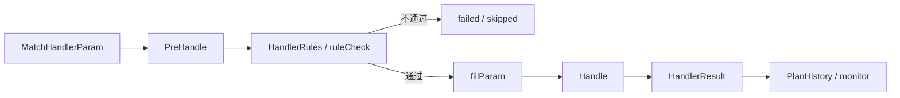

# Marketing Handler 执行和风险控制深挖

> 返回：[Marketing Engine 架构梳理](./marketing-engine-architecture.md)
>
> 项目索引：[Marketing 项目材料](./README.md)

## 一、Handler 是什么

Processor 解决“对谁”，Handler 解决“做什么”。

代码接口：

```go
type Handler interface {
    PreHandle(ctx context.Context, param HandlerParam) interface{}
    Handle(ctx context.Context, param HandlerParam, req interface{}) HandlerResult
    GetHandlerType() string
    GetHandlerDesc() string
}
```

面试说法：

> Handler 不是直接上来执行业务。它先 PreHandle 做参数校验和请求组装，再经过 HandlerRules 校验和占位符填充，最后 Handle 执行真正动作。

## 二、执行链路



## 三、Handler 类型

| 类型 | 作用 | 风险点 |
| --- | --- | --- |
| Notify | 多渠道通知、WhatsApp、AI Call 等。 | 模板参数、跳转链接、频控、防骚扰、渠道失败。 |
| Voucher | 发券或奖励。 | 资损、库存、已领券、互斥券、产品范围、下游幂等。 |
| PNAR | 保单/券/奖励提醒。 | 到期日变化、重复提醒、延迟检查、时区。 |
| Chat | 商城内弹窗或文案。 | 用户体验、展示频控、参数替换。 |
| DataClean / Metrics | 指标更新、数据清洗。 | 批量处理、内存峰值、执行耗时。 |
| Mix | 组合动作。 | 部分成功、补偿、执行顺序。 |

## 四、Notify Handler 深挖

Notify 的 PreHandle 做很多准备：

- 查询 notify 配置。
- 查询防骚扰配置。
- 初始化多渠道参数。
- 填充占位符。
- 处理 redirect URL token。
- 兼容 WhatsApp / AI Call 字段。
- 组装 NotifyCenter 请求。

风险点：

| 风险 | 防守 |
| --- | --- |
| 模板占位符缺失 | token 必须能从上下文或 placeholder service 填到。 |
| 跳转链接未完全替换 | 检查 double braces token，失败时报警。 |
| 重复通知 | anti-harassment 参数和 NotifyCenter 侧频控。 |
| 渠道差异 | WhatsApp、AI Call 等渠道有额外字段。 |

面试说法：

> Notify Handler 的难点不是调一个通知接口，而是把运营配置、占位符、跳转链接、防骚扰、多渠道差异都统一处理，最后交给 NotifyCenter。

## 五、Voucher Handler 深挖

Voucher Handler 风险更高，因为涉及资损。

代码中体现的保护点：

- 多券场景先查询用户已有券。
- 如果用户已领基础券，可能跳过发券。
- 按 group 做券替换或 A/B 策略。
- 发券前检查用户是否已领目标券。
- 检查互斥券。
- 检查产品范围。
- 可选检查用户是否做过报价/匹配操作。
- 调 RewardCenter 发券。
- 对不同错误分类上报 monitor。

面试说法：

> 发券 Handler 的重点是资损防控。不能只是调 voucher API，要检查用户是否已领、是否有互斥券、券是否适用当前产品、是否满足发券资格，并依赖 RewardCenter 做最终发券和幂等。

## 六、HandlerRules 和 RuleCenter 的价值

Handler 执行前有二次校验：

- 计划触发时用户满足条件，不代表执行时仍然满足。
- 通知和发券前需要做最后一次状态确认。
- PNAR 到期日、保单状态、奖励状态可能变化。

面试说法：

> HandlerRules 是最后一道业务闸门。它可以避免计划触发后，由于状态变化仍然误发通知或误发券。

## 七、Handler 失败怎么记录

DoExecuteHandler 会将执行结果转换成 `HandlerResult`：

- success：执行成功。
- failed：执行失败，带 code 和 detail。
- delay：延迟执行，不算普通失败。

然后：

- 记录 PlanHistory。
- 记录 Plan detail。
- 更新 result distribution。
- 上报 monitor。

## 八、深挖追问

| 追问 | 回答 |
| --- | --- |
| PreHandle 能不能做业务动作？ | 不建议。PreHandle 应做参数校验和请求组装，真正业务动作在 Handle。 |
| 发券怎么避免重复？ | 已领券检查、互斥券检查、RewardCenter 幂等、执行记录共同防。 |
| 通知怎么防骚扰？ | notify anti-harassment 配置和 NotifyCenter 侧频控。 |
| Handler 部分成功怎么办？ | Mix/multiple voucher 类要汇总成功项和失败项，必要时补偿或记录错误。 |
| HandlerRules 不通过算失败吗？ | 业务上可视为不满足执行条件，结果会记录到 handler result；某些 delay 场景单独处理。 |

## 九、1 分钟回答

> Handler 是 Marketing 的执行层，负责真正的营销动作。它有统一接口：PreHandle 做参数校验和请求组装，Handle 做业务执行。执行前还会经过 HandlerRules 和参数填充，执行后记录 HandlerResult、PlanHistory 和监控。不同 Handler 风险不同：Notify 要处理占位符、跳转链接、防骚扰和渠道差异；Voucher 涉及资损，要检查已领券、互斥券、产品范围、发券资格和下游 RewardCenter 幂等。面试时我会强调 Handler 是营销动作风险控制的最后一层。

## 十、资料来源

- Handler 接口：`/Users/si.chen/GolandProjects/insurance-marketing/src/engine/internal/handler/handler.go`
- Notify Handler：`/Users/si.chen/GolandProjects/insurance-marketing/src/engine/internal/handler/notify/notify_handler.go`
- Voucher Handler：`/Users/si.chen/GolandProjects/insurance-marketing/src/engine/internal/handler/voucher/dispatch_voucher_handler.go`
- PNAR Handler：`/Users/si.chen/GolandProjects/insurance-marketing/src/engine/internal/handler/pnar/`
- Mix Handler：`/Users/si.chen/GolandProjects/insurance-marketing/src/engine/internal/handler/mix/`
