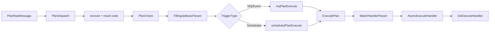
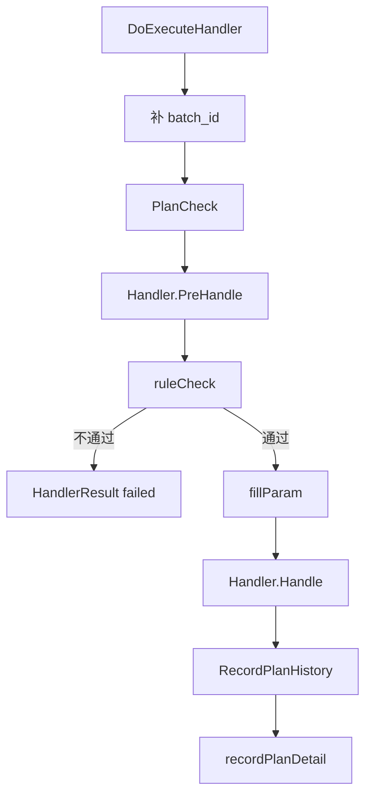

# Marketing PlanDispatch 生命周期深挖

> 返回：[Marketing Engine 架构梳理](./marketing-engine-architecture.md)
>
> 项目索引：[Marketing 项目材料](./README.md)

## 一、这篇解决什么问题

面试官如果追问“一个 Plan 从触发到执行到底怎么走”，不要只说 `Trigger -> Processor -> Handler`，可以按这篇把代码级生命周期讲出来。

核心链路：

```text
Kafka / Scheduler / Event
  -> PlanRawMessage
  -> PlanDispatch
  -> PlanCheck / FillingUpBasicParam
  -> mqPlanExecute 或 scheduledPlanExecute
  -> ExecutePlan
  -> MatchHandlerParam
  -> AsyncExecuteHandler
  -> DoExecuteHandler
  -> RecordPlanHistory / recordPlanDetail
```

## 二、PlanDispatch 主流程



代码证据：

- `PlanDispatch`：`/Users/si.chen/GolandProjects/insurance-marketing/src/engine/internal/manager/impl/plan_manager_impl.go`
- `PlanManager` 接口：`/Users/si.chen/GolandProjects/insurance-marketing/src/engine/internal/manager/plan_manager.go`

## 三、触发类型差异

| TriggerType | 代码路径 | 面试解释 |
| --- | --- | --- |
| Scheduled | `scheduledPlanExecute` | 定时计划消息中应该只有一个 plan_id，先查 plan detail，再按 user group processor 匹配。 |
| MQ | `mqPlanExecute` | 先用消息匹配 user group，再反查关联的 plan list。 |
| Event | 也走 `mqPlanExecute` | 实时事件和 MQ 类似，先看事件命中哪些 user group，再找 plan。 |

### Scheduled 关键点

`scheduledPlanExecute` 会检查：

- `PlanIdList` 必须只有一个。
- plan detail 能从 cache 查到。
- `MatchUserGroupByProcessors` 必须命中。
- 如果不命中，会记录 `PlanInsideBizMatchUserGroupProcessorFailed` 并清空 `PlanIdList`。

面试说法：

> 定时计划不是拿到 plan_id 就直接执行，还要重新查 plan detail 并跑 user group processor。这样即使离线数据推来了，也能在执行前做最后一层过滤。

### MQ / Event 关键点

`mqPlanExecute` 会：

- 调 `MatchKafkaUserGroupListByMessage` 匹配 user group。
- 再用 `GetPlanIdsByUserGroupIds` 找关联 plan。
- 最终把 plan list 放回 message。

面试说法：

> MQ/Event 模式不是消息里直接指定所有 plan，而是先用消息内容匹配 user group，再通过 user group 找 plan。这样同一类事件可以驱动多个计划。

## 四、DoExecuteHandler 执行细节



几个深挖点：

| 步骤 | 作用 | 被问时怎么说 |
| --- | --- | --- |
| 补 `batch_id` | 如果没有 batch_id，按 plan + date 生成每日 batch。 | 支持实时/MQ 类计划也能按日沉淀批次结果。 |
| `PlanCheck` | 执行前再确认 plan 状态。 | 避免计划已经停用但消息还在路上。 |
| `PreHandle` | 参数校验和组装，不做真正业务动作。 | 把参数准备和业务执行拆开，便于校验和复用。 |
| `ruleCheck` | HandlerRules 二次校验。 | 降低误触达，尤其是 PNAR、发券、通知。 |
| `fillParam` | 占位符替换。 | 把 message / user / plan 上下文填到 handler 参数里。 |
| `Handle` | 真正执行业务动作。 | 发通知、发券、PNAR、数据清洗等。 |
| 记录 history | 记录执行结果和明细。 | 方便按 plan、batch、execute id 排障。 |

## 五、异常处理怎么讲

PlanDispatch 外层有 recover：

- handler 执行前失败，会增加 batch result code。
- 避免单条消息处理 panic 影响整个 consumer。

AsyncExecuteHandler：

- 用框架 wrapper 包住执行，上报监控方法。
- Delay 类异常不算失败，等待后续执行。
- 其他异常会转成失败结果。

DoExecuteHandler：

- `handlerErr` 会区分业务异常和未知异常。
- 业务异常用 code 记录，未知异常记录 error。
- 最终仍会记录 plan history 和 plan detail。

面试说法：

> Marketing Engine 的异常处理不是简单 panic。PlanDispatch 会兜底 recover，DoExecuteHandler 会把业务异常转换成 HandlerResult，并记录 plan history。这样单条消息失败可以定位到 plan、batch、handler 和错误 code。

## 六、可能被深挖的问题

| 追问 | 稳妥回答 |
| --- | --- |
| 为什么执行前还要 PlanCheck？ | 消息可能延迟到达，计划状态可能已经变更，执行前要二次确认。 |
| Scheduled 为什么要求一个 plan_id？ | 定时任务语义是一批数据对应一个计划；多个 plan 会让批次和结果归因混乱。 |
| MQ/Event 为什么先匹配 user group？ | 事件是一类用户行为，先确定用户命中哪些人群，再找关联计划。 |
| Delay 异常为什么不算失败？ | 延迟匹配是业务设计的一部分，当前不执行，等待后续事件重新触发。 |
| Handler panic 会不会影响整批？ | 单条会记录失败和错误 code；批次结果通过 result distribution 汇总。 |

## 七、1 分钟回答

> Marketing 的 PlanDispatch 是统一执行入口。无论定时、MQ 还是实时事件，最终都会进入 PlanDispatch。它先做 PlanCheck 和基础参数填充，再按 TriggerType 走不同分支：Scheduled 会按 plan_id 查 plan detail 并跑 user group processor；MQ/Event 会先匹配 user group，再反查 plan list。之后 ExecutePlan 会把 plan 转成 handler 参数，进入 AsyncExecuteHandler 和 DoExecuteHandler。DoExecuteHandler 里会二次 PlanCheck、PreHandle、HandlerRules 校验、占位符填充、真正执行 Handler，最后记录 plan history 和执行结果。

## 八、资料来源

- `PlanDispatch`：`/Users/si.chen/GolandProjects/insurance-marketing/src/engine/internal/manager/impl/plan_manager_impl.go`
- Plan batch history：`/Users/si.chen/GolandProjects/insurance-marketing/src/engine/internal/biz/impl/plan_batch_history_biz_impl.go`
- Engine event：`/Users/si.chen/GolandProjects/insurance-marketing/src/engine/event/engine_event.go`
