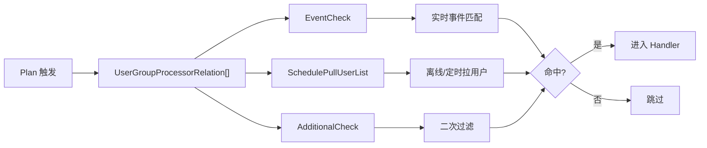
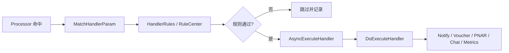

# Marketing Processor / Handler / RuleCenter 深挖

> 返回：[Marketing Engine 架构梳理](./marketing-engine-architecture.md)
>
> 图解：[Marketing Engine 架构图解](./marketing-engine-architecture.html)
>
> 项目索引：[Marketing 项目材料](./README.md)

## 一、为什么这块容易被深挖

面试官听到“规则引擎、插件化、配置化”后，很可能追问：

- Processor 链到底怎么组合？
- AND / OR / AdditionalCheck 有什么区别？
- Handler 执行前为什么还要 rule check？
- RuleCenter 和 Processor 有什么边界？
- 新增一个营销动作怎么接？
- 怎么防止重复发券/重复通知？

## 二、Processor 链怎么理解



## 三、三类 Processor

| 类型 | 解决的问题 | 常见追问 |
| --- | --- | --- |
| EventCheck | 实时事件是否匹配计划。 | 事件字段缺失、重复事件、状态变化怎么处理。 |
| SchedulePullUserList | 定时任务如何拉到目标用户列表。 | ES 查询、Marketing-Data 离线供数、大批量怎么处理。 |
| AdditionalCheck | 命中后是否还要额外过滤。 | 是否买过产品、是否在某人群、是否仍满足活动条件。 |

面试说法：

> EventCheck 偏实时事件匹配，SchedulePullUserList 偏定时拉人群，AdditionalCheck 偏二次过滤。三者组合起来，避免“触发了就一定执行”的风险。

## 四、Handler 执行深挖



| Handler | 面试口径 | 风险 |
| --- | --- | --- |
| Notify | 发站内/推送/WhatsApp/AI Call 等通知。 | 重复通知、模板参数、渠道失败。 |
| Voucher | 发券或奖励。 | 资损、库存、预算、幂等。 |
| PNAR | 保单到期提醒。 | 到期日变化、重复提醒、时区/日期。 |
| Chat | 商城内弹窗或文案。 | 展示频控、用户体验。 |
| Metrics / DataClean | 更新指标或清洗数据。 | 批量数据量、内存、重试。 |
| Mix | 组合动作，如奖励 + 通知。 | 部分成功、补偿、执行顺序。 |

## 五、RuleCenter 边界

| 位置 | RuleCenter 做什么 |
| --- | --- |
| Trigger 前 | 判断整个计划是否还要触发。 |
| Processor 中 | 判断用户是否满足某个复用条件。 |
| Handler 前 | 执行动作前做最后校验。 |

不要混淆：

- Processor 是“筛选流程节点”。
- RuleCenter 是“可复用条件判断能力”。
- Handler 是“执行动作”。

回答模板：

> RuleCenter 不替代 Processor。Processor 负责把筛选流程串起来，RuleCenter 提供其中可复用的判断逻辑，比如活动有效期、用户是否满足某条件、订单奖励状态等。

## 六、防重复触达怎么回答

重复触达不能只靠一个点解决，要多层防护：

```text
Trigger 层：避免重复调度 / 重复消费
Processor 层：用户是否仍满足条件
RuleCenter：活动、状态、时间窗口二次校验
Handler 层：动作幂等、执行记录、下游幂等
下游服务：发券/通知/奖励侧幂等
监控排障：按 plan_id / user_id / message_id 查链路
```

面试说法：

> 营销系统最怕重复触达和资损，所以不能只说“Kafka 保证一次”。更稳的是从 plan batch、user group、rule check、handler 幂等、下游幂等和执行记录一起防。

## 七、新增 Processor / Handler 怎么讲

### 新增 Processor

1. 明确输入：事件消息、用户信息、计划配置、processor params。
2. 实现对应接口：EventCheck / SchedulePullUserList / AdditionalCheck。
3. 注册 processor code 到全局 map。
4. 在 Admin 配置中引用 code 和 params。
5. 补单测和典型计划验证。

### 新增 Handler

1. 定义 handler name 和 params。
2. 实现参数匹配和执行逻辑。
3. 接 RuleCenter 或 HandlerRules 做前置校验。
4. 处理幂等、失败、重试和下游错误。
5. 注册 handler 并验证 Admin 配置。

## 八、容易被问倒的点

| 追问 | 稳妥回答 |
| --- | --- |
| Processor 顺序错了会怎样？ | 可能提前放大数据量或漏过滤；应把低成本、高选择性的过滤前置。 |
| Handler 部分成功怎么办？ | 看动作类型。发券/通知类要依赖下游幂等、执行记录和补偿策略，不能泛称事务。 |
| Rule 参数是 JSON 会不会不安全？ | 要做参数校验、默认值、兼容性和灰度；错误配置不能导致全量误触达。 |
| 实时事件重复怎么办？ | 消息侧可能重复，业务侧要有幂等键或执行记录。 |
| 定时任务拉太多人怎么办？ | 大人群交给 Marketing-Data，限制 batch、分页/scroll、监控资源。 |

## 九、1 分钟回答

> Processor、Handler、RuleCenter 是 Marketing Engine 的三个核心扩展点。Processor 负责筛选用户，分为实时事件匹配、定时拉人群和额外过滤；Handler 负责执行动作，比如通知、发券、PNAR；RuleCenter 提供通用条件判断，可以被 Trigger、Processor 和 Handler 复用。新增能力时通常新增一个 Processor 或 Handler 并注册，主流程不需要大改。面试里我会强调重复触达风险：触发、筛选、规则、Handler 幂等和下游幂等都要一起考虑。

## 十、代码和资料证据

- Processor 三类接口：`/Users/si.chen/GolandProjects/insurance-marketing/src/engine/internal/processor/user_group/`
- User Group 链式匹配：`/Users/si.chen/GolandProjects/insurance-marketing/src/engine/internal/biz/impl/user_group_biz_impl.go`
- Handler 插件：`/Users/si.chen/GolandProjects/insurance-marketing/src/engine/internal/handler/`
- RuleCenter：`/Users/si.chen/GolandProjects/insurance-marketing/src/basic/rule-center/`
