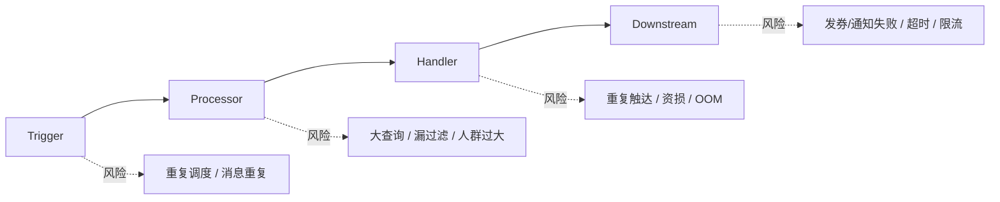

# Marketing 稳定性和排障深挖

> 返回：[Marketing Engine 架构梳理](./marketing-engine-architecture.md)
>
> OOM 案例：[Marketing 容器 OOMKilled 排障](./oom-killed-troubleshooting-star.md)
>
> 项目索引：[Marketing 项目材料](./README.md)

## 一、这篇重点背什么

Marketing 可能被深挖的稳定性问题：

- OOMKilled 怎么判断。
- 大批量人群怎么避免打爆主服务。
- Kafka 消费重复或堆积怎么办。
- 发券/通知怎么防重复。
- Handler 执行失败怎么排查。
- 规则配置错误怎么降低影响。

## 二、Marketing 稳定性风险地图



## 三、OOMKilled 怎么回答

已有案例口径：

> `exit code 137` 只是线索，强证据是平台显示 OOMKilled、`memory.events.oom_kill=1`、usage 超过 limit。还要区分业务 panic、smoke test retry 和真正导致容器退出的 OOM。

排查顺序：

```text
1. 看容器状态和 exit code
2. 看 OOMKilled / memory.events.oom_kill / usage > limit
3. 排除普通 panic 或 smoke test retry
4. 回看 OOM 前 5-15 分钟内存曲线
5. 对照 consumer、scheduler、handler、大查询、最近发版
6. 短期扩容恢复，长期优化 batch/并发/流式处理
```

## 四、大批量人群怎么防止拖垮主服务

| 风险 | 解决口径 |
| --- | --- |
| 定时计划一次性拉全量 | 交给 Marketing-Data 离线抽取，主服务消费整理后的数据。 |
| ES 查询过大 | 分页/scroll、max length、限制预览接口。 |
| Handler 一次加载太多用户 | 分批处理、限制并发、及时释放大对象。 |
| 下游通知/发券限流 | QPS 控制、重试、失败记录、下游幂等。 |
| 执行时间太长 | 异步任务化、监控耗时、按 batch 排查。 |

面试说法：

> Marketing 主服务不适合承担所有重数据处理。离线人群、大查询、文件处理交给 Marketing-Data；Marketing Engine 保留计划执行、规则筛选和动作编排。

## 五、重复触达和幂等

重复触达来源：

- 定时任务重复触发。
- MQ 至少一次投递导致重复消费。
- 同一用户命中多个 Processor 条件。
- Handler 失败重试。
- 下游发券/通知接口超时但实际成功。

防守：

| 层 | 防守方式 |
| --- | --- |
| Plan / batch | plan_id、batch_id、执行记录。 |
| Message | message key、业务唯一键、消费记录。 |
| Processor | AdditionalCheck 二次过滤。 |
| RuleCenter | 活动状态、时间窗口、状态变化校验。 |
| Handler | 幂等键、执行记录、失败重试边界。 |
| Downstream | 发券/通知侧幂等、局部失败返回。 |

不要说：

> Kafka 保证不重复，所以不会重复触达。

更稳：

> 消息系统通常只能提供投递语义，业务上还要用幂等键和执行记录兜底。

## 六、Handler 失败怎么排查

```text
1. plan_id / handler_name / trigger_type
2. user group 是否命中
3. HandlerParams 是否解析成功
4. HandlerRules / RuleCenter 是否通过
5. 下游 RPC 是否成功
6. 是否存在重试、超时、局部失败
7. 是否有执行记录或监控指标
```

常见场景：

| 场景 | 排查 |
| --- | --- |
| 通知没发出 | 看 handler、模板参数、渠道返回、用户过滤。 |
| 发券失败 | 看券配置、预算/库存、用户是否已领、下游错误。 |
| PNAR 不触发 | 看到期日、plan 配置、事件消息、RuleCenter 校验。 |
| 执行慢 | 看人群规模、下游延迟、批次大小、并发和内存。 |

## 七、配置错误怎么防

| 配置 | 风险 | 防守 |
| --- | --- | --- |
| ProcessorParams | JSON 字段错导致筛选失效。 | 参数校验、默认值、配置预览。 |
| HandlerParams | 模板、券、PNAR 参数错。 | handler 参数校验、灰度验证。 |
| HandlerRules | 规则漏配导致误触达。 | 关键计划强制二次校验。 |
| TriggerRuleParam | 不该触发的 plan 被触发。 | 触发前规则校验。 |
| topic / consumer | 消息进错链路。 | topic 配置 review 和消费监控。 |

## 八、面试 1 分钟回答

> Marketing 稳定性我会按 Trigger、Processor、Handler、下游依赖分层看。Trigger 层关注重复调度和消息重复，Processor 层关注人群是否过大、规则是否漏过滤，Handler 层关注重复触达、幂等和下游调用，基础设施层关注内存、consumer lag 和 OOM。比如 OOMKilled 不能只看 exit code 137，还要看 OOMKilled、memory.events 和 usage 是否超过 limit；大批量人群要尽量交给 Marketing-Data，主服务只做计划执行和动作编排。

## 九、代码和资料证据

- OOM 案例：[Marketing 容器 OOMKilled 排障](./oom-killed-troubleshooting-star.md)
- Engine consumer：`/Users/si.chen/GolandProjects/insurance-marketing/src/engine/consumer/inner/default_consumer.go`
- PlanDispatch：`/Users/si.chen/GolandProjects/insurance-marketing/src/engine/internal/manager/impl/plan_manager_impl.go`
- Processor：`/Users/si.chen/GolandProjects/insurance-marketing/src/engine/internal/processor/user_group/`
- Handler：`/Users/si.chen/GolandProjects/insurance-marketing/src/engine/internal/handler/`
