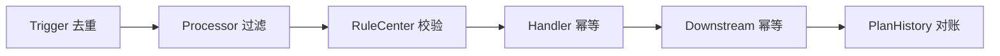

# Marketing 技术优化点和深挖清单

> 返回：[Marketing Engine 架构梳理](./marketing-engine-architecture.md)
>
> 项目索引：[Marketing 项目材料](./README.md)

## 一、面试可重点讲的优化主线

Marketing 的优化不要只讲“性能优化”，更应该讲：

1. **配置化和插件化**：Plan、Processor、Handler、RuleCenter。
2. **执行链路统一**：三种 Trigger 汇聚到 PlanDispatch。
3. **防重复触达**：Processor、RuleCenter、Handler 幂等、下游幂等。
4. **重数据拆分**：Marketing-Data 承接离线抽取。
5. **用户名单缓存优化**：Redis 二级 Roaring Bitmap / LocalCache / RemoteLocalCache。
6. **消费并发控制**：topic 级 consume limit。
7. **批次可观测**：PlanBatchHistory + result distribution。
8. **稳定性排障**：OOM、consumer lag、handler error 分层定位。

## 二、优化点总表

| 优化点 | 解决的问题 | 面试怎么讲 |
| --- | --- | --- |
| Processor/Handler 自注册 | 新增营销能力如果改主流程，风险高。 | 策略模式 + 注册表，新增能力只新增实现和注册。 |
| 三种 Trigger 统一入口 | 定时、MQ、事件各写一套执行逻辑会分裂。 | 全部汇聚到 PlanDispatch，统一筛选和执行。 |
| PlanCheck 二次校验 | 消息延迟时 plan 可能已停用。 | 执行前再次检查 plan 状态，避免过期计划继续触达。 |
| HandlerRules 二次校验 | 触发时满足条件，执行时状态可能变化。 | Handler 执行前再校验，降低误发通知/误发券。 |
| Marketing-Data 拆分 | 大查询、文件处理拖慢主引擎。 | 主服务专注执行，离线抽取独立可观测。 |
| Redis 二级 Roaring Bitmap | 大用户名单在线判断慢、普通 Set/Bitmap 容易形成资源浪费。 | user_id 按 high/low 拆分，稀疏段用 Set，密集段用 Bitmap，满段只记 meta。 |
| 本地 Roaring Bitmap 缓存 | 热点人群需要更快 membership check。 | 数量受控的人群加载到本服务内存，用 `roaring64.Bitmap.Contains` 判断。 |
| RemoteLocalCache | 其他服务也需要快速判断用户名单。 | Marketing 把序列化 `roaring64.Bitmap` 存 Redis，其他服务拉到本地缓存。 |
| topic 级并发限制 | 高流量 topic 可能打爆服务。 | 默认并发 + 配置化并发，超时保护。 |
| Batch History 汇总 | 只看日志难判断整批成功。 | 汇总抽取数量、执行分布、成功失败和异常状态。 |
| Done 后再检查 | 批次完成后仍可能有迟到消费。 | 结束后延迟检查 distribution，发现不一致改 exception。 |
| Notify 防骚扰 | 通知重复影响用户体验。 | anti-harassment 配置和 NotifyCenter 频控。 |
| Voucher 防资损 | 发券重复或错发有资损风险。 | 已领券、互斥券、产品范围、RewardCenter 幂等。 |

## 三、防重复触达专项

分层回答：

| 层 | 防线 |
| --- | --- |
| Trigger | 避免重复调度；MQ 至少一次投递要有业务幂等。 |
| Processor | 用户是否仍满足条件，低成本过滤前置。 |
| RuleCenter | 活动、状态、时间窗口二次判断。 |
| Handler | 执行记录、已领券检查、防骚扰、参数校验。 |
| Downstream | Voucher/Notify/RewardCenter 侧最终幂等。 |
| History | plan/batch/execute 维度排查和对账。 |

不要说：

> Kafka 不重复，所以不会重复触达。

更稳：

> 消息系统不能替业务保证完全不重复，Marketing 要靠业务幂等和执行记录兜底。

## 四、性能和资源优化专项

| 风险 | 优化 |
| --- | --- |
| 定时大批量人群 | 交给 Marketing-Data 离线抽取，主引擎消费消息。 |
| 大名单在线判断 | 预处理到 Redis 二级 Roaring Bitmap，避免执行时扫 DB/ES/S3。 |
| Redis BigKey | highKey 分段，meta hash + 二级容器拆 key。 |
| topic 消费过快 | topic 级并发限制和等待超时。 |
| Handler 一次处理太多 | 分批、减少大对象、避免一次性加载全量。 |
| ES 大查询 | Marketing-Data scroll/limit/max length，不在主链路做大查询。 |
| 下游 RPC 慢 | 限流、超时、失败结果、重试边界。 |
| OOMKilled | 区分 exit code 137、OOMKilled、usage > limit，再查任务和 consumer 峰值。 |

## 五、可观测性优化专项

应该能按这些维度查：

- `plan_id`
- `batch_id`
- `execute_id`
- `handler_name`
- `trigger_type`
- `topic`
- result code distribution
- success / fail count
- plan history detail
- consumer logs

面试说法：

> Marketing 的排障不是只看一条 error log，而是从 plan、batch、execute id、handler、topic 和 result distribution 串起来看。

## 六、配置风险优化专项

| 配置 | 风险 | 防守 |
| --- | --- | --- |
| ProcessorParams | 条件错导致漏过滤或全量命中。 | 参数校验、Admin 预览、灰度。 |
| HandlerParams | 模板、券、跳转链接配置错。 | PreHandle 校验和占位符检查。 |
| HandlerRules | 漏配导致误触达。 | 高风险计划强制二次规则。 |
| TopicName | 消息走错消费链路。 | topic 注册和计划配置 review。 |
| AntiHarassment | 频控配置缺失导致骚扰。 | Notify 防骚扰配置和监控。 |

## 七、面试项目包装

可以这样讲：

> 我们对 Marketing Engine 的优化重点不是单纯提高 QPS，而是让营销计划可配置、可扩展、可观测、可控风险。架构上用 Plan 抽象统一定时、MQ 和实时事件；扩展上用 Processor、Handler、RuleCenter 自注册；稳定性上把大数据抽取拆到 Marketing-Data，并对 topic 消费做并发限制；风险上通过 Processor、HandlerRules、防骚扰、发券检查和下游幂等降低重复触达和资损；排障上用 batch history 和 result distribution 汇总执行结果。

## 八、容易被追问的点

| 追问 | 回答 |
| --- | --- |
| 你说插件化，怎么保证不会注册冲突？ | Processor code 注册时检查唯一性；Handler name 需要通过规范和 review 控制。 |
| 你说配置化，配置错怎么办？ | PreHandle、Processor 参数校验、RuleCheck、Admin 预览和灰度验证。 |
| 如何证明一批执行完？ | Marketing-Data history + Marketing result distribution 对账。 |
| OOM 怎么优化？ | 短期扩容恢复，长期看 consumer 并发、大批量 handler、大对象和 Marketing-Data 拆分。 |
| 发券重复怎么办？ | 已领券检查、互斥券、RewardCenter 幂等、执行记录和批次对账。 |
| 用户名单缓存怎么优化？ | 详见 [Marketing 用户名单 Redis / Roaring Bitmap 深挖](./marketing-user-list-redis-roaring-bitmap-deep-dive.md)。 |

## 九、资料来源

- PlanManager：`/Users/si.chen/GolandProjects/insurance-marketing/src/engine/internal/manager/impl/plan_manager_impl.go`
- Consumer：`/Users/si.chen/GolandProjects/insurance-marketing/src/engine/consumer/inner/default_consumer.go`
- Batch History：`/Users/si.chen/GolandProjects/insurance-marketing/src/engine/internal/biz/impl/plan_batch_history_biz_impl.go`
- Handler：`/Users/si.chen/GolandProjects/insurance-marketing/src/engine/internal/handler/`
- RuleCenter：`/Users/si.chen/GolandProjects/insurance-marketing/src/basic/rule-center/`
- Group Center / Redis Roaring Bitmap：`/Users/si.chen/GolandProjects/insurance-marketing/src/basic/group-center/`
