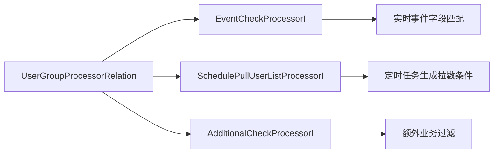

# Marketing User Group Processor 链深挖

> 返回：[Marketing Engine 架构梳理](./marketing-engine-architecture.md)
>
> 项目索引：[Marketing 项目材料](./README.md)

## 一、这篇重点背什么

User Group Processor 是 Marketing 最容易被问细的模块。它决定“这个用户是不是目标人群”，也是防止误触达和重复触达的关键层。

用户名单和缓存专项可以继续看：[Marketing 用户名单 Redis / Roaring Bitmap 深挖](./marketing-user-list-redis-roaring-bitmap-deep-dive.md)。

核心回答：

> Processor 链是 Marketing Engine 的用户筛选层。它把实时事件匹配、定时拉人群和额外过滤抽象成不同 processor，通过 ConditionType 组合成 AND、OR、Delay 等逻辑。

## 二、Processor 注册机制

代码里所有 processor 都实现基础接口并自注册：

```go
type BaseUserGroupProcessorI interface {
    GetProcessorDisplayName() string
    GetProcessorCode() string
}
```

注册时维护两张 map：

| map | 作用 |
| --- | --- |
| `processorCodeMap` | 按 processor code 查具体实现，并检查 code 唯一。 |
| `subTypeProcessorMap` | 按 subtype 给 Admin 或管理侧展示可选 processor。 |

面试说法：

> Processor 是策略模式 + 自注册。新增筛选能力时实现接口并注册 processor code，主流程按配置里的 code 找处理器，不需要改 PlanDispatch 主链路。

## 三、三类 Processor



| 类型 | 接口方法 | 适合场景 | 例子 |
| --- | --- | --- | --- |
| EventCheck | `Handle(ctx, params, message) bool` | MQ/Event 消息是否命中条件。 | 保单状态变更、页面行为、用户事件。 |
| SchedulePullUserList | `Handle(ctx, params, message) (bool, string)` | 定时计划定义从哪里拉用户。 | 按保单、用户营销信息、车辆信息拉人群。 |
| AdditionalCheck | `Handle(ctx, params, message) bool` | 命中后再做业务过滤。 | 是否买过产品、是否在某个组、折扣状态。 |

## 四、ConditionType 怎么讲

| ConditionType | 语义 | 面试重点 |
| --- | --- | --- |
| UserList | 定时/离线人群来源。 | 通常和 Marketing-Data 或 ES 拉数有关。 |
| RealtimeAnd | 实时条件全部通过。 | 适合强约束，降低误触达。 |
| RealtimeOr | 实时条件任一通过。 | 适合多个入口事件触发同一计划。 |
| DelayAnd | 延迟后再 AND 检查。 | 适合等待状态变化后再判断。 |
| DelayOr | 延迟后再 OR 检查。 | 适合多个延迟条件任一满足。 |

面试提醒：

> Delay 不是失败，而是当前不执行，发布延迟事件或等待后续检查。面试时不要把 Delay 解释成系统异常。

## 五、执行顺序和优化思路

Processor 链顺序会影响性能和准确性。

优化原则：

- 低成本过滤尽量前置。
- 高选择性过滤尽量前置。
- 会调用下游 RPC 的 AdditionalCheck 不要无脑放前面。
- 需要 ES/离线拉数的大查询交给 Marketing-Data。
- Delay 类型要明确重试/等待窗口。

举例：

```text
事件字段本地判断
  -> 活动状态 / 时间窗口
  -> 用户是否在目标组
  -> 下游是否已有保单/券/奖励
  -> Handler 执行
```

## 六、防误触达和防重复触达

Processor 层可以挡住很多风险：

| 风险 | Processor 防线 |
| --- | --- |
| 用户事件重复 | EventCheck + 后续 Handler 幂等。 |
| 用户已经不满足条件 | AdditionalCheck 二次确认。 |
| 人群范围过大 | SchedulePullUserList 条件收紧，Marketing-Data 限制 max length。 |
| 配置错导致漏过滤 | Processor params 校验和 Admin 预览。 |
| 状态延迟变化 | DelayAnd / DelayOr 延迟检查。 |

## 七、深挖追问

| 追问 | 回答 |
| --- | --- |
| Processor 和 RuleCenter 区别？ | Processor 是筛选流程节点，RuleCenter 是可复用判断逻辑。Processor 可以调用 RuleCenter。 |
| Processor code 重复会怎样？ | 注册时会检查唯一性，重复会 panic 初始化失败。 |
| 新增 Processor 要注意什么？ | 参数校验、输出字段、下游依赖、性能、是否影响重复触达。 |
| Delay processor 怎么解释？ | 它用于业务等待窗口，不是系统失败；当前返回不执行，后续再触发检查。 |
| UserList 和 AdditionalCheck 谁先？ | 定时人群先由 UserList 定义来源，AdditionalCheck 做额外过滤；顺序要结合成本和选择性。 |
| 用户名单很大怎么判断命中？ | 不在主链路扫 DB/ES/S3，大名单会预处理成 Redis 二级 Roaring Bitmap 或本地 `roaring64.Bitmap`，在线只做 membership check。 |

## 八、1 分钟回答

> User Group Processor 是 Marketing 的用户筛选链。它分成 EventCheck、SchedulePullUserList 和 AdditionalCheck 三类：EventCheck 负责实时事件是否匹配，SchedulePullUserList 负责定时计划怎么拉人群，AdditionalCheck 负责额外业务过滤。Processor 通过 code 自注册，Admin 配置里引用 code 和 params。执行时按 ConditionType 组合 AND、OR、Delay 等逻辑。面试里我会强调 Processor 是防误触达的关键层，低成本和高选择性过滤要尽量前置，复杂大人群拉取交给 Marketing-Data。

## 九、资料来源

- Processor 基础接口：`/Users/si.chen/GolandProjects/insurance-marketing/src/engine/internal/processor/user_group/user_group_processor.go`
- EventCheck：`/Users/si.chen/GolandProjects/insurance-marketing/src/engine/internal/processor/user_group/event_check/`
- SchedulePullUserList：`/Users/si.chen/GolandProjects/insurance-marketing/src/engine/internal/processor/user_group/schedule_pull_user_list/`
- AdditionalCheck：`/Users/si.chen/GolandProjects/insurance-marketing/src/engine/internal/processor/user_group/additional_check/`
- 链式匹配：`/Users/si.chen/GolandProjects/insurance-marketing/src/engine/internal/biz/impl/user_group_biz_impl.go`
