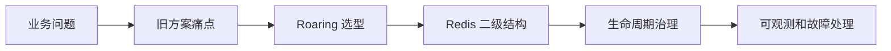
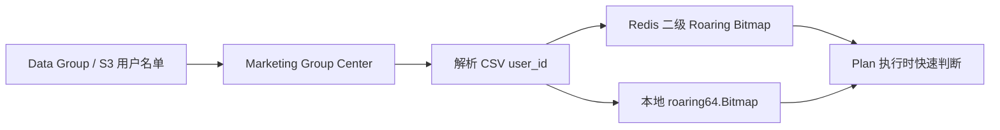
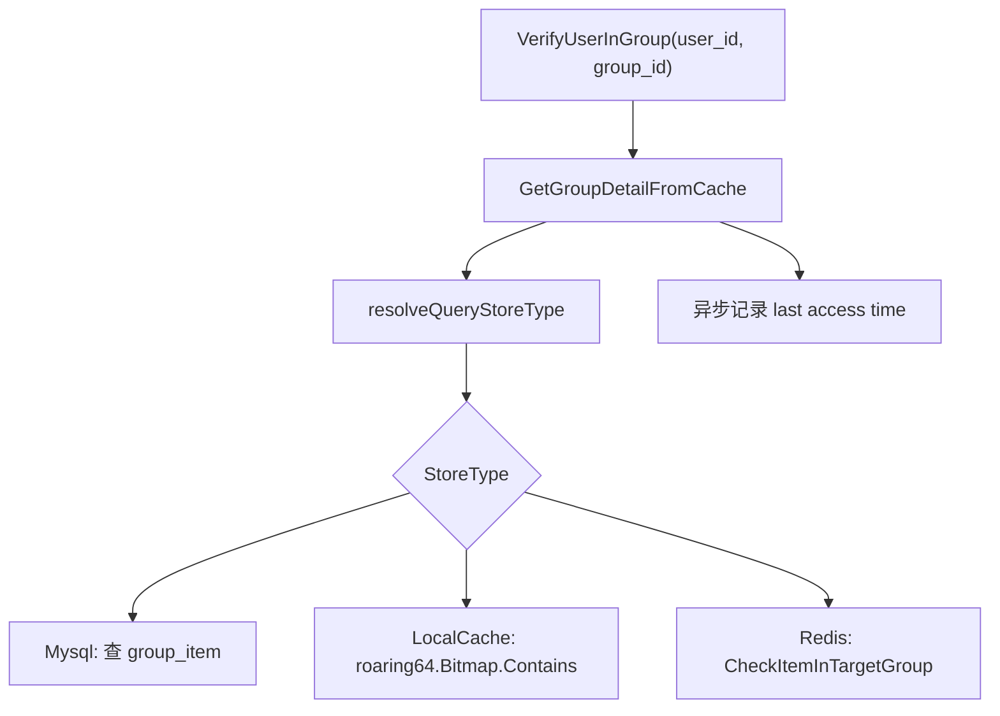
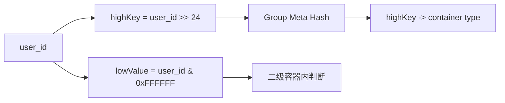
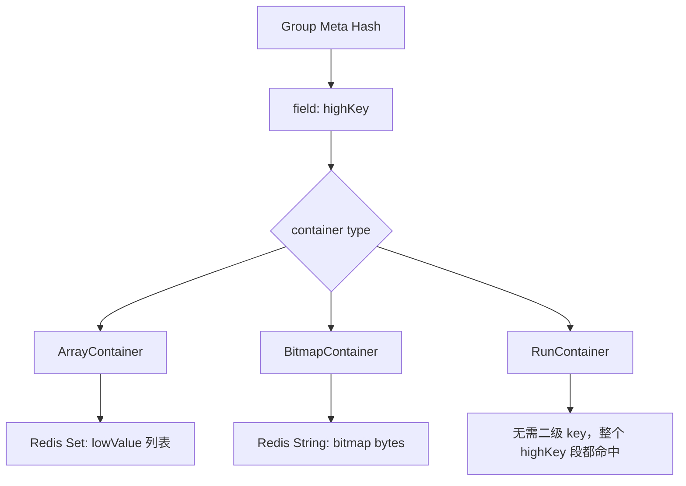
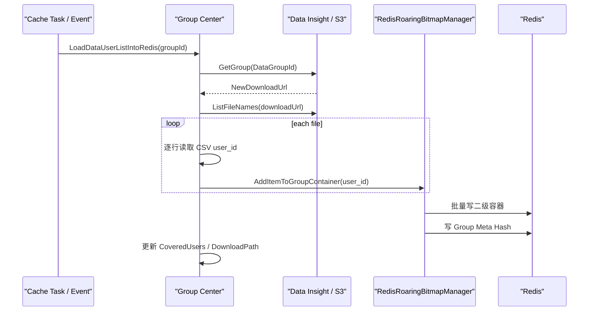
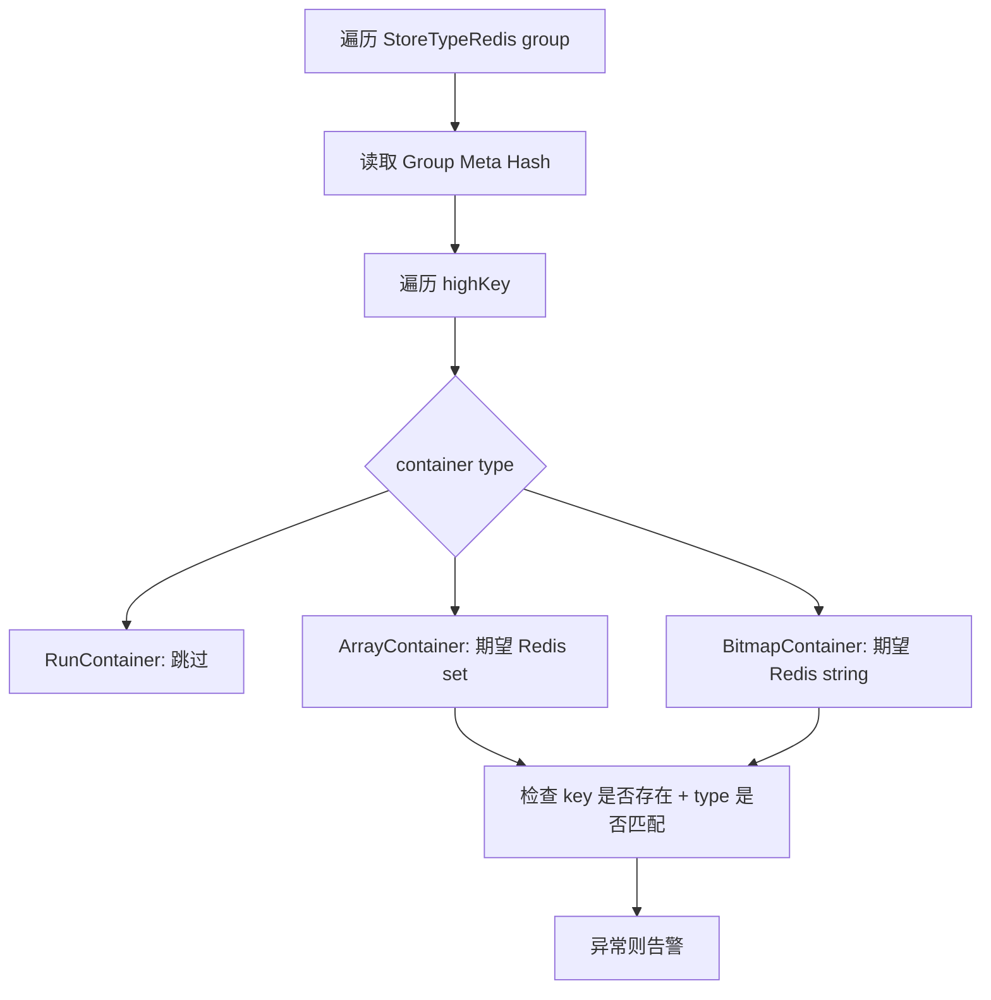
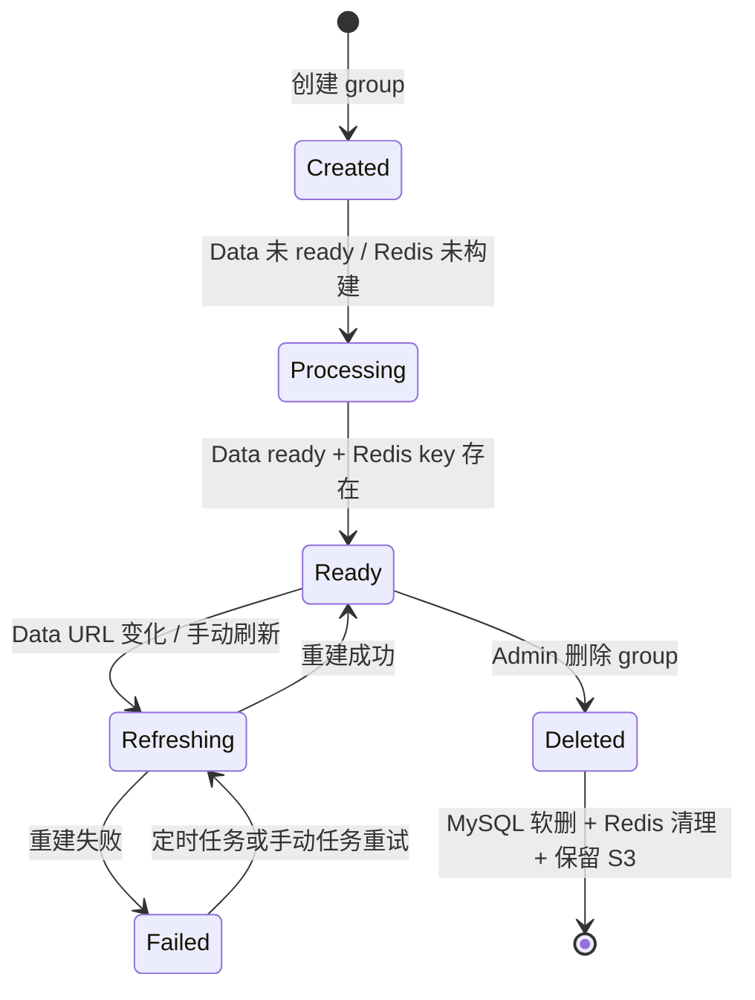

# Marketing 用户名单 Redis / Roaring Bitmap 深挖

> 返回：[Marketing Engine 架构梳理](./marketing-engine-architecture.md)
>
> 项目索引：[Marketing 项目材料](./README.md)
>
> 可视化图解：[Marketing 用户名单 Redis / Roaring Bitmap 图解](./marketing-user-list-redis-roaring-bitmap-deep-dive.html)

## 一、这篇重点背什么

这篇专门补 Marketing 里“用户名单”相关的技术深挖。它比普通 Processor 更容易被问细，因为这里同时涉及：

- 大批量用户 ID 怎么存。
- 在线判断用户是否命中人群怎么快。
- Redis 里怎么避免 BigKey。
- Roaring Bitmap 为什么适合用户名单。
- 数据更新后缓存怎么刷新、怎么校验完整性。

一句话回答：

> Marketing 的 User Group 不是每次都扫 DB 或 ES 判断用户是否命中，而是把离线用户名单预处理成可快速查询的缓存。大名单会拆成 Redis 二级 Roaring Bitmap 结构，稀疏段用 Set，密集段用 Bitmap，满段只记 meta；本服务内还支持本地 `roaring64.Bitmap` 缓存和给其他服务使用的 RemoteLocalCache。

Confluence 资料已补充：

- [人群分组匹配优化设计](https://confluence.shopee.io/pages/viewpage.action?pageId=2520060867)
- [人群分组匹配优化设计-归档](https://confluence.shopee.io/pages/viewpage.action?pageId=2563285442)
- [人群分组缓存生命周期管理优化](https://confluence.shopee.io/pages/viewpage.action?pageId=3132095191)
- [Group Center 批次反向索引设计方案](https://confluence.shopee.io/pages/viewpage.action?pageId=3196988176)

## 二、面试讲述路线

如果面试官让你详细讲这块，可以按 5 层展开：



| 层级 | 你要讲清楚什么 | 关键句 |
| --- | --- | --- |
| 业务问题 | Marketing 要在触达前判断用户是否属于某个目标人群。 | 这是典型 membership check。 |
| 旧方案痛点 | Bloom Filter 有误判，固定 bitmap 浪费内存。 | 精准触达场景不能接受误判。 |
| Roaring 选型 | Roaring 对整数集合做分段压缩，支持精准匹配。 | 稀疏用 Array/Set，密集用 Bitmap，连续/满段用 Run。 |
| Redis 二级结构 | 64 位 user_id 拆 high/low，meta hash 记录每个 highKey 的容器类型。 | 查询先查 meta，再查二级容器。 |
| 生命周期治理 | 数据会更新，缓存会缺失，空分组也要能表达。 | 需要定时检查、手动刷新、完整性检查、告警和 marker。 |

一句完整开场：

> 这块我会从用户组匹配问题讲起。Marketing 触达前需要判断用户是否在目标人群里，原来 Bloom Filter 类方案有误判，Redis 固定 bitmap 又有内存浪费，所以我们把用户名单预处理成 Roaring Bitmap 思路的结构。具体落地时没有改 Redis 服务端，而是在客户端按 user_id 高低位拆分，把每个 highKey 对应的 lowValue 存到不同容器里：稀疏段用 Redis Set，密集段用 Redis bitmap，满段只记录 meta。这样能做到精准匹配，同时避免单个 Redis BigKey。后面再配合缓存刷新、完整性检查和空分组 marker，保证缓存生命周期可控。

## 三、先讲人话

营销计划要回答一个问题：

> 当前用户是不是这个计划的目标人群？

如果每次触达都去查 ES、S3 文件或大表，主链路会慢，而且流量高时容易拖垮下游。所以系统会提前把用户名单准备好：

1. 数据侧生成名单文件或 Data Group。
2. Marketing 把文件里的 user_id 解析出来。
3. 按适合的存储方式写到 Redis 或内存。
4. 执行计划时只做一次快速 membership check。



## 四、Group StoreType 怎么区分

代码里人群不是只有一种存法，而是按 `StoreType` 区分。

| StoreType | 含义 | 查询方式 | 面试说法 |
| --- | --- | --- | --- |
| `StoreTypeMysql` | 小规模或普通 DB 人群。 | 查 `group_item`。 | 简单但不适合大规模在线判断。 |
| `StoreTypeDataS3` | Data 侧输出的离线文件。 | 通常作为源数据，不直接在线查询。 | 用于离线名单来源。 |
| `StoreTypeRedis` | 大名单写入 Redis 二级 Roaring Bitmap。 | `CheckItemInTargetGroup`。 | 主打在线快速判断。 |
| `StoreTypeLocalCache` | Marketing 服务本地内存缓存。 | `roaring64.Bitmap.Contains`。 | 适合热点、数量受控的本服务查询。 |
| `StoreTypeRemoteLocalCache` | 其他服务使用的本地缓存源。 | Marketing 先把序列化 bitmap 放 Redis，其他服务拉取。 | 适合跨服务复用用户组。 |
| `StoreTypeInsuranceS3` | Insurance S3 文件源。 | 作为文件来源。 | 常和 RemoteLocalCache 搭配。 |

关键点：

> `VerifyUserInGroup` 会先根据 group 的 usage 和 store type 解析出可查询存储，再分别走 DB、本地内存或 Redis Roaring Bitmap。不是所有 store type 都直接参与在线查询。

### StoreType 决策矩阵

Confluence 里不是简单按“数据大就 Redis”来选，而是按四个维度判断：数据量、是否要求即时查询、请求并发、是否允许误差。

| 场景 | 数据量 | 并发 | 是否要求精准 | 推荐查询存储 | 原因 |
| --- | --- | --- | --- | --- | --- |
| Seller Promotion 名单 | 小 | 低 | 不允许误差 | MySQL | 查询压力低，DB 足够。 |
| mepage 资源位名单 | 大 | 高 | 原来允许误差，优化后精准 | 本地 Roaring Bitmap | 全局 QPS 高，减少 Redis 压力。 |
| 货架分组名单 | 大 | 低 | 不允许误差 | Redis Roaring Bitmap | 需要精准，但不适合每次扫 S3/DB。 |
| Data tag 大名单 | 大 | 低/中 | 看业务要求 | Data S3 + Redis / LocalCache | S3 做持久化，缓存做查询加速。 |

面试提醒：

> StoreType 是工程取舍，不是技术炫技。小数据低并发可以 MySQL；高并发热点可以本地 Roaring；大名单精准匹配更适合 Redis Roaring。

## 五、在线判断链路



### 1. 为什么要先查 GroupDetail cache

GroupDetail 里有 `MetaInfo`，包括数据来源、DataGroupId、文件路径、StoreTypeList、CoveredUsers 等。在线判断前必须知道这个 group 到底应该从哪里查。

### 2. 为什么记录 last access time

代码里会异步记录 group 最近访问时间，并且 5 分钟内节流一次。这个信息可以服务于后续清理、排查或使用情况判断。

注意不要在面试里说成强一致业务逻辑：

> last access time 是辅助观测和管理信息，不是判断用户命中的必要条件。

### 3. 在线查询伪代码

```text
VerifyUserInGroup(ctx, user_id, group_id)
  group = GetGroupDetailFromCache(group_id)
  store_type = resolveQueryStoreType(group.usage, group.store_types)

  async recordLastAccessTime(group_id)

  if store_type == MySQL:
      return query group_item where group_id and user_id

  if store_type == LocalCache:
      bitmap = localCache[group_id]
      return bitmap.Contains(user_id)

  if store_type == Redis:
      return CheckItemInTargetGroup(group_id, user_id)
```

Redis Roaring 的查询可以继续拆：

```text
CheckItemInTargetGroup(group_id, user_id)
  highKey = user_id >> 24
  lowValue = user_id & 0xFFFFFF

  containerType = HGET groupMetaKey(group_id), highKey

  if containerType is nil:
      return false

  if containerType == ArrayContainer:
      return SISMEMBER groupHighKey(group_id, highKey), lowValue

  if containerType == BitmapContainer:
      return GETBIT groupHighKey(group_id, highKey), lowValue

  if containerType == RunContainer:
      return true
```

这段伪代码可以直接背。面试官追问“到底怎么查 Redis”，就按这段说。

## 六、Redis 二级 Roaring Bitmap 结构

这是最值得重点讲的优化。

### 1. 为什么要拆 high / low

代码把 user_id 拆成两段：

```text
highKey = user_id >> 24
lowValue = user_id & 0xFFFFFF
```

含义：

- `highKey` 决定这个用户落在哪个大段。
- `lowValue` 是这个大段里的位置。
- 每个大段最多覆盖 `2^24` 个 low value。
- Confluence 里的方案口径是把 64 位整数拆成高 40 位和低 24 位：低位容器最大容量 `16,777,216`，单 bitmap 容器最大约 `2M`，单用户组理论最大 highKey 数 `1024`。

这样做的好处：

- 避免一个超大 Redis key 承载所有用户。
- 不同 highKey 可以分别选择最适合的容器。
- 查询时只需要先定位 highKey，再查对应容器。



### 2. Redis 里具体存什么



| 容器 | Redis 形态 | 适合场景 | 查询方式 |
| --- | --- | --- | --- |
| `ArrayContainer` | Redis Set | 某个 highKey 段里用户较少，比较稀疏。 | `SISMEMBER` |
| `BitmapContainer` | Redis String bitmap | 某个 highKey 段里用户较多，比较密集。 | `GETBIT` |
| `RunContainer` | 只记录 meta | 整个 low 区间都命中。 | 直接返回 true |

面试重点：

> 这不是简单把所有 user_id 丢进一个 Redis Set，而是按 highKey 分段，再按稀疏/密集程度选择不同容器。稀疏时 Set 更省，密集时 Bitmap 查询快且空间可控，满段时只存 meta。

### 3. Redis key 和 value 怎么理解

不要死记具体 key 字符串，面试更重要的是说清结构：

| Key 类型 | 逻辑含义 | 数据结构 | 内容 |
| --- | --- | --- | --- |
| Group Meta Key | 某个 group 的 highKey 到容器类型映射。 | Redis Hash | `highKey -> 1/2/3` |
| Group High Key | 某个 group 某个 highKey 的 lowValue 集合。 | Redis Set 或 String bitmap | Set 存 lowValue；String 存 bitmap bytes。 |
| Local Roaring Key | RemoteLocalCache 场景给其他服务拉取。 | Redis String | `roaring64.Bitmap.MarshalBinary()` 结果。 |
| Last Access Key | 记录分组最近访问时间。 | Redis String | RFC3339 时间字符串。 |

逻辑例子：

```text
group_id = 123
user_id  = 9,000,000,001

highKey  = user_id >> 24
lowValue = user_id & 0xFFFFFF

HGET group_meta:123 highKey -> 2
GETBIT group_high:123:highKey lowValue -> 1
=> 用户命中 group 123
```

### 4. 容器选择怎么落到代码

| 容器 | 代码里的行为 | 为什么这样 |
| --- | --- | --- |
| ArrayContainer | 初始创建 `RoaringArrayContainer`，内部维护有序数组，输出到 Redis Set。 | 少量元素用数组/Set，空间更省。 |
| BitmapContainer | Array 超过 `ArrayDefaultMaxSize=65536` 后转 Bitmap。 | 密集后用 bitmap 查询快，空间上限稳定。 |
| RunContainer | Bitmap 接近填满时用 RunContainer 表达满段。 | 满段不需要再存所有 bit，只要 meta 表示整段命中。 |

和标准 Roaring Bitmap 的关系：

> 标准 Roaring 常见是 32 位整数高 16 位/低 16 位，容器阈值常见 4096。我们这里面对的是 64 位 user_id，Confluence 评估后选了 40/24 拆分，并把低位容器临界点设为 65536，是结合 Redis 存储和 user_id 分布做的工程化改造。

## 七、Redis 缓存构建链路

以 Data Group 到 Redis 为例：



关键实现点：

| 步骤 | 代码行为 | 面试解释 |
| --- | --- | --- |
| 获取源文件 | 根据 `DataGroupId` 查 `NewDownloadUrl`。 | Data 侧负责产出名单，Marketing 负责消费和缓存。 |
| 解析 CSV | 按行读取，每行解析一个 user_id。 | 避免主链路临时查大文件。 |
| 跳过表头 | 第一条非空且非数字记录会按 header 候选跳过。 | 提高文件兼容性。 |
| 加入容器 | `AddItemToGroupContainer` 按 high/low 放入容器。 | 构建分段 Roaring 结构。 |
| 批量写 Redis | highKey 每 100 个容器批量写一次。 | 控制 Redis 写入批次和内存峰值。 |
| 写 meta | `group meta hash` 记录 highKey 到容器类型。 | 查询时先读 meta 再决定怎么查二级 key。 |
| 更新统计 | 更新 `CoveredUsers` 和 download path。 | 后续页面展示和变更检测用。 |

### 构建链路里的异常处理

| 异常场景 | 处理方式 | 为什么重要 |
| --- | --- | --- |
| Data Group 没有 `NewDownloadUrl` | 触发告警，跳过或等待后续更新。 | 没有稳定数据源不能构建缓存。 |
| 文件列表为空 | 告警；如果是过期 data tag，可降噪跳过告警。 | 避免长期噪音，也避免误判数据 ready。 |
| 首行不是数字 | 当作表头候选跳过。 | 兼容 CSV header。 |
| 中间行不是合法 user_id | 计入 invalidCount 并告警。 | 区分合法空分组和脏数据。 |
| `success=0 && invalid>0` | 认为数据异常，不写 Redis。 | 避免把坏数据误当空分组。 |
| `success=0 && invalid=0` | 写空分组 marker。 | 表达“缓存已初始化，但没有成员”。 |
| Redis 写失败 | 告警并返回失败。 | 避免 ApproveStatus 错误推进。 |

### 空分组 marker 为什么重要

原问题：

```text
HighKeyMap 为空 -> groupMetaInfo 为空 -> HMSet 空 map -> Redis 报 wrong number of arguments
```

改造后：

```text
HighKeyMap 为空 -> 写入 "__empty_group__" = RunContainer
```

注意：`__empty_group__` 不是实际 highKey。查询用户时会按数字 highKey 查 meta，因此查不到就返回 false。删除和完整性巡检遍历 meta 时会跳过这个 marker。

面试说法：

> 空分组也要有一个“已初始化成功”的表达，否则系统无法区分“缓存没建好”和“这个 group 本来就没有人”。marker 解决的就是这个状态表达问题。

## 八、本地缓存和 RemoteLocalCache

### 1. LocalCache

`StoreTypeLocalCache` 会在 Marketing 服务内维护：

```text
group_id -> *roaring64.Bitmap
```

执行判断时直接：

```text
bitmap.Contains(user_id)
```

适合场景：

- 本服务内高频判断。
- 人群数量有限。
- 可以接受服务内存占用。

保护点：

- 默认 `MaxLocalCacheNum = 16`。
- 初始化前会复用旧缓存，只有数据源变化时更新。
- `InitMemoryForAllCids` 会按 CID 初始化。

### 2. RemoteLocalCache

`StoreTypeRemoteLocalCache` 的逻辑是：

1. Marketing 从 Insurance S3 或 Data S3 读取用户名单。
2. 构造标准 `roaring64.Bitmap`。
3. `MarshalBinary` 序列化。
4. 写入 Redis string。
5. 其他服务再从 Redis 读取并初始化自己的本地缓存。

面试说法：

> RemoteLocalCache 不是让 Marketing 在线查这个 Redis key，而是把用户名单处理成跨服务可复用的压缩 bitmap，让其他服务可以拉到本地做快速判断。

### 三种缓存方案对比

| 方案 | 查询位置 | 优点 | 缺点 | 适合场景 |
| --- | --- | --- | --- | --- |
| MySQL | DB | 简单、数据一致性清楚。 | 大量在线查询会慢。 | 小名单、低并发。 |
| LocalCache | 服务内存 | 查询最快，不打 Redis。 | pod 重启要加载，受内存限制，多 pod 各自占用。 | mepage 这类高 QPS 热点分组。 |
| Redis Roaring | Redis | 精准、容量扩展比本地好，pod 重启不需要全量重载。 | 多一次 Redis 请求，key 发散，需要生命周期管理。 | 大名单、需要精准匹配。 |
| RemoteLocalCache | Redis 作为分发源，其他服务本地查 | 跨服务复用，查询最终落本地。 | 需要消费者服务正确拉取、更新和失效。 | C-BFF/Product 等需要本地快速判断的场景。 |

## 九、一致性和刷新机制

这块可以作为“优化项 + 稳定性保障”来讲。

| 机制 | 解决的问题 | 代码行为 |
| --- | --- | --- |
| 定时检查 Redis cache | Redis key 缺失或数据源变化。 | `CheckAndReloadGroupCache` 检查并重建。 |
| download path 对比 | Data Group 内容更新。 | 新旧 `downloadUrl` 不同则删除旧 key 并重建。 |
| ApproveStatus 推进 | 避免数据没准备好就标记完成。 | Data ready 且 Redis key 存在后改成 done。 |
| 手动刷新任务 | 定点修复某个 group 缓存。 | `refresh_group_redis_cache_task` 加锁、删除旧 key、重建。 |
| 二级 Redis 完整性检查 | meta 存在但二级容器缺失或类型错误。 | 检查 highKey 容器是否存在、类型是否匹配。 |
| SeaTalk 告警 | 缓存构建失败、文件为空、非法记录。 | 关键失败会发告警。 |

### 二级 Redis 完整性检查怎么讲



可背表达：

> 二级 Redis 结构最怕 meta 和实际容器不一致。比如 meta 说某个 highKey 是 Set，但二级 key 丢了，在线判断就会漏命中；或者 meta 说 Bitmap，但 Redis 类型不是 string，也会导致查询异常。所以系统有完整性检查任务，按 group 遍历 meta，再检查二级 key 是否存在、类型是否符合预期。

### 缓存生命周期状态机



面试讲法：

> 用户名单缓存不是一次写完就结束。创建后要等 Data ready 和 Redis 构建成功才能进入可用状态；Data URL 变化时要重建；缓存 key 缺失时要补建；删除时要清 Redis 但保留 S3 便于恢复；如果缓存异常，可以通过手动刷新任务定点修复。

### 从线上问题怎么排查

| 现象 | 优先检查 | 可能原因 |
| --- | --- | --- |
| 用户本该命中但未命中 | group meta 是否有 highKey；二级 key 是否存在；container type 是否匹配。 | Redis key 缺失、Data 未更新、high/low 计算或缓存旧版本。 |
| 用户不该命中但命中 | Data 源名单是否包含该 user_id；RunContainer 是否误标；group 是否选错。 | 源数据错误、配置选错 group、缓存未刷新。 |
| Group 一直 processing | Data ready 状态、`NewDownloadUrl`、Redis key 是否存在。 | Data 文件未产出、Redis 写失败、空文件异常。 |
| Redis 内存异常增长 | group 数量、highKey 数量、active/old key 清理情况。 | 旧 group 未删、缓存 TTL 改为不过期后缺少清理、draft/active 叠加。 |
| 告警太多 | data tag 是否过期、文件为空是否合法。 | 过期 data tag 未降噪、空分组没有 marker。 |

### 删除和可删除标识

缓存生命周期子页里还有一条重要治理线：删除 group 不能只看当前 group 自己，要看是否被活动、货架、通知、券、Promotion、C-BFF 等引用。

| 机制 | 作用 |
| --- | --- |
| Delete Checker 注册 | 每种 `usage_type` 注册对应 checker，新增 usage 时不容易漏。 |
| DeleteGroup 全量检查 | 删除前遍历 checker，任何关联都阻断。 |
| `last_access_time` | 展示这个 group 最近有没有被运行时访问。 |
| `can_delete_group` | 定时任务预计算“看起来可删除”的提示，但最终以 DeleteGroup 实时 checker 为准。 |

面试提醒：

> `can_delete_group` 只是展示和运营提示，不是最终授权。真正删除时仍然要跑实时 checker，避免删掉正在被业务引用的分组。

## 十、为什么 Roaring Bitmap 适合这个场景

先讲人话：

> 用户名单本质是“集合 membership check”：给一个 user_id，判断它在不在集合里。Roaring Bitmap 非常适合压缩大量整数集合，并且支持快速判断。

再讲原理：

- 普通 Set 存每个 user_id，稀疏时简单，但大规模时 Redis 对象开销明显。
- 普通 Bitmap 按最大 user_id 开空间，ID 很大且稀疏时浪费。
- Roaring Bitmap 会分段，并在每个段里选择 Array / Bitmap / Run 等容器。
- 当前实现把这个思想落到了 Redis 二级结构里，避免单 key 过大，也能按段选择不同存法。

面试怎么说：

> 我们的优化点不是只用了一个现成库，而是把 Roaring Bitmap 的分段思想和 Redis 存储结合起来。写入时按 highKey 分桶，稀疏桶用 Set，密集桶用 Bitmap，满桶用 RunContainer；读取时先查 meta，再用 `SISMEMBER` 或 `GETBIT` 判断，所以能兼顾空间和查询效率。

### 和 Bloom Filter 的本质区别

| 维度 | Bloom Filter | Roaring Bitmap |
| --- | --- | --- |
| 是否精准 | 可能误判存在。 | 精准 membership check。 |
| 删除支持 | 标准 Bloom 不适合删除，需要 Counting Bloom 等变体。 | 集合结构天然可以表达精确成员。 |
| 空间模型 | 依赖 bit 数和 hash 个数，误判率和空间换算。 | 依赖整数分布，稀疏/密集段使用不同容器。 |
| 适合场景 | 可以接受误判的快速过滤。 | 不允许误判的用户组匹配。 |

一句话：

> Bloom Filter 更像“先粗筛”，Roaring Bitmap 更像“精确集合”。Marketing 用户触达如果不能接受误判，就应该往精确集合方向优化。

## 十一、容易被深挖的追问

| 追问 | 回答 |
| --- | --- |
| 为什么不直接用 Redis Set 存所有用户？ | 大名单会形成大 key，内存和网络开销高；分段后可以按 highKey 拆 key，稀疏段才用 Set。 |
| 为什么不直接用 Redis Bitmap？ | user_id 可能很大且稀疏，纯 Bitmap 会按最大 offset 开空间，浪费明显。 |
| high / low 为什么按 24 位拆？ | Confluence 对比过 38/26、39/25、40/24 三种拆法。40/24 下单容器最大 2M、临界元素数 65536、理论最大 highKey 数 1024，兼顾单 key 大小和 key 发散。代码也用 `LowBitNum=24`。 |
| ArrayContainer 和 BitmapContainer 怎么切换？ | 代码里 Array 超过 `ArrayDefaultMaxSize` 后转 BitmapContainer；Bitmap 接近满段时可变成 RunContainer。 |
| Redis key 缺失怎么办？ | 定时检查会发现 key 缺失并触发重建；手动刷新任务也可指定 group 重建。 |
| Data Group 更新怎么办？ | 对比 Data Group download path，发现变化就删除旧缓存并重建。 |
| 怎么防缓存不一致？ | ApproveStatus 要等数据 ready 和 Redis key 存在；二级 Redis 完整性检查会检查 meta 和二级 key。 |
| 本地缓存会不会撑爆内存？ | 有 `MaxLocalCacheNum` 上限，且只适合数量受控的场景；大名单更适合 Redis Roaring 或 RemoteLocalCache。 |
| 线上判断失败会不会中断营销执行？ | `verifyUserInTargetGroup` 有 recover 兜底，异常时倾向返回不命中，避免异常扩散；但要配合告警排查。 |
| 为什么 Redis nil 不应该打 Warn？ | 用户不在 group 里时，highKey 不存在是正常未命中，不是系统异常；打 Warn 会制造日志噪音。 |
| TTL=0 会不会导致 Redis 永远不删？ | TTL=0 表示不过期，删除由 group 删除、手动刷新、生命周期任务触发；好处是避免超长 TTL 语义不清，风险是必须做好清理治理。 |
| 为什么手动刷新要加锁？ | 同一 group 同时删除旧 key 和重建新 key，有并发风险；用分布式锁按 group 互斥。 |
| 空分组 marker 会不会导致所有用户都命中？ | 不会。marker 字段名是 `__empty_group__`，正常查询按数字 highKey HGET，查不到就返回 false；遍历清理时跳过 marker。 |
| 本地缓存和 Redis 缓存会不会不一致？ | 会有短暂窗口，所以要靠 reload、定时任务、Data URL 对比和手动刷新修复；不同场景选择不同一致性要求。 |
| 为什么 batch 反向索引不复用正向索引？ | 正向索引回答 `group_id + user_id -> bool`，batch 反向索引回答 `batch_id + user_id -> group_id[]`；逐组扫正向索引成本随 group 数线性增长。 |

## 十二、可以包装成的优化项

面试项目表达：

> 我参与/熟悉的一个优化点是 Marketing 用户名单匹配。原来大名单如果直接查 DB、ES 或普通 Redis Set，会在在线触达链路里产生较高延迟和资源压力。我们把用户名单预处理成 Redis 二级 Roaring Bitmap：按 user_id 高低位拆分，meta 记录每个 highKey 的容器类型，稀疏数据用 Set，密集数据用 Bitmap，满段用 RunContainer。在线判断时只需要一次 meta 查询加一次 `SISMEMBER` 或 `GETBIT`。同时通过 Data Group download path 变更检测、缓存重建任务、二级 Redis 完整性检查和告警，保证缓存更新和查询可靠性。

注意：如果面试官问具体性能指标，比如 QPS、延迟下降、内存节省比例，目前文档没有确认的真实数据，不要编。可以说：

> Confluence 里有测试样本，例如本地 Roaring Bitmap 在 100 万用户量级约 2.24M，1000 万用户量级约 20.2M，明显低于原本的 Bloom Filter 样本；Redis 二级 Roaring 也有 246 万、1000 万数据量的初始化和内存样本。不过正式面试如果要讲线上收益百分比，我会只引用文档样本，不编造线上监控结论。

### 30 秒版本

> Marketing 里用户组匹配本质是判断 user_id 是否在某个名单集合里。旧的 Bloom/bitmap 方案要么有误判，要么固定占用内存高。我们用 Roaring Bitmap 的思想做了优化：本地高 QPS 场景用 `roaring64.Bitmap`，其他大名单用客户端改造的 Redis Roaring Bitmap。Redis 里按 user_id 高 40 位、低 24 位拆分，meta 记录每个 highKey 的容器类型，稀疏用 Set，密集用 Bitmap，满段用 Run。这样精准匹配、内存更可控，也避免在线链路扫 DB/ES/S3。

### 2 分钟版本

> 这个优化的背景是 Marketing 触达前要判断用户是否属于目标人群。原来的本地 Bloom Filter 和 Redis 类 Bloom bitmap 都是近似匹配，会有误判；而 Redis 固定 bitmap 对小容量用户组也要占固定空间。我们选了 Roaring Bitmap 思路，因为 user_id 是整数集合，Roaring 可以按分段选择不同容器，实现精准 membership check。落地上，我们没有引入 Redis 插件，而是在客户端把 64 位 user_id 拆成 highKey 和 lowValue。Meta Hash 存 highKey 到容器类型的映射；如果容器是 ArrayContainer，就在 Redis Set 里查 lowValue；如果是 BitmapContainer，就用 GETBIT；如果是 RunContainer，就直接认为该 highKey 段命中。缓存构建由 Data Group / S3 文件异步完成，在线执行只做快速查询。后面还补了缓存生命周期治理，比如 Data URL 变化重建、二级 Redis 完整性检查、手动刷新、空分组 marker 和 last_access_time，保证缓存不只是快，也可维护、可排查。

### 5 分钟版本

> 我会分三层讲。第一层是业务问题：Marketing 的 Plan 执行前需要做用户组匹配，这个匹配必须快，而且在很多触达场景不能误判。第二层是选型：小数据低并发可以 MySQL，高并发 mepage 用本地 Roaring Bitmap 减少 Redis 压力，大名单精准匹配用 Redis Roaring Bitmap。我们没有直接用 Redis Set，因为大名单会形成大 key；也没有直接用普通 Bitmap，因为 user_id 分布可能稀疏，会浪费空间。第三层是落地：按 40/24 拆分 user_id，highKey 用作分桶，lowValue 存到对应容器。容器按数据密度选择：稀疏段用 Set，密集段用 Bitmap，满段用 RunContainer。查询时先 HGET meta 拿容器类型，再用 SISMEMBER 或 GETBIT 判断。最后一层是工程治理：Data URL 变更触发重建，Redis key 缺失可以定时补建，完整性检查会校验 meta 和二级 key，空分组用 marker 表示已经初始化但无成员，删除 group 前通过 checker 防止删除仍被活动引用的分组。

## 十三、Confluence 已确认的优化点

### 1. 旧方案问题

Confluence 对用户组按四个维度分类：

- 数据量大小。
- 请求并发高低。
- 是否要求即时查询。
- 是否要求精准查询。

旧方案主要有两个问题：

| 问题 | 说明 | 面试解释 |
| --- | --- | --- |
| 不支持精准匹配 | 本地 Bloom Filter、Redis 类 Bloom bitmap 都有误判概率。 | 营销触达和货架分组如果要求精准，就不能接受误判。 |
| 内存占用偏高 | Redis 类 Bloom bitmap 用四组固定 1.2 亿位 bitmap 联合过滤，小容量用户组也要占固定空间。 | 数据量小时固定 bitmap 很浪费。 |

旧方案样本：

| 用户量级 | 本地 Bloom Filter | Redis 类 Bloom bitmap |
| --- | --- | --- |
| 100 万数据内存 | 35M | 60M |
| 1000 万数据内存 | 65M | 60M |
| 100 万数据误判率 | 1/100 万 | 1/1 万 |
| 1000 万数据误判率 | 1/100 万 | 8/1 万 |

设计目标：

- 支持精准匹配，消除误判。
- 降低 Redis bitmap 占用内存。

### 2. 方案选型

Confluence 对比了几类方案：

| 方案 | 优点 | 缺点 | 结论 |
| --- | --- | --- | --- |
| 客户端改造 Redis Roaring Bitmap | 不改 Redis 组件，分组数据存在 Redis，pod 重启不用重新加载全部数据。 | key 会发散，客户端定制开发。 | 作为非 mepage 场景主方案。 |
| 引入 Redis-Roaring Bitmap 插件 | Redis key 发散少，客户端改动少。 | 需要 SRE 引入插件，可能影响其他 Redis 业务；开源版本只支持 32 位。 | 没作为首选。 |
| 自研 Redis 插件支持 64 位 | 使用体验最好，Redis key 发散少。 | 改造成本高，需要 SRE 配合，影响面大。 | 没作为首期方案。 |
| 内存 Roaring Bitmap | 精准、内存低、纯内存查询快。 | 容量扩展性受 pod 内存限制，pod 重启需要初始化。 | mepage 场景使用。 |

方案选择：

- `mepage` 资源位分组：使用本地 Roaring Bitmap。Confluence 原因是全局 QPS 约 `1500+`，希望降低 Redis 压力和接口响应时延。
- 其他分组：使用客户端改造的 Redis Roaring Bitmap。

### 3. 40 / 24 拆分的评审依据

Confluence 对 high/low 拆分做过对比：

| 高位数 | 低位数 | 单用户组最大 key 数 | 低位容器最大容量 | 单容器最大内存 | Set/Bitmap 临界元素数 |
| --- | --- | --- | --- | --- | --- |
| 38 | 26 | 256 | 67,108,864 | 8M | 262,144 |
| 39 | 25 | 512 | 33,554,432 | 4M | 131,072 |
| 40 | 24 | 1024 | 16,777,216 | 2M | 65,536 |

最终当前代码采用 `LowBitNum=24`。面试时可以说：

> 24 位低位是一个折中：单个 bitmap 容器最大约 2M，不会太大；每个用户组最多 1024 个 highKey，key 发散可接受；Set 到 Bitmap 的临界点是 65536，和代码里的 ArrayContainer 转 BitmapContainer 逻辑一致。

### 4. 本地 Roaring Bitmap 测试样本

Confluence 给出的本地缓存样本：

| 用户量级 | Roaring Bitmap 内存 | Bloom Filter 内存 | Map 内存估算 | Roaring 加载耗时 |
| --- | --- | --- | --- | --- |
| 100 | 0.44K | 待补充 | 0.8K | < 1S |
| 1000 | 4K | 待补充 | 8K | < 1S |
| 1 万 | 39K | 待补充 | 80K | < 1S |
| 10 万 | 340K | 待补充 | 800K | 1S |
| 100 万 | 2.24M | 35M | 8M | 12S |
| 1000 万 | 20.2M | 65M | 80M | 112S |

可讲结论：

> Roaring Bitmap 在大名单上比 Bloom Filter 和普通 map 更省内存，而且是精准匹配；加载耗时和 map 同量级，但换来了更低内存和更明确的数据结构语义。

### 5. Redis Roaring Bitmap 测试样本

Confluence 给出的 Redis 初始化样本：

| 用户组数据量 | Redis 内存预估 | 总初始化耗时 | 本地初始化 | Redis 初始化 |
| --- | --- | --- | --- | --- |
| 2,461,973 test 真实数据 | 64,031,648 bytes | 8s | 7s | 1s |
| 10,000,000 live 真实数据 | 16,777,216 bytes | 24s | 24s | 0s |
| 10,000,000 live 真实数据 | 22,934,816 bytes | 25s | 23s | 2s |
| 9,993,581 随机构造数据 | 319,794,592 bytes | 31s | 24s | 7s |

本地 Roaring 和 Redis Roaring 对比校验：

| 检测类型 | 分组样本量 | 抽检量 | 一致率 |
| --- | --- | --- | --- |
| 正向匹配 | 9,999,999 | 10,000 | 100% |
| 反向不匹配 | 9,999,999 | 100 | 100% |

注意：

> 这些是 Confluence 测试样本，不等于线上长期监控指标。面试里可以引用为“设计验证数据”，不要说成“线上稳定收益百分比”。

### 6. 缓存生命周期管理优化

`人群分组缓存生命周期管理优化` 子页补了很多可讲的工程优化点：

| 优化点 | 解决的问题 | 当前代码/设计落点 |
| --- | --- | --- |
| Delete Checker 注册机制 | 删除检查散落在代码里，新增 usage_type 容易漏 checker。 | usage_type -> checker 注册；删除前全量 checker。 |
| 删除策略改造 | 删除 group 时连 S3 数据一起删，无法恢复。 | MySQL 软删除 + Redis 清理 + 保留 S3。 |
| last_access_time | 用户看不到分组最近是否还在被用。 | `VerifyUserInGroup` 异步记录，5 分钟节流。 |
| 未使用分组检测 | 旧 group 长期堆积，Redis 占用不可控。 | `detect_unused_group_task` 结合 last_access_time 和 checker 标记可删除。 |
| 手动刷新 Redis | 单个 group 缓存异常时只能等定时任务。 | `refresh_group_redis_cache_task` 加锁、删旧 key、重建。 |
| 过期 data tag 告警降噪 | data tag 已过期但仍告警。 | 根据 EA `end_date` 跳过过期告警。 |
| group not found 日志降级 | 正常未命中也打 warn，影响排查。 | Redis nil 未命中降级为 debug。 |
| Redis 缓存取消 TTL | 超长 TTL 语义不清。 | 写入 TTL=0，由删除/刷新触发清理。 |
| 空分组 marker | 空文件或只有表头导致 HMSet 空 map 报错。 | 写 `__empty_group__ = RunContainer`，遍历时跳过。 |

这个子页很适合包装成稳定性优化：

> Redis Roaring Bitmap 解决的是“怎么快、怎么准”；缓存生命周期管理解决的是“缓存什么时候建、什么时候删、坏了怎么修、空分组怎么兜底”。两个合起来才是完整方案。

### 7. 关联拓展：batch 反向索引

`Group Center 批次反向索引设计方案` 是后续更高级的方向，解决的问题不是单个 group 的 `group_id + user_id -> bool`，而是：

```text
batch_id + user_id -> group_id[]
```

适合业务在一批 tag group 里做实时千人千面判断。核心点：

- 查询必须带 `batch_id`，避免旧 group 污染新策略。
- Group Center 只返回命中的 `group_id[]`，不保存业务费率和优先级。
- batch group 首期只建反向索引，不建现有正向 Redis / LocalCache。
- 用 `active_version` / `draft_version` 做版本切换，draft 不完整时继续读旧 active。
- Data fingerprint 以 `NewDownloadUrl` 为核心，manifest 记录每个 group 的快照。

面试里如果被追问“如果不是判断用户是否在某个组，而是要知道用户命中哪些组怎么办”，可以用这个作为拓展回答。

## 十四、不能乱说的点

| 容易说错 | 更稳的说法 |
| --- | --- |
| “Roaring Bitmap 一定比所有方案都省内存。” | 它依赖数据分布。Confluence 样本里对我们的用户名单更省，但随机数据的 Redis 内存也可能更高。 |
| “用了 Redis 就强一致。” | 这是缓存加速层，需要 Data URL 对比、刷新任务和完整性检查来维护一致性。 |
| “RunContainer 就是 Redis 里存了连续区间。” | 当前实现里 RunContainer 表示满段，不需要二级 key；不要讲成复杂区间存储。 |
| “空分组 marker 表示用户都命中。” | marker 只表示空分组缓存初始化成功，正常查询仍返回 false。 |
| “batch 反向索引已经替代现有正向匹配。” | 它是拓展方案，解决 `batch_id + user_id -> group_id[]`，不是替代 `group_id + user_id -> bool`。 |
| “优化带来了线上多少 QPS/延迟收益。” | 目前可引用 Confluence 测试样本，不要编线上长期指标。 |

## 十五、资料来源

- Group Center 主逻辑：`/Users/si.chen/GolandProjects/insurance-marketing/src/basic/group-center/internal/biz/impl/group_biz_impl.go`
- Redis Roaring Bitmap 写入：`/Users/si.chen/GolandProjects/insurance-marketing/src/basic/group-center/internal/roaring_bitmap/redis_roaring_bitmap_manager.go`
- Local Roaring Bitmap 写入：`/Users/si.chen/GolandProjects/insurance-marketing/src/basic/group-center/internal/roaring_bitmap/local_roaring_bitmap_manager.go`
- Data/S3 文件转 bitmap：`/Users/si.chen/GolandProjects/insurance-marketing/src/basic/group-center/internal/util/group_biz_util_local_cache.go`
- Data Group 写 Redis：`/Users/si.chen/GolandProjects/insurance-marketing/src/basic/group-center/internal/util/group_biz_util_redis.go`
- 缓存刷新任务：`/Users/si.chen/GolandProjects/insurance-marketing/src/basic/group-center/task/`
- Redis 查询 SDK：`/Users/si.chen/GolandProjects/insurance-marketing/vendor/git.garena.com/shopee/insurance/insurance-backend/insurance-framework/marketing-sdk/group_match/redis_roaring_bitmap.go`
- StoreType 常量：`/Users/si.chen/GolandProjects/insurance-marketing/src/common/constant/group_constant.go`
