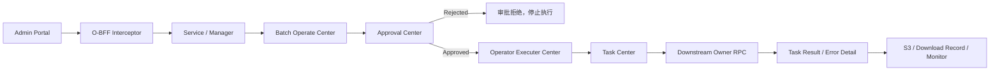
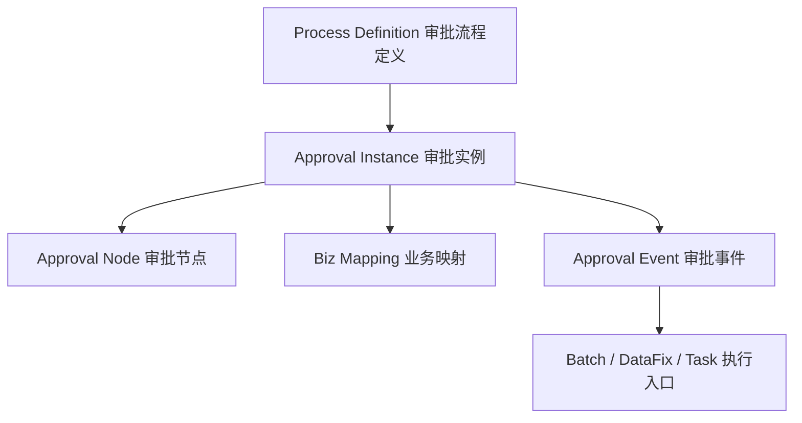
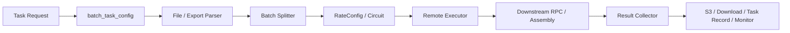
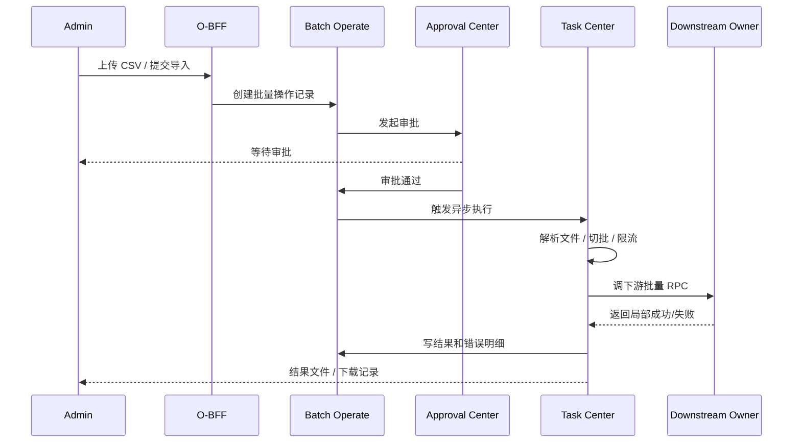

# O-BFF Approval Center / Task Center 架构说明

> 可视化图解：[Approval Center / Task Center 架构图解](./o-bff-approval-task-center-architecture.html)
>
> 返回：[O-BFF 架构梳理](./o-bff-architecture.md)
>
> 深挖文档：[O-BFF 审批 / 批量 / 任务 / 数据修复深挖](./o-bff-governance-centers-deep-dive.md)
>
> 项目索引：[O-BFF 项目材料](./README.md)

## 一、先讲人话

Approval Center 和 Task Center 经常一起出现，但职责完全不同：

| 中心 | 核心问题 | 一句话 |
| --- | --- | --- |
| Approval Center | **能不能执行？谁批准？有没有审计？** | 高风险后台操作的审批状态机和审计层。 |
| Task Center | **怎么异步执行？怎么切批？怎么记录结果？** | 配置驱动的批处理执行引擎。 |

面试背法：

> Approval Center 管“允不允许做”，Task Center 管“允许后怎么做”。审批通过不代表业务一定成功，真正执行还要看 Task Center、下游 owner 服务和任务结果。

## 二、整体协作架构



这张图可以拆成三句话：

1. Admin 提交后，O-BFF 先建立“这次操作”的上下文。
2. Approval Center 负责审批流，不直接做批处理。
3. 审批通过后，Task Center 负责真正的异步执行、结果记录和错误明细。

## 三、Approval Center 架构

### 1. 解决的问题

后台操作风险比普通查询高，尤其是：

- 批量修改配置。
- 批量导入。
- 数据修复。
- 影响用户、保单、订单、券、营销计划的操作。

这些动作不能直接执行，需要先回答：

- 谁提交的？
- 操作对象是什么？
- 是否需要审批？
- 审批人是谁？
- 审批通过后触发什么？
- 审批拒绝后如何停止？
- 后续如何审计和复盘？

### 2. 概念模型



| 概念 | 人话解释 | 面试要点 |
| --- | --- | --- |
| 审批流程定义 | 这个业务怎么审批、谁审批、节点怎么走。 | 是规则/模板，不是某一次提交。 |
| 审批实例 | 某一次真实提交，比如某个 CSV 导入。 | 每次高风险操作都应该有实例可查。 |
| 审批节点 | 当前卡在哪个审批人/步骤。 | 能回答待审批、通过、拒绝等状态。 |
| 业务映射 | Admin API / biz_type 和审批类型的映射。 | 标准 proxy 也可以通过 `audit_biz_type_mapping` 接审批。 |
| 审批事件 | 审批结果通知后续模块。 | 审批通过后才触发执行。 |

### 3. 状态流

```text
Created
  -> Pending Approval
  -> Approved / Rejected
  -> Approved 后触发业务执行
  -> Executed Success / Executed Failed
```

注意：`Approved` 只是“允许执行”，不是“执行成功”。

面试高分点：

> 审批状态和执行状态要分开。审批通过只代表风险控制层放行，后面的 Task Center 或下游 RPC 仍然可能失败，所以要有任务状态、错误明细和审计记录。

## 四、Task Center 架构

### 1. 解决的问题

Task Center 解决的是长耗时和批量执行问题：

- Admin 页面不能同步等几万条数据处理完。
- CSV 需要解析、校验、字段映射。
- 大导出需要分页、scroll、S3 文件和下载记录。
- 调下游 RPC 需要切批、限流、超时、熔断。
- 失败要能定位到单条数据。

### 2. 架构模型



| 模块 | 作用 | 深挖点 |
| --- | --- | --- |
| `batch_task_config` | 配置任务类型、远程调用、字段映射、导入导出策略。 | Task Center 是配置驱动，不是每个导入导出都硬编码。 |
| File / Export Parser | 解析 CSV，或分页/scroll 查询导出数据。 | 导入看文件字段，导出看分页稳定性。 |
| Batch Splitter | 把大批量拆成多个小批次。 | 避免一次请求过大打爆下游。 |
| RateConfig / Circuit | 控制 batch size、并发、QPS、timeout、熔断。 | 保护下游和 O-BFF 自身稳定性。 |
| Remote Executor | 调下游 RPC / Assembly / JSON RPC。 | 下游要支持幂等和局部失败。 |
| Result Collector | 汇总成功、失败、错误明细。 | 面试重点是“失败定位到单条”。 |
| S3 / Download / Monitor | 结果文件、下载记录、监控指标。 | 异步任务必须可查、可下载、可观测。 |

### 3. Task Center 不等于 Batch Operate Center

| 维度 | Batch Operate Center | Task Center |
| --- | --- | --- |
| 关注点 | 这次运营批量操作是什么。 | 这个任务怎么执行。 |
| 负责 | 上传记录、审批关联、批量操作状态、下载入口。 | 文件解析、切批、调用下游、S3、callback、monitor。 |
| 类比 | 工单 / 操作记录。 | 执行引擎。 |
| 关系 | 可以发起审批，审批通过后进入执行。 | 通常在审批通过后真正跑任务。 |

## 五、典型流程 1：批量导入



面试说法：

> 批量导入不是 Admin 同步调接口直接执行，而是先创建批量操作记录，再走审批，审批通过后由 Task Center 异步解析文件、切批、调用下游，并生成成功失败明细。

## 六、典型流程 2：批量导出

```text
Admin 发起导出
  -> O-BFF 创建 task record
  -> 读取 batch_task_config
  -> 按 Page / Scroll / SearchAfter 查询
  -> 生成文件
  -> 上传 S3
  -> 写 download record
  -> Admin 下载结果
```

导出比普通查询更需要 Task Center，因为：

- 数据量大。
- 页面不能同步等。
- 需要稳定分页或 scroll。
- 需要文件生成和下载记录。
- 失败要能查 task 状态。

## 七、典型流程 3：数据修复

```text
Admin 创建 data fix
  -> 填业务 ID、字段、修复原因
  -> 发起审批
  -> 审批通过
  -> reliable event / async execute
  -> 调 owner 服务修复接口
  -> 记录执行状态
```

数据修复不一定都经过 Task Center，但一定要记住：

> 数据修复不能说成直接改库。O-BFF 负责入口、审批、审计和异步触发，真正数据语义仍由 owner 服务处理。

## 八、深挖追问

| 追问 | 稳妥回答 |
| --- | --- |
| 审批通过是否代表执行成功？ | 不是。审批和执行是两个阶段，审批通过只是放行，执行结果要看 Task Center / event / 下游返回。 |
| 为什么需要 Task Center？ | 批量和长耗时任务不能同步阻塞页面，需要切批、限流、异步执行、结果文件和错误明细。 |
| Task Center 如何保证稳定？ | `RateConfig` 控制 batch size、并发、QPS、timeout、熔断；任务状态和监控保证可观测。 |
| 下游部分失败怎么办？ | 下游应返回单条错误，Task Center 汇总成功/失败数量和错误文件。 |
| 怎么避免重复执行？ | 前端重复请求控制、batch/task record、业务唯一键、下游幂等一起防。 |
| 为什么不直接在 O-BFF 改 DB？ | 会绕过 owner 服务状态机、校验、审计和领域约束。 |

## 九、1 分钟面试回答

> Approval Center 和 Task Center 是 O-BFF 后台治理里的两个不同层次。Approval Center 负责高风险操作的审批状态机，解决“这件事能不能执行、谁审批、怎么审计”；Task Center 负责审批通过后的异步批处理，解决“怎么解析文件、怎么切批、怎么限流、怎么调下游、怎么记录成功失败和错误明细”。比如批量导入会先创建 Batch Operate 记录并发起审批，审批通过后再进入 Task Center 异步执行，最后生成结果文件和任务状态。审批通过不等于执行成功，这两个状态要分开看。

## 十、代码和资料证据

- Approval Center：`/Users/si.chen/GolandProjects/insurance-operator-bff/src/approval_center/`
- Batch Operate Center：`/Users/si.chen/GolandProjects/insurance-operator-bff/src/batch_operate_center/`
- Task Center：`/Users/si.chen/GolandProjects/insurance-operator-bff/src/task_center/`
- Operator Executer Center：`/Users/si.chen/GolandProjects/insurance-operator-bff/src/operator_executer_center/`
- Data Fix Center：`/Users/si.chen/GolandProjects/insurance-operator-bff/src/data_fix_center/`
- Task config：`/Users/si.chen/GolandProjects/insurance-operator-bff/src/task_center/model/model_ext/task_config.go`
- 监控告警：`/Users/si.chen/GolandProjects/insurance-operator-bff/project-kb/tech/OBFF_Monitoring_Alerts.md`
