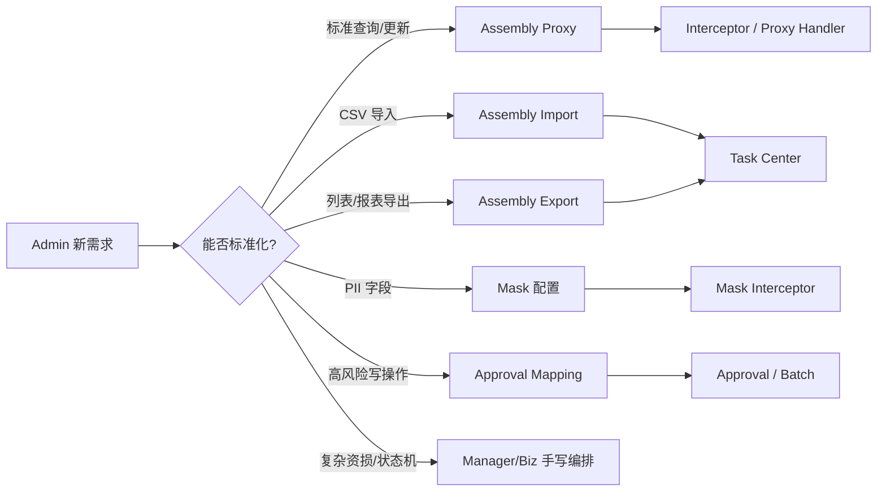

# O-BFF 配置化组件深挖

> 返回：[O-BFF 架构梳理](./o-bff-architecture.md)
>
> 图解：[O-BFF 架构图解](./o-bff-architecture.html)
>
> 项目索引：[O-BFF 项目材料](./README.md)

## 一、这篇重点背什么

O-BFF 可以重点包装成“后台配置化组件体系”。面试官如果追问：

- “你们说配置化，具体配置了什么？”
- “Assembly Proxy 和手写接口怎么取舍？”
- “批量导入导出怎么配置？”
- “Mask、Approval、Operate History 怎么统一接入？”
- “配置化会不会失控？”

就用这篇。

## 二、配置化组件总图

## 三、组件清单

| 组件 | 解决的问题 | 配置入口 | 运行时 |
| --- | --- | --- | --- |
| Assembly Proxy | 标准 Admin 接口重复写转发代码。 | `admin_assembly_tab`、`proxy_config`、`admin-proxy-config`。 | `rpc_proxy` / `rpc_new_proxy` interceptor。 |
| Assembly Import | CSV 导入、字段转换、切批、下游调用。 | `batch_task_config`、`remote_type=6`、`admin-import-config`。 | Task Center 文件处理 + 下游 RPC。 |
| Assembly Export | Admin 导出、分页/scroll、S3 下载。 | `batch_task_config`、`remote_type=7`、`admin-export-config`。 | Task Center 查询 + 文件生成 + download record。 |
| Mask | response PII 脱敏。 | config-center `[mask.field].mask_fields`、`admin-mask-config`。 | mask interceptor。 |
| Approval Mapping | 标准接口也能接审批。 | `audit_biz_type_mapping`、审批配置。 | Proxy 后识别审批映射，创建审批/批量记录。 |
| Operate History | 后台操作留痕。 | operation log / update history interceptor。 | 记录操作者、对象、动作、结果。 |
| RateConfig | 批量任务限流、超时、熔断。 | `batch_task_config`。 | Task Center 执行时控制并发和超时。 |
| AssemblyExtraConfig | 文件列转换、唯一键、错误列、下载策略。 | `batch_task_config` extra config。 | 文件解析、导出分页、结果文件生成。 |

## 四、配置化 vs 手写代码边界

| 场景 | 推荐方式 | 面试解释 |
| --- | --- | --- |
| 标准查询 / 简单更新 | Assembly Proxy | 入参、出参、下游 RPC 契约稳定，适合配置化。 |
| CSV 导入 | Assembly Import | 文件解析、字段映射、切批、错误列可以复用 Task Center。 |
| 大列表导出 | Assembly Export | 分页/scroll、S3、download record 是通用能力。 |
| PII 字段脱敏 | Mask 配置 | 敏感字段不应该散落在业务代码里处理。 |
| 高风险写操作 | Approval Mapping + Batch | 配置化接审批，避免漏审。 |
| 状态机 / 资损 / 跨服务强编排 | 手写 Manager/Biz | 需要显式幂等、补偿、异常分支和领域校验。 |

一句话：

> 配置化负责标准化后台能力，手写代码负责复杂业务语义。不能把配置化当成绕过设计和下游契约的万能方案。

## 五、Batch Task 配置深挖

### `RateConfig` 关注点

| 字段类型 | 作用 | 追问怎么答 |
| --- | --- | --- |
| batch size | 控制每批处理多少条。 | 防止一次请求过大打爆下游。 |
| max concurrency | 控制并发。 | 导入导出要考虑下游承载能力。 |
| qps limit | 限制 QPS。 | 防止后台任务挤占线上接口资源。 |
| timeout / timeout wait | 控制超时和等待。 | 长任务必须有超时边界。 |
| circuit | 熔断保护。 | 连续失败时暂停，避免放大故障。 |

### `AssemblyExtraConfig` 关注点

- `file_transform_list`：文件列到请求字段的转换。
- `array_field_name`：数组字段承载批量数据。
- `unique_field_map`：去重或唯一键映射。
- `download_strategy`：Page / Scrolling。
- page/scroll field names：导出分页字段。
- error list / error msg field：错误结果列。

面试说法：

> Assembly Import/Export 的难点不是“把文件读出来”，而是把字段映射、唯一键、错误明细、分页策略、并发和超时都配置化，保证不同 Admin 页面复用同一套任务框架。

## 六、配置化风险和防守

| 风险 | 防守口径 |
| --- | --- |
| 配置错误导致调错下游接口 | 上线前校验 API、字段、环境、region、request/response 契约。 |
| 导入重复执行 | 下游幂等、任务记录、唯一键、重复请求控制。 |
| 导出数据太大 | Page/Scroll/SearchAfter、稳定排序、S3 文件、超时和限流。 |
| 脱敏漏字段 | 敏感字段统一走 mask 配置，变更时补充接口级测试和字段 review。 |
| 审批漏接 | 高风险接口必须确认 `audit_biz_type_mapping` 或审批配置。 |
| 配置化承接复杂状态机 | 明确边界，复杂资损链路写 Manager/Biz。 |

## 七、面试 1 分钟回答

> O-BFF 里我们做了一套 Admin 配置化组件。标准接口用 Assembly Proxy，导入导出用 Assembly Import/Export 和 Task Center，PII 字段用 Mask 配置，高风险操作通过 Approval Mapping 接审批，操作历史也统一留痕。这样做的价值是降低后台重复开发，同时把审批、审计、脱敏、批量任务这些治理能力统一起来。但配置化有边界，涉及复杂状态机、资损或跨服务强编排时，我会落到 Manager/Biz 手写逻辑，并检查下游分页、幂等和错误结构。

## 八、代码和资料证据

- 配置化组件地图：`/Users/si.chen/GolandProjects/insurance-operator-bff/project-kb/system/Admin_Platform_Component_Map.md`
- Assembly ADR：`/Users/si.chen/GolandProjects/insurance-operator-bff/project-kb/decisions/ADR-0002-admin-current-assembly-configuration.md`
- Proxy wrapper：`/Users/si.chen/GolandProjects/insurance-operator-bff/src/interceptor/rpc_proxy/`
- Assembly Biz：`/Users/si.chen/GolandProjects/insurance-operator-bff/src/biz/impl/admin_assembly_biz_impl.go`
- Task config：`/Users/si.chen/GolandProjects/insurance-operator-bff/src/task_center/model/model_ext/task_config.go`
