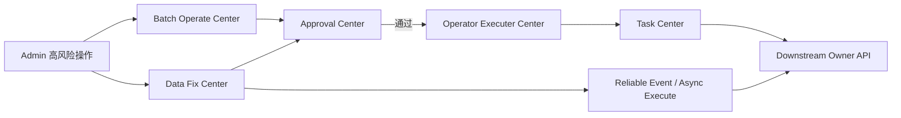

# O-BFF 审批 / 批量 / 任务 / 数据修复深挖

> 返回：[O-BFF 架构梳理](./o-bff-architecture.md)
>
> 图解：[O-BFF 架构图解](./o-bff-architecture.html)
>
> Approval / Task 图解：[Approval Center / Task Center 架构图解](./o-bff-approval-task-center-architecture.html)
>
> 项目索引：[O-BFF 项目材料](./README.md)

## 一、为什么单独背治理中心

O-BFF 最容易被深挖的不是某个普通查询接口，而是后台高风险操作怎么治理：

- 审批怎么保证不绕过？
- 批量导入导出怎么异步化？
- Task Center 和 Batch Operate 区别是什么？
- 数据修复为什么不能直接改库？
- 失败怎么查、怎么重试、怎么审计？

## 二、四个中心的关系



## 三、Approval Center 深挖

### 它解决什么

后台修改、批量操作、数据修复都可能产生资损或用户影响，不能直接执行。Approval Center 解决的是：

- 谁提交。
- 谁审批。
- 审批状态是什么。
- 审批通过后触发什么。
- 事后怎么审计。

### 面试回答

> 审批不是简单加一个状态字段，而是一套流程治理：创建审批实例、推进审批节点、记录审批事件，并在审批通过后触发实际业务执行。这样后台高风险操作可以被拦截、追踪和复盘。

### 深挖追问

| 问题 | 回答 |
| --- | --- |
| 审批失败怎么办？ | 不触发实际业务执行，保留审批和操作记录。 |
| 审批通过后执行失败怎么办？ | 审批和执行是两个阶段，要查执行记录、任务记录或 reliable event 结果。 |
| 标准 proxy 接口怎么接审批？ | 通过 Approval Mapping / `audit_biz_type_mapping` 将接口和审批业务类型关联。 |
| 怎么避免绕过审批？ | 高风险入口统一走配置和中心模块，review 时检查是否接入审批。 |

## 四、Batch Operate vs Task Center

| 维度 | Batch Operate Center | Task Center |
| --- | --- | --- |
| 关注点 | 一次运营批量操作记录。 | 任务怎么执行。 |
| 包含 | 上传、审批、状态、撤回、下载、批量记录。 | 文件解析、切批、并发、RPC、S3、callback、monitor。 |
| 面试关键词 | 运营记录、审批上下文、操作历史。 | 配置驱动、异步执行、限流、错误明细。 |
| 关系 | 可以创建批量操作并等待审批。 | 审批通过后真正执行批处理。 |

回答模板：

> Batch Operate 更偏“这次批量操作是什么、谁提交、是否审批、结果在哪里下载”；Task Center 更偏“这批数据怎么解析、怎么切批、怎么调用下游、怎么写结果和监控”。两者经常串起来，但边界不同。

## 五、批量导入深挖


### 重点防守

- 不能同步卡 Admin 页面。
- 不能一条失败导致全批不清楚。
- 下游最好支持局部失败结构。
- 要能定位到单条错误。
- 要考虑幂等和重复提交。
- 要有任务状态和结果下载。

## 六、批量导出深挖

导出比查询更危险，因为数据量大。

重点：

- Page / Scroll / SearchAfter 选择。
- 稳定排序字段。
- 超时和最大导出量。
- S3 文件生成和下载记录。
- ES 或下游 API 的分页契约。
- 监控和错误处理。

面试说法：

> 大导出不能直接同步查全量返回，必须任务化。设计时要明确分页或 scroll 策略、稳定排序、终止条件、S3 文件生成和任务状态，否则容易超时、重复、漏数。

## 七、Data Fix Center 深挖

### 为什么不能直接改库

直接改库会绕过：

- owner 服务状态机。
- 字段校验。
- 领域约束。
- 操作审计。
- 失败重试。
- 回滚分析。

### 正确链路

```text
创建修复记录
  -> 填修复模块、业务 ID、字段和原因
  -> 发起审批
  -> 审批通过
  -> reliable event / async execute
  -> 调 owner 服务修复接口
  -> 更新修复状态和错误信息
```

面试回答：

> 数据修复要工具化、审批化、异步化、可追踪。O-BFF 提供后台入口和流程治理，真正数据语义仍交给 owner 服务处理。

## 八、可能被深挖的可靠性问题

| 问题 | 回答抓手 |
| --- | --- |
| 批量任务重复执行怎么办？ | 重复请求控制、任务记录、下游幂等、唯一键和状态机。 |
| 下游部分失败怎么办？ | 结果明细里记录每条失败原因，支持下载和重试策略。 |
| 审批通过但执行失败怎么办？ | 审批状态和执行状态分开看，查 Task Center / event / 下游错误。 |
| 导出数据不一致怎么办？ | 明确 ES 是查询视图，必要时回查 owner MySQL；导出用稳定分页。 |
| 监控怎么做？ | Batch、Task、RPC Proxy、ES Adapter 等指标；label 控制低基数，不放 PII。 |

## 九、面试 1 分钟回答

> O-BFF 的后台治理核心是把高风险操作变成可审批、可任务化、可审计的流程。比如批量导入会先创建 Batch Operate 记录并发起审批，审批通过后由 Task Center 异步解析文件、切批、限流调用下游，并生成成功失败明细和下载结果。数据修复也不是直接改库，而是创建修复记录、审批、异步调用 owner 服务并记录状态。这样可以保证后台操作有入口、有审批、有执行记录、有失败定位，也不会把领域事实从下游 owner 服务拿走。

## 十、代码和资料证据

- Approval Center：`/Users/si.chen/GolandProjects/insurance-operator-bff/src/approval_center/`
- Batch Operate Center：`/Users/si.chen/GolandProjects/insurance-operator-bff/src/batch_operate_center/`
- Task Center：`/Users/si.chen/GolandProjects/insurance-operator-bff/src/task_center/`
- Data Fix Center：`/Users/si.chen/GolandProjects/insurance-operator-bff/src/data_fix_center/`
- Operator Executer Center：`/Users/si.chen/GolandProjects/insurance-operator-bff/src/operator_executer_center/`
- 监控告警：`/Users/si.chen/GolandProjects/insurance-operator-bff/project-kb/tech/OBFF_Monitoring_Alerts.md`
