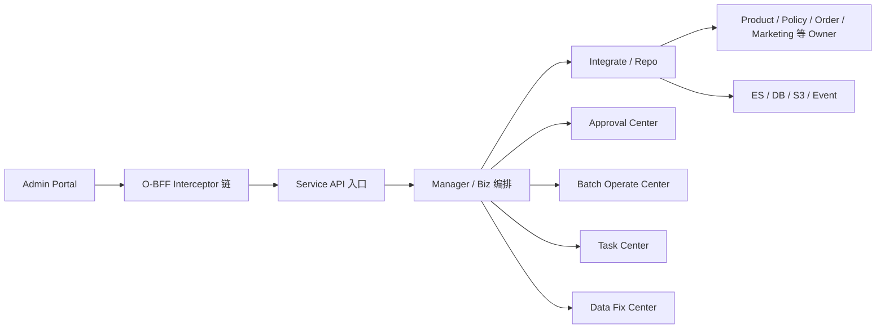

# O-BFF 核心知识深挖

> 返回：[O-BFF 架构梳理](./o-bff-architecture.md)
>
> 图解：[O-BFF 架构图解](./o-bff-architecture.html)
>
> 项目索引：[O-BFF 项目材料](./README.md)

## 一、面试先背这 8 个点

1. O-BFF 是 Insurance Admin 的后台聚合和治理层，不是普通 RPC 透传。
2. 核心链路是 `Admin -> Interceptor -> Service -> Manager/Biz -> Integrate/Repo -> Downstream`。
3. Interceptor 统一做权限、公共参数、脱敏、操作日志、重复请求、proxy、审批信息等横切能力。
4. 下游 Product、Policy、Order、Marketing 等 owner 服务仍是业务事实源。
5. 高风险操作走 Approval Center，不能直接执行。
6. 批量导入导出走 Batch Operate / Task Center，不能同步卡住页面。
7. 数据修复走 Data Fix Center + 审批 + 异步执行，不能说成“直接改库”。
8. 标准后台能力通过 Assembly 配置化接入，复杂资损或状态机场景再手写 Manager/Biz。

## 二、整体架构怎么讲



面试版：

> O-BFF 是后台运营入口。Admin 页面不直接对接多个后端服务，而是先进入 O-BFF。O-BFF 通过 interceptor 统一处理权限、脱敏、日志、重复请求和 proxy，再由 service 接协议、manager/biz 做场景编排、integrate 调下游 owner 服务。高风险写操作走审批，批量导入导出走任务中心，数据修复走审批和异步执行。

## 三、每层职责怎么防守

| 层 | 负责什么 | 不负责什么 |
| --- | --- | --- |
| Interceptor | 权限、脱敏、操作日志、重复请求、proxy、审批上下文等横切能力。 | 不写复杂业务状态机。 |
| Service | Admin API 入口，做参数承接、协议适配、调用 manager。 | 不直接堆复杂下游编排。 |
| Manager/Biz | 后台业务场景编排，组合审批、任务、下游调用。 | 不抢 owner 服务的领域事实。 |
| Integrate | 下游 RPC/client 封装，隔离接口细节。 | 不直接决定业务规则。 |
| Approval/Batch/Task/DataFix | 后台治理中心能力。 | 不替代 Product/Policy/Order 的数据 owner 角色。 |
| Repo / ES | 本地配置、记录、查询视图。 | ES 不是事实源。 |

## 四、最容易被深挖的问题

### 1. O-BFF 和普通 BFF 有什么区别？

普通 BFF 更偏页面聚合和字段适配。O-BFF 是后台运营 BFF，除了聚合，还要承接后台治理：

- 权限和操作日志。
- PII 脱敏。
- 高风险操作审批。
- 批量任务和结果下载。
- 数据修复流程。
- Proxy / Assembly 配置化。
- ES 查询和导出。

回答模板：

> O-BFF 更像 Admin 操作治理层。它不仅拼字段，还要保证后台操作可审批、可审计、可追踪、可重试，并且把标准后台能力配置化。

### 2. 怎么避免 O-BFF 变成大泥球？

用边界防守：

- 领域事实归 owner 服务。
- O-BFF 只做 Admin 场景编排和治理。
- 标准接口配置化，复杂流程显式 Manager/Biz。
- 下游接口封在 integrate。
- 横切能力放 interceptor。
- 批量、审批、数据修复沉到中心模块。

风险说法：

> 如果 O-BFF 直接改下游 DB 或承载 Product/Policy 的状态机，就会变成大泥球，也会绕过 owner 服务校验。

### 3. 为什么要有 Interceptor 链？

因为后台请求的公共治理很多，如果散落在每个 service 方法里，会造成漏接和维护困难。

典型能力：

- Auth / permission。
- 公共参数。
- Mask 脱敏。
- Operate log / update history。
- Repeated request。
- RPC proxy / orchestration。
- Security log。
- Panic protection。

面试说法：

> Interceptor 把横切治理前置收口，让 service 专注业务场景。比如脱敏、操作日志、重复请求控制，不应该每个接口都手写一遍。

### 4. 下游 API 不满足 Admin 契约怎么办？

先不要强行配置上线。要列清楚差异：

- 是否支持分页或游标。
- 是否支持稳定排序。
- 是否支持批量 item 返回。
- 是否有 `error_id` / `error_msg` / 局部失败结果。
- 是否幂等。
- 是否能承受导入导出并发。

回答模板：

> O-BFF 可以适配字段，但不能替下游兜底所有契约缺失。导入导出前要先确认分页、幂等、局部失败和错误结构，不满足就推动下游补契约，或者在 TD 里标记风险和待确认。

## 五、排障路径

### Admin 接口失败

```text
1. 看路由/API 是否命中 O-BFF
2. 看 interceptor：权限、脱敏、重复请求、proxy 配置
3. 看 service/manager 日志和 request id
4. 看 Approval / Batch / Task / DataFix 记录
5. 看 integrate 下游 RPC 返回
6. 如果是查询问题，再看 ES / Canal / mapping / DSL
```

### 批量任务异常

```text
1. 查 batch operate record
2. 查 task record / status / callback
3. 查输入文件、字段映射、错误列
4. 查下游批量 API 返回
5. 查 S3/download record
6. 查 Prometheus 和日志
```

## 六、面试 1 分钟深挖回答

> O-BFF 的核心难点不是写一个接口，而是后台操作治理。Admin 请求进入后先过 interceptor，把权限、脱敏、日志、重复请求、proxy 等公共能力统一处理；Service 负责接 API，Manager/Biz 负责编排场景，Integrate 调 Product、Policy、Order、Marketing 等 owner 服务。高风险写操作会接审批，批量导入导出会任务化，数据修复会走 Data Fix Center 和异步执行。它的边界是只做 Admin 场景治理，不替下游 owner 服务承载领域事实。

## 七、代码和资料证据

- 架构 KB：`/Users/si.chen/GolandProjects/insurance-operator-bff/project-kb/System_Architecture.md`
- Interceptor：`/Users/si.chen/GolandProjects/insurance-operator-bff/src/interceptor/`
- Service：`/Users/si.chen/GolandProjects/insurance-operator-bff/src/service/`
- Manager：`/Users/si.chen/GolandProjects/insurance-operator-bff/src/manager/`
- Biz：`/Users/si.chen/GolandProjects/insurance-operator-bff/src/biz/`
- Integrate：`/Users/si.chen/GolandProjects/insurance-operator-bff/src/integrate/`
- 下游契约：`/Users/si.chen/GolandProjects/insurance-operator-bff/project-kb/tech/Admin_Downstream_API_Contract.md`
