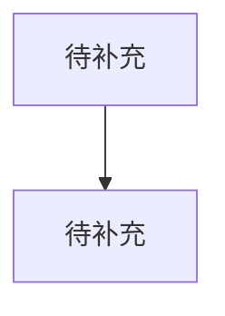

# 编号 MySQL 问题标题

分类：待补充

难度：L1 / L2 / L3 / L4

优先级：P0 / P1 / P2

关键词：待补充

复习状态：未整理 / 已成稿 / 可复述 / 需强化

## 问题

待补充

## 先讲人话

待补充

## 前置概念

| 概念 | 小白解释 |
| --- | --- |
| 待补充 | 待补充 |

## 30 秒短答

待补充

## 面试时可以直接这样回答

待补充

## 先用一张图看懂



## 原理拆解

### 1. 待补充

待补充

### 2. 待补充

待补充

## 结合项目怎么讲

待补充

## 术语表

| 术语 | 解释 |
| --- | --- |
| 待补充 | 待补充 |

## 常见场景

- 待补充

## 容易说错的点

1. 待补充

## 高频追问

### 追问 1：待补充

待补充

### 追问 2：待补充

待补充

### 追问 3：待补充

待补充

## 记忆口诀

```text
待补充
```
